## 学习知识点：

Pod控制器：掌握各种控制器的特点以及使用定义方式
服务发现：掌握 SVC 原理及其构建方式
存储：掌握多种存储类型的特点，并且能够在不同环境中选择合适的存储方案（有自己的见解）
调度器：掌握调度器的原理，能够根据要求把Pod定义到想要的节点运行
安全：集群的认证、鉴权、访问控制、原理及其流程
HELM：类似Linux yum，掌握HELM原理、模板自定义、部署常用插件
运维：修改kubeadm，达到证书可用期限为10年，能够构建高可用的k8s集群

## 3、组件说明

APIserver：所有服务访问统一入口
controllermanager：维持副本期望数目
schedule：负责接受任务，选择合适的节点进行分配任务
etcd：键值对数据库，存储k8s集群所有重要信息（持久化）

kubelet：直接跟容器引擎交互实现容器的生命周期管理
kube-proxy：负责写入规则至 IPTABLES、IPVS 实现服务映射访问

CoreDNS：可以为集群中的SVC创建一个域名IP的对应关系解析
dashboard：给k8s集群提供一个 B/S 结构访问体系
ingress controller：官方只能实现四层代理，ingress可以实现七层代理
federation：提供一个可以跨集群中心多k8s统一管理功能
Prometheus：提供k8s集群监控能力
elk：提供k8s集群日志统一分析介入平台

## 1- k8s常用对象说明
### 1- master
集群的控制节点，负责整个集群的管理和控制，kubernetes的所有的命令基本都是发给Master，由它来负责具体的执行过程。
#### 1.1. Master的组件
- kube-apiserver：资源增删改查的入口
- kube-controller-manager：资源对象的大总管
- kube-scheduler：负责资源调度（Pod调度）
- etcd Server: kubernetes的所有的资源对象的数据保存在etcd中。
### 2  Node
Node是集群的工作负载节点，默认情况kubelet会向Master注册自己，一旦Node被纳入集群管理范围，kubelet会定时向Master汇报自身的情报，包括操作系统，Docker版本，机器资源情况等。
如果**Node超过指定时间不上报信息**，会被Master判断为“失联”，标记为**Not Ready**，随后Master会触发Pod转移。
#### 2.1. Node的组件
- kubelet:Pod的管家，与Master通信
- kube-proxy：实现kubernetes Service的通信与负载均衡机制的重要组件
- Docker：容器的创建和管理
#### 2.2. Node相关命令
kubectl get nodes
kuebctl describe node {node_name}
#### 2.3. describe命令的Node信息
- Node基本信息：名称、标签、创建时间等
- Node当前的状态，Node启动后会进行自检工作，磁盘是否满，内存是否不足，若都正常则切换为Ready状态。
- Node的主机地址与主机名
- Node上的资源总量：CPU,内存，最大可调度Pod数量等
- Node可分配资源量：当前Node可用于分配的资源量
- 主机系统信息：主机唯一标识符UUID，Linux kernel版本号，操作系统，kubernetes版本，kubelet与kube-proxy版本
- 当前正在运行的Pod列表及概要信息
- 已分配的资源使用概要，例如资源申请的最低、最大允许使用量占系统总量的百分比
- Node相关的Event信息。

###   3- Pod
Pod是Kubernetes中操作的基本单元。每个Pod中有个**根容器(Pause容器)**，Pause容器的状态代表整个容器组的状态，其他业务容器共享Pause的IP，即Pod IP，共享Pause挂载的Volume，这样简化了同个Pod中不同容器之间的网络问题和文件共享问题。
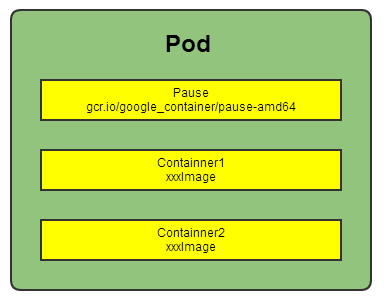

1. Kubernetes集群中，同宿主机的或不同宿主机的Pod之间要求能够TCP/IP直接通信，因此采用**虚拟二层网络技术**来实现，例如Flannel，Openvswitch(OVS)等，这样在同个集群中，**不同的宿主机**的Pod IP为**不同IP段**的IP，集群中的所有Pod IP都是唯一的，不同Pod之间可以直接通信。
2. Pod有两种类型：普通Pod和静态Pod。静态Pod即不通过K8S调度和创建，直接在某个具体的Node机器上通过具体的文件来启动。普通Pod则是由K8S创建、调度，同时数据存放在ETCD中。
3. Pod IP和具体的容器端口（ContainnerPort）组成一个具体的**通信地址，即Endpoint**。一个Pod中可以存在多个容器，可以有多个端口，Pod IP一样，即有多个Endpoint。
4. Pod **Volume** 是定义在Pod之上，被各个容器挂载到自己的文件系统中，可以用分布式文件系统实现后端存储功能。
5. Pod中的 **Event** 事件可以用来排查问题，可以通过kubectl describe pod xxx 来查看对应的事件。
6. 每个Pod可以对其能使用的服务器上的计算资源设置限额，一般为CPU和Memory。K8S中一般将千分之一个的CPU配置作为最小单位，用m表示，是一个绝对值，即100m对于一个Core的机器还是48个Core的机器都是一样的大小。Memory配额也是个绝对值，单位为内存字节数。
7. 资源配额的两个参数
8. Requests:该资源的最小申请量，系统必须满足要求。
9. Limits:该资源最大允许使用量，当超过该量，K8S会kill并重启Pod。
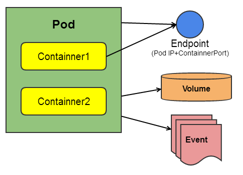

pod创建完整流程
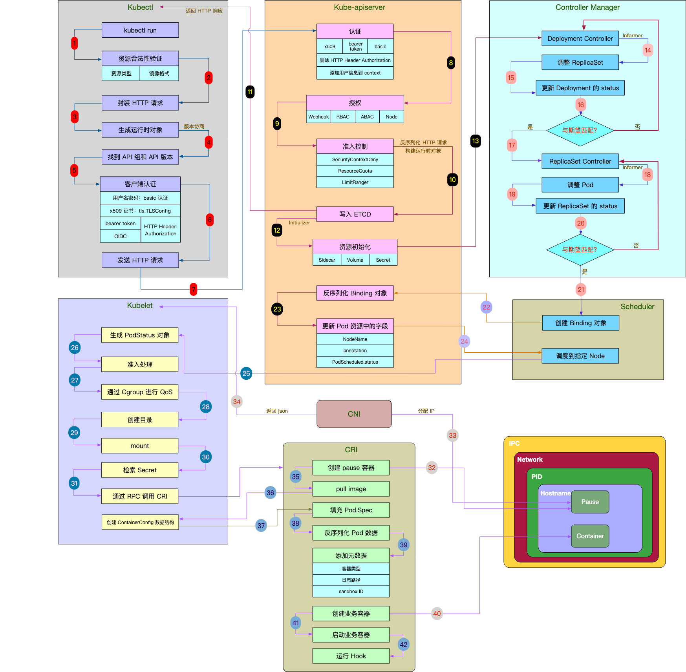


### 4- Label

1. Label是一个键值对，可以附加在任何对象上，比如Node,Pod,Service,RC等。Label和资源对象是多对多的关系，即一个Label可以被添加到多个对象上，一个对象也可以定义多个Label。
2. Label的作用主要**用来实现精细的、多维度的资源分组管理**，以便进行资源分配，调度，配置，部署等工作。
3. Label通俗理解就是“标签”，**通过标签来过滤筛选指定的对象**，进行具体的操作。k8s通过 **Label Selector(标签选择器)** 来筛选指定Label的资源对象，类似SQL语句中的条件查询（WHERE语句）。
4. **Label Selector**有基于等式和基于集合的两种表达方式，可以多个条件进行组合使用。
5. 基于等式：name=redis-slave（匹配name=redis-slave的资源对象）;env!=product(匹配所有不具有标签env=product的资源对象)
6. 基于集合：name in (redis-slave,redis-master);name not in (php-frontend)（匹配所有不具有标签name=php-frontend的资源对象）

使用场景
1. kube-controller进程通过资源对象RC上定义的Label Selector来筛选要监控的Pod副本数，从而**实现副本数始终保持预期数目**。
2. kube-proxy进程通过Service的Label Selector来选择对应Pod，自动建立每个Service到对应Pod的**请求转发路由表**，从而实现Service的智能**负载均衡**机制。
3. kube-scheduler实现**Pod定向调度**：对Node定义特定的Label，并且在Pod定义文件中使用NodeSelector标签调度策略。
### 5- Replication Controller(RC)

RC是k8s系统中的核心概念，定义了一个期望的场景。
主要包括：
- Pod期望的副本数（replicas）
- 用于筛选目标Pod的Label Selector
- 用于创建Pod的模板（template）

RC特性说明：
1. Pod的缩放可以通过以下命令实现：kubectl scale rc redis-slave --replicas=3
2. 删除RC并不会删除该RC创建的Pod，可以将副本数设置为0，即可删除对应Pod。或者通过kubectl stop /delete命令来一次性删除RC和其创建的Pod。
3. 改变RC中Pod模板的镜像版本可以实现滚动升级（Rolling Update）。具体操作见[https://kubernetes.io/docs/tasks/run-application/rolling-update-replication-controller/](https://kubernetes.io/docs/tasks/run-application/rolling-update-replication-controller/)
4. Kubernetes1.2以上版本将RC升级为Replica Set，它与当前RC的唯一区别在于Replica Set支持基于集合的Label Selector(Set-based selector)，而旧版本RC只支持基于等式的Label Selector(equality-based selector)。
5. Kubernetes1.2以上版本通过Deployment来维护Replica Set而不是单独使用Replica Set。即控制流为：**Delpoyment→Replica Set→Pod**。即新版本的Deployment+Replica Set替代了RC的作用。
### 6- Deployment
Deployment是kubernetes 1.2引入的概念，用来解决Pod的编排问题。Deployment 可以理解为RC的升级版（**RC+Replicat Set**）。特点在于可以随时知道Pod的部署进度，即对Pod的创建、调度、绑定节点、启动容器完整过程的进度展示。

**使用场景**
1. 创建一个Deployment对象来生成对应的Replica Set并**完成Pod副本的创建过程**。
2. 检查Deployment的状态来确认部署动作是否完成（Pod副本的数量是否达到预期值）。
3. 更新Deployment以创建新的Pod(例如镜像升级的场景)。
4. 如果当前Deployment不稳定，回退到上一个Deployment版本。
5. 挂起或恢复一个Deployment。
可以通过 `kubectl describe deployment` 来查看Deployment控制的Pod的水平拓展过程。
### 7- Horizontal Pod Autoscaler(HPA)

Horizontal Pod Autoscaler(HPA)即Pod**横向自动扩容**，与RC一样也属于k8s的资源对象。
HPA原理：通过追踪分析RC控制的所有目标Pod的负载变化情况，来确定是否针对性调整Pod的副本数。

Pod负载度量指标：
- CPUUtilizationPercentage：Pod所有副本自身的CPU利用率的平均值。即当前Pod的CPU使用量除以Pod Request的值。
- 应用自定义的度量指标，比如服务每秒内响应的请求数（TPS/QPS）。
### 8- Service
#### 8.1. Service概述
Service定义了一个服务的访问**入口地址**，前端应用通过这个入口地址访问其背后的一组由Pod副本组成的集群实例，**Service与其后端的Pod副本集群之间是通过Label Selector来实现“无缝对接”**。RC保证Service的Pod副本实例数目保持预期水平。
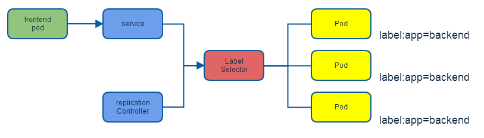

#### 8.2. kubernetes的服务发现机制

主要通过 kube-dns 这个组件来进行DNS方式的服务发现。
#### 8.3. 外部系统访问Service的问题

|IP类型            |说明          |
|---|---|
|Node IP|Node节点的IP地址|
|Pod IP|Pod的IP地址|
|Cluster IP|Service的IP地址|

#### 8.3.1. Node IP
Node IP 是集群中每个节点的**物理网卡IP地址**，是真实存在的物理网络，kubernetes集群之外的节点访问kubernetes内的某个节点或TCP/IP服务的时候，需要通过NodeIP进行通信。
#### 8.3.2. Pod IP
Pod IP是每个Pod的IP地址，是Docker Engine根据**docker0网桥的IP段地址进行分配的**，是一个虚拟二层网络，集群中一个Pod的容器访问另一个Pod中的容器，是通过Pod IP进行通信的，而**真实的TCP/IP流量是通过Node IP所在的网卡流出的**。
#### 8.3.3. Cluster IP
1. Service的Cluster IP是一个**虚拟IP**，只作用于Service这个对象，由kubernetes管理和分配IP地址（来源于Cluster IP地址池）。
2. Cluster IP**无法被ping通**，因为没有一个实体网络对象来响应。
3. **Cluster IP结合Service Port组成的具体通信端口**才具备TCP/IP通信基础，属于kubernetes集群内，集群外访问该IP和端口需要额外处理。
4. k8s集群内Node IP 、Pod IP、Cluster IP之间的通信采取k8s自己的**特殊的路由规则**，与传统IP路由不同。
#### 8.3.4. 外部访问Kubernetes集群
通过宿主机与容器端口映射的方式进行访问，例如：Service定位文件如下：可以通过任意Node的IP 加端口访问该服务。也可以通过Nginx或HAProxy来设置负载均衡。

### 9- Volume(存储卷)

#### 9.1. Volume的功能
1. Volume是Pod中能够被多个容器访问的**共享目录**，可以让容器的数据写到宿主机上或者写文件到网络存储中。
2. 可以实现容器配置文件集中化定义与管理，通过ConfigMap资源对象来实现。
#### 9.2. Volume的特点
k8s中的Volume与Docker的Volume相似，但不完全相同。
1. k8s上**Volume定义在Pod上**，然后被一个Pod中的多个容器挂载到具体的文件目录下。
2. k8s的Volume与Pod生命周期相关而不是容器是生命周期，即容器挂掉，数据不会丢失，但是**Pod挂掉，数据则会丢失**。
3. k8s中的Volume支持多种类型的Volume：Ceph、GlusterFS等分布式系统。
#### 9.3. Volume的使用方式
先在Pod上声明一个Volume，然后容器**引用**该Volume并**Mount**到容器的某个目录。
#### 9.4. Volume类型
##### 9.4.1. emptyDir
emptyDir Volume是在Pod分配到Node时创建的，初始内容为空，无须指定宿主机上对应的目录文件，由K8S自动分配一个目录，当Pod被删除时，对应的emptyDir数据也会永久删除。
**作用**：
1. 临时空间，例如程序的临时文件，无须永久保留
2. 长时间任务的中间过程CheckPoint的临时保存目录
3. 一个容器需要从另一个容器中获取数据的目录（即多容器共享目录）
**说明**：
目前用户无法设置emptyVolume的使用介质，如果kubelet的配置使用硬盘则emptyDir将创建在该硬盘上。
##### 9.4.2. hostPath
hostPath是在Pod上**挂载宿主机上的文件或目录**。
**作用**：
1. 容器应用日志**需要持久化**时，可以使用宿主机的高速文件系统进行存储。
2. 需要访问宿主机上Docker引擎内部数据结构的容器应用时，可以通过定义hostPath为宿主机/var/lib/docker目录，使容器内部应用可以直接访问Docker的文件系统。
**注意点：**
1. 在不同的Node上具有相同配置的Pod可能会因为宿主机上的目录或文件不同导致对Volume上目录或文件的访问结果不一致。
2. 如果使用了资源配额管理，则kubernetes无法将hostPath在宿主机上使用的资源纳入管理。
##### 9.4.3. gcePersistentDisk
表示使用谷歌**公有云提供的永久磁盘**（Persistent Disk ,PD）存放Volume的数据，它与EmptyDir不同，PD上的内容会被永久保存。当Pod被删除时，PD只是被卸载时，但不会被删除。需要先创建一个永久磁盘，才能使用gcePersistentDisk。

使用gcePersistentDisk的限制条件：
- Node(运行kubelet的节点)需要是GCE虚拟机。
- 虚拟机需要与PD存在于相同的GCE项目中和Zone中。
### 10- Persistent Volume

Volume定义在Pod上，属于“计算资源”的一部分，而 **Persistent Volume和Persistent Volume Claim** 是**网络存储**，简称 **PV和PVC**，可以理解为k8s集群中某个网络存储中对应的一块存储。

- PV是网络存储，**不属于任何Node**，但可以在每个Node上访问。
- PV不是定义在Pod上，而是**独立于Pod之外定义**。
- PV常见类型：GCE Persistent Disks、NFS、RBD等。

PV是**有状态的对象**，状态类型如下：
- Available: 空闲状态
- Bound: 已经**绑定到某个PVC**上
- Released: 对应的PVC已经删除，但资源还没有回收
- Failed: PV自动回收失败
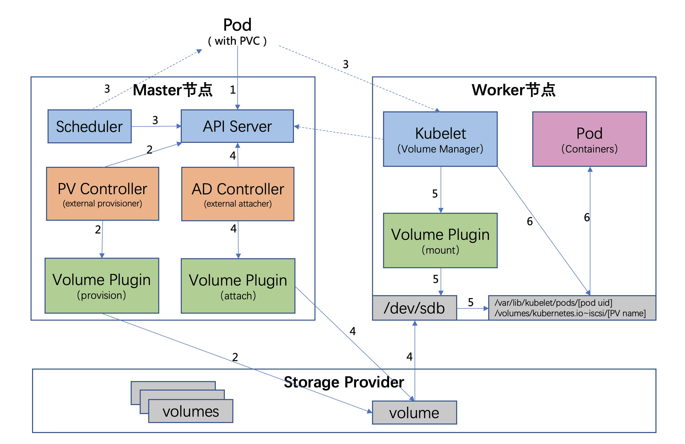

流程如下：
1. 用户创建了一个包含 PVC 的 Pod，该 PVC 要求使用动态存储卷；
2. Scheduler 根据 Pod 配置、节点状态、PV 配置等信息，把 Pod 调度到一个合适的 Worker 节点上；
3. PV 控制器 watch 到该 Pod 使用的 PVC 处于 Pending 状态，于是调用 Volume Plugin（in-tree）创建存储卷，并创建 PV 对象（out-of-tree 由 External Provisioner 来处理）；
4. AD 控制器发现 Pod 和 PVC 处于待挂接状态，于是调用 Volume Plugin 挂接存储设备到目标 Worker 节点上
5. 在 Worker 节点上，Kubelet 中的 Volume Manager 等待存储设备挂接完成，并通过 Volume Plugin 将设备挂载到全局目录：**/var/lib/kubelet/pods/[pod uid]/volumes/kubernetes.io~iscsi/[PVname]**（以 iscsi 为例）；
6. Kubelet 通过 Docker 启动 Pod 的 Containers，用 bind mount 方式将已挂载到本地全局目录的卷映射到容器中。

详细流程图
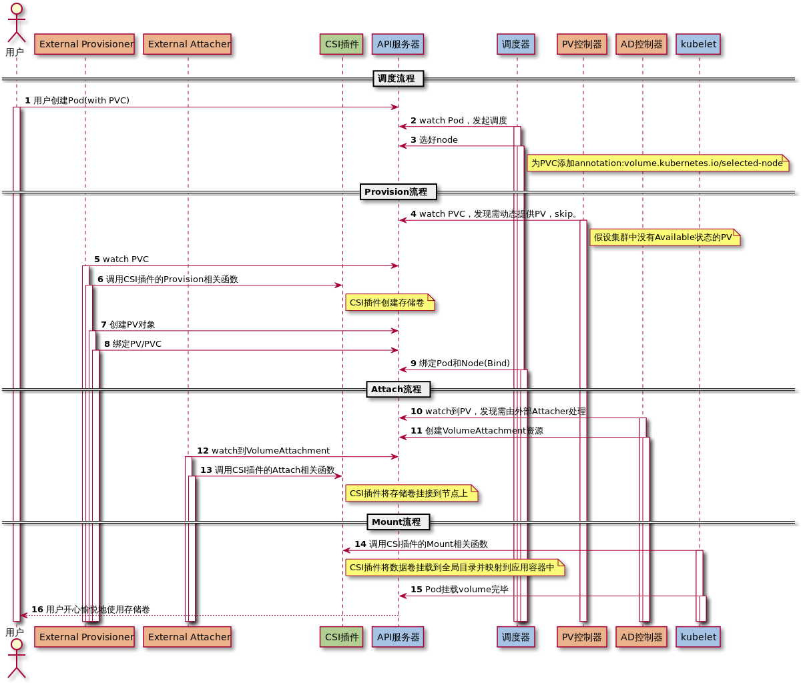

### 11- Namespace
Namespace即命名空间，主要用于多租户的**资源隔离**，通过将资源对象分配到不同的Namespace上，便于不同的分组在共享资源的同时可以被分别管理。
k8s集群启动后会默认创建一个“default”的Namespace。可以通过kubectl get namespaecs查看。

可以通过 `kubectl config use-context namespace` 配置当前k8s客户端的环境，通过kubectl get pods获取当前namespace的Pod。或者通过 `kubectl get pods --namespace=NAMESPACE` 来获取指定namespace的Pod。

默认 namespace：
- kube-system 主要用于运行系统级资源，存放 k8s 自身的组件
- kube-public 此命名空间是自动创建的，并且可供所有用户（包括未经过身份验证的用户）读取。此命名空间主要用于集群使用，关联的一些资源在集群中是可见的并且可以公开读取。此命名空间的公共方面知识一个约定，但不是非要这么要求。
- default 未指定名称空间的资源就是 default，即你在创建pod 时如果没有指定 namespace，则会默认使用 default
### 12- Annotation(注解)
Annotation与Label类似，也使用key/value的形式进行定义，Label定义元数据（Metadata）,Annotation定义“附加”信息。

通常Annotation记录信息如下：
- build信息，release信息，Docker镜像信息等。
- 日志库、监控库等。


## 2 搭建 k8s 集群

官方安装链接：[在 Linux 系统中安装并设置 kubectl | Kubernetes](https://kubernetes.io/zh-cn/docs/tasks/tools/install-kubectl-linux/)

参考链接：https://zhuanlan.zhihu.com/p/509043446

### 2-  安装 k8s
#### 2.1 环境准备

| 角色     | IP              | 组件                             |
| ------ | --------------- | ------------------------------ |
| master | 192.168.194.128 | docker，kubectl，kubeadm，kubelet |
| node1  | 192.168.194.130 | docker，kubectl，kubeadm，kubelet |
| node2  | 192.168.194.131 | docker，kubectl，kubeadm，kubelet |

更换阿里源/etc/apt/sources.list

```shell
deb http://mirrors.aliyun.com/ubuntu/ focal main restricted universe multiverse
deb-src http://mirrors.aliyun.com/ubuntu/ focal main restricted universe multiverse

deb http://mirrors.aliyun.com/ubuntu/ focal-security main restricted universe multiverse
deb-src http://mirrors.aliyun.com/ubuntu/ focal-security main restricted universe multiverse

deb http://mirrors.aliyun.com/ubuntu/ focal-updates main restricted universe multiverse
deb-src http://mirrors.aliyun.com/ubuntu/ focal-updates main restricted universe multiverse

# deb http://mirrors.aliyun.com/ubuntu/ focal-proposed main restricted universe multiverse
# deb-src http://mirrors.aliyun.com/ubuntu/ focal-proposed main restricted universe multiverse

deb http://mirrors.aliyun.com/ubuntu/ focal-backports main restricted universe multiverse
deb-src http://mirrors.aliyun.com/ubuntu/ focal-backports main restricted universe multiverse
```

##### 2.1.1 关闭防火墙

所有节点都需要关闭防火墙。

```text
systemctl status ufw
systemctl stop ufw
systemctl disable ufw
```

##### 2.1.2 禁用交换内存（k8s要求的要关闭）

参考链接：https://www.51cto.com/article/704190.html

https://www.yuque.com/leifengyang/oncloud/ghnb83

```shell
#暂时禁止：关闭swap
sudo swapoff -a  

# 永久禁止：
# 在此文件中，注释掉该 /swapfile 行。
sudo vim /etc/fstab
# 或者执行下面命令
sudo sed -ri 's/.*swap.*/#&/' /etc/fstab
```

执行 `free -m` ，Swap后面全是0表示已经关闭

```shell
root@k8s-node2:/home/xbu# free -m
               total        used        free      shared  buff/cache   available
Mem:            7933         823        5170          24        1939        6824
Swap:              0           0           0
```
配置kubelet的 cgroup:

编辑 `kubelet` 的配置文件以包含正确的 `cgroup` 配置。配置文件通常位于`/etc/default/kubelet` 或 `/etc/systemd/system/kubelet.service.d/` 目录下。你可以使用文本编辑器打开配置文件：
```shell
sudo vim /etc/default/kubelet

KUBELET_EXTRA_ARGS="--cgroup-driver=systemd"
```
##### 2.1.3 设置主机名
```shell
sudo hostnamectl set-hostname k8s-master

root@k8s-node2:/home/xbu# hostname
k8s-node2

# 查看 /etc/hosts文件，127.0.1.1 要映射主机名 k8s-node2
root@k8s-node2:/home/xbu# cat /etc/hosts
127.0.0.1       localhost
#127.0.1.1      qa-vm
127.0.1.1       k8s-node2

10.103.12.50    teletest.snwl.com
```

编辑3台机器/etc/hosts文件，添加下面内容：

```shell
10.103.230.24 k8s-master
10.103.230.20 k8s-node1
10.103.230.21 k8s-node2
```

##### 2.1.4 修改linux内核参数

写入参数：

```text
cat <<EOF > /etc/sysctl.d/k8s.conf
net.ipv4.ip_forward = 1
net.bridge.bridge-nf-call-ip6tables = 1
net.bridge.bridge-nf-call-iptables = 1
EOF
```

参数生效：

```text
sysctl -p /etc/sysctl.d/k8s.conf
```

加载网桥过滤模块：

```text
modprobe br_netfilter
```

查看网桥过滤模块是否加载成功：

```shell
lsmod | grep br_netfilter

root@k8s-node2:/home/xbu# lsmod | grep br_netfilter
br_netfilter           32768  0
bridge                409600  1 br_netfilter
```

##### 2.1.5 安装docker

按照docker学习笔记安装
注意：要加上 "exec-opts": ["native.cgroupdriver=systemd"]
```shell
sudo mkdir -p /etc/docker
sudo tee /etc/docker/daemon.json <<-'EOF'
{
  "exec-opts": ["native.cgroupdriver=systemd"],
  "registry-mirrors": ["https://bjikbp76.mirror.aliyuncs.com"]
}
EOF

sudo systemctl daemon-reload
sudo systemctl restart docker
```
##### 2.1.6. 安装 k8s 组件

```shell
sudo apt-get install -y ca-certificates curl software-properties-common apt-transport-https curl


# 2: 安装GPG证书
curl https://mirrors.aliyun.com/kubernetes/apt/doc/apt-key.gpg | apt-key add - 

# 3：添加源
cat <<EOF >/etc/apt/sources.list.d/kubernetes.list
deb https://mirrors.aliyun.com/kubernetes/apt/ kubernetes-xenial main
EOF

# 4：安装kubelet kubeadm kubectl
apt-get update

# 不要使用最新的版本，在[kubelet-start] Starting the kubelet总是出错，1.24版本以后k8s不支持docker
apt-get install -y kubelet=1.23.6-00 kubeadm=1.23.6-00 kubectl=1.23.6-00
apt-get install -y kubelet kubeadm kubectl

#5：设置kubelet开机自启
systemctl enable kubelet
```

##### 2.1.7 下载集群镜像

```shell
# # 1：查看所需镜像 kubeadm config images list
root@k8s-master:/home/xbu/k8s# kubeadm config images list
registry.k8s.io/kube-apiserver:v1.28.1
registry.k8s.io/kube-controller-manager:v1.28.1
registry.k8s.io/kube-scheduler:v1.28.1
registry.k8s.io/kube-proxy:v1.28.1
registry.k8s.io/pause:3.9
registry.k8s.io/etcd:3.5.9-0
registry.k8s.io/coredns/coredns:v1.10.1

# 将要下载的镜像写入执行文件，换成了阿里源registry.cn-hangzhou.aliyuncs.com下载
## 使用 v1.23.6版本，别的版本总是出错
sudo tee ./images.sh <<-'EOF'
#!/bin/bash
images=(
kube-apiserver:v1.23.6
kube-controller-manager:v1.23.6
kube-scheduler:v1.23.6
kube-proxy:v1.23.6
pause:3.6
etcd:3.5.1-0
coredns:v1.8.6
)
for imageName in ${images[@]} ; do
docker pull registry.cn-hangzhou.aliyuncs.com/google_containers/$imageName
docker tag registry.cn-hangzhou.aliyuncs.com/google_containers/$imageName $imageName
docker rmi registry.cn-hangzhou.aliyuncs.com/google_containers/$imageName 
done
EOF

# 执行脚本
chmod +x ./images.sh && ./images.sh
```

#### 2.2 集群初始化

##### 1 master节点操作：

```shell
# 1：初始化：--apiserver-advertise-address=master节点IP，--kubernetes-version=版本号
kubeadm init \
    --apiserver-advertise-address=10.103.230.24 \
    --image-repository registry.aliyuncs.com/google_containers \
    --kubernetes-version=v1.23.6 \
    --service-cidr=172.16.0.0/12 \
    --pod-network-cidr=192.168.0.0/16
```

初始化成功：

```shell
root@master-22:~# kubeadm init \
    --apiserver-advertise-address=10.103.230.22 \
    --image-repository registry.cn-hangzhou.aliyuncs.com/google_containers \
    --kubernetes-version=v1.28.1 \
    --service-cidr=172.16.0.0/12 \
    --pod-network-cidr=192.168.0.0/16
[init] Using Kubernetes version: v1.28.1
[preflight] Running pre-flight checks
        [WARNING KubernetesVersion]: Kubernetes version is greater than kubeadm version. Please consider to upgrade kubeadm. Kubernetes version: 1.28.1. Kubeadm version: 1.23.x
        [WARNING SystemVerification]: this Docker version is not on the list of validated versions: 24.0.6. Latest validated version: 20.10
[preflight] Pulling images required for setting up a Kubernetes cluster
[preflight] This might take a minute or two, depending on the speed of your internet connection
[preflight] You can also perform this action in beforehand using 'kubeadm config images pull'
W0913 15:46:51.816415   25879 images.go:80] could not find officially supported version of etcd for Kubernetes v1.28.1, falling back to the nearest etcd version (3.5.1-0)
[certs] Using certificateDir folder "/etc/kubernetes/pki"
[certs] Generating "ca" certificate and key
[certs] Generating "apiserver" certificate and key
[certs] apiserver serving cert is signed for DNS names [kubernetes kubernetes.default kubernetes.default.svc kubernetes.default.svc.cluster.local master-22] and IPs [172.16.0.1 10.103.230.22]
[certs] Generating "apiserver-kubelet-client" certificate and key
[certs] Generating "front-proxy-ca" certificate and key
[certs] Generating "front-proxy-client" certificate and key
[certs] Generating "etcd/ca" certificate and key
[certs] Generating "etcd/server" certificate and key
[certs] etcd/server serving cert is signed for DNS names [localhost master-22] and IPs [10.103.230.22 127.0.0.1 ::1]
[certs] Generating "etcd/peer" certificate and key
[certs] etcd/peer serving cert is signed for DNS names [localhost master-22] and IPs [10.103.230.22 127.0.0.1 ::1]
[certs] Generating "etcd/healthcheck-client" certificate and key
[certs] Generating "apiserver-etcd-client" certificate and key
[certs] Generating "sa" key and public key
[kubeconfig] Using kubeconfig folder "/etc/kubernetes"
[kubeconfig] Writing "admin.conf" kubeconfig file
[kubeconfig] Writing "kubelet.conf" kubeconfig file
[kubeconfig] Writing "controller-manager.conf" kubeconfig file
[kubeconfig] Writing "scheduler.conf" kubeconfig file
[kubelet-start] Writing kubelet environment file with flags to file "/var/lib/kubelet/kubeadm-flags.env"
[kubelet-start] Writing kubelet configuration to file "/var/lib/kubelet/config.yaml"
[kubelet-start] Starting the kubelet
[control-plane] Using manifest folder "/etc/kubernetes/manifests"
[control-plane] Creating static Pod manifest for "kube-apiserver"
[control-plane] Creating static Pod manifest for "kube-controller-manager"
[control-plane] Creating static Pod manifest for "kube-scheduler"
[etcd] Creating static Pod manifest for local etcd in "/etc/kubernetes/manifests"
W0913 15:47:05.226058   25879 images.go:80] could not find officially supported version of etcd for Kubernetes v1.28.1, falling back to the nearest etcd version (3.5.1-0)
[wait-control-plane] Waiting for the kubelet to boot up the control plane as static Pods from directory "/etc/kubernetes/manifests". This can take up to 4m0s
[apiclient] All control plane components are healthy after 22.506678 seconds
[upload-config] Storing the configuration used in ConfigMap "kubeadm-config" in the "kube-system" Namespace
[kubelet] Creating a ConfigMap "kubelet-config-1.28" in namespace kube-system with the configuration for the kubelets in the cluster
NOTE: The "kubelet-config-1.28" naming of the kubelet ConfigMap is deprecated. Once the UnversionedKubeletConfigMap feature gate graduates to Beta the default name will become just "kubelet-config". Kubeadm upgrade will handle this transition transparently.
[upload-certs] Skipping phase. Please see --upload-certs
[mark-control-plane] Marking the node master-22 as control-plane by adding the labels: [node-role.kubernetes.io/master(deprecated) node-role.kubernetes.io/control-plane node.kubernetes.io/exclude-from-external-load-balancers]
[mark-control-plane] Marking the node master-22 as control-plane by adding the taints [node-role.kubernetes.io/master:NoSchedule]
[bootstrap-token] Using token: 8dr02f.ehx8uitv1ws716sg
[bootstrap-token] Configuring bootstrap tokens, cluster-info ConfigMap, RBAC Roles
[bootstrap-token] configured RBAC rules to allow Node Bootstrap tokens to get nodes
[bootstrap-token] configured RBAC rules to allow Node Bootstrap tokens to post CSRs in order for nodes to get long term certificate credentials
[bootstrap-token] configured RBAC rules to allow the csrapprover controller automatically approve CSRs from a Node Bootstrap Token
[bootstrap-token] configured RBAC rules to allow certificate rotation for all node client certificates in the cluster
[bootstrap-token] Creating the "cluster-info" ConfigMap in the "kube-public" namespace
[kubelet-finalize] Updating "/etc/kubernetes/kubelet.conf" to point to a rotatable kubelet client certificate and key
[addons] Applied essential addon: CoreDNS
[addons] Applied essential addon: kube-proxy

Your Kubernetes control-plane has initialized successfully!

To start using your cluster, you need to run the following as a regular user:

  mkdir -p $HOME/.kube
  sudo cp -i /etc/kubernetes/admin.conf $HOME/.kube/config
  sudo chown $(id -u):$(id -g) $HOME/.kube/config

Alternatively, if you are the root user, you can run:

  export KUBECONFIG=/etc/kubernetes/admin.conf

You should now deploy a pod network to the cluster.
Run "kubectl apply -f [podnetwork].yaml" with one of the options listed at:
  https://kubernetes.io/docs/concepts/cluster-administration/addons/

Then you can join any number of worker nodes by running the following on each as root:

kubeadm join 10.103.230.24:6443 --token nnpn09.qlttmmuzlmb02lxt \
        --discovery-token-ca-cert-hash sha256:f088c67730eab37415ce70a6d597407569eb6bc820ecaeba83ada39175fa4ecd
```

##### 2 admin.conf配置文件
```shell
# 2：admin.conf配置文件
mkdir -p $HOME/.kube
sudo cp -i /etc/kubernetes/admin.conf $HOME/.kube/config
sudo chown $(id -u):$(id -g) $HOME/.kube/config
```

##### 3 node节点操作：
```shell
kubeadm join 10.103.230.22:6443 --token ajg55t.9cqkvfmffu9ktioe \
        --discovery-token-ca-cert-hash sha256:f088c67730eab37415ce70a6d597407569eb6bc820ecaeba83ada39175fa4ecd --v=5

## token 过期后可以在master生成新的token
root@k8s-master:~# kubeadm token create --print-join-command
kubeadm join 10.103.230.24:6443 --token 464jbb.wh6q15kiake2wgzy --discovery-token-ca-cert-hash sha256:738e2b9d2d841fe7e2eb3a63ac762bfba6c57bd2b67566dff88b17e99bad373e

# 如果初始化的 token 不小心清空了，可以通过如下命令获取或者重新申请
# 如果 token 已经过期，就重新申请
kubeadm token create

# token 没有过期可以通过如下命令获取
kubeadm token list

# 获取 --discovery-token-ca-cert-hash 值，得到值后需要在前面拼接上 sha256:
openssl x509 -pubkey -in /etc/kubernetes/pki/ca.crt | openssl rsa -pubin -outform der 2>/dev/null | \
openssl dgst -sha256 -hex | sed 's/^.* //'
```
##### 4 安装网络插件
master节点执行：`kubectl get nodes`，此时处于NotReady，需要安装网络插件。
```shell
xbu@k8s-master:~$ kubectl get nodes
NAME         STATUS     ROLES                  AGE     VERSION
k8s-master   NotReady   control-plane,master   4m50s   v1.23.6
k8s-node2    NotReady   <none>                 3m25s   v1.23.6
k8s-node3    NotReady   <none>                 13s     v1.23.6
```
安装的网络插件有两种，calico 和 flannel，这里使用的是方式一。
方式一：
```shell
# 在master节点操作
# 1：新建/root/kube-flannel.yml，写入https://github.com/flannel-io/flannel/tree/master/Documentation/kube-flannel.yml内容
/root/kube-flannel.yml

# 2：kubectl apply -f kube-flannel.yml
kubectl apply -f /root/kube-flannel.yml

root@k8s-master:~# kubectl apply -f /root/kube-flannel.yml
namespace/kube-flannel created
clusterrole.rbac.authorization.k8s.io/flannel created
clusterrolebinding.rbac.authorization.k8s.io/flannel created
serviceaccount/flannel created
configmap/kube-flannel-cfg created
daemonset.apps/kube-flannel-ds created
```
等待它安装完毕，集群的状态已经是Ready。
```shell
root@k8s-master:~# kubectl get nodes
NAME         STATUS   ROLES                  AGE   VERSION
k8s-master   Ready    control-plane,master   15m   v1.23.6
k8s-node2    Ready    <none>                 13m   v1.23.6
k8s-node3    Ready    <none>                 10m   v1.23.6
```
>遇到的错误：（参考 https://cloud.tencent.com/developer/article/2189597）
>（Error registering network: failed to acquire lease: subnet "10.244.0.0/16" specified in the flannel net config doesn't contain "192.168.0.0/24" PodCIDR of the "k8s-master" node）
>
>下载的 kube-flannel.yml 文件中默认的网络配置子网是 10.224.0.0/16，
>net-conf.json: |
    {
      "Network": "10.224.0.0/16",
      "Backend": {
        "Type": "vxlan"
      }
    }
    与 kubeadm init 中配置的 --pod-network-cidr=192.168.0.0/16 不一致，需要修改一下

方式二：
```shell
# 在 master 节点上执行
# 下载 calico 配置文件，可能会网络超时
curl https://docs.projectcalico.org/manifests/calico.yaml -O

# 修改 calico.yaml 文件中的 CALICO_IPV4POOL_CIDR 配置，修改为与初始化的 cidr 相同， kubeadm init 中配置的是 --pod-network-cidr=192.168.0.0/16

# 修改 IP_AUTODETECTION_METHOD 下的网卡名称

# 删除镜像 docker.io/ 前缀，避免下载过慢导致失败
sed -i 's#docker.io/##g' calico.yaml
```

##### 5 命令查看 pod 信息
```shell
# 获取 kube-system 命名空间下的 pod
xbu@k8s-master:~$ kubectl get pods -n kube-system
NAME                                 READY   STATUS    RESTARTS   AGE
coredns-6d8c4cb4d-5gpnc              1/1     Running   0          28d
coredns-6d8c4cb4d-cqbh8              1/1     Running   0          28d
etcd-k8s-master                      1/1     Running   0          28d
kube-apiserver-k8s-master            1/1     Running   0          28d
kube-controller-manager-k8s-master   1/1     Running   0          28d
kube-proxy-c97mk                     1/1     Running   0          28d
kube-proxy-jqf9q                     1/1     Running   0          28d
kube-proxy-lkkwr                     1/1     Running   0          28d
kube-scheduler-k8s-master            1/1     Running   0          28d

# 使用 kubectl describe po <pod名字> 查看pod信息
xbu@k8s-master:~/k8s$ kubectl get pods
NAME                     READY   STATUS    RESTARTS   AGE
nginx-7cbb8cd5d8-476z4   1/1     Running   0          28d
xbu@k8s-master:~/k8s$ kubectl describe po nginx-7cbb8cd5d8-476z4
Name:         nginx-7cbb8cd5d8-476z4
Namespace:    default
Priority:     0
Node:         k8s-node3/10.103.230.18
Start Time:   Wed, 13 Sep 2023 18:38:26 +0800
Labels:       app=nginx
              pod-template-hash=7cbb8cd5d8
Annotations:  <none>
Status:       Running
IP:           192.168.2.3
IPs:
  IP:           192.168.2.3
Controlled By:  ReplicaSet/nginx-7cbb8cd5d8
Containers:
  nginx:
    Container ID:   docker://056c8ad3e9f4f3a35940769f81e0735abdaa58ab505d9eaa226969226a14ea2e
    Image:          nginx:1.14-alpine
    Image ID:       docker-pullable://nginx@sha256:485b610fefec7ff6c463ced9623314a04ed67e3945b9c08d7e53a47f6d108dc7
    Port:           <none>
    Host Port:      <none>
    State:          Running
      Started:      Tue, 19 Sep 2023 11:21:24 +0800
    Ready:          True
    Restart Count:  0
    Environment:    <none>
    Mounts:
      /var/run/secrets/kubernetes.io/serviceaccount from kube-api-access-hp4qp (ro)
Conditions:
  Type              Status
  Initialized       True 
  Ready             True 
  ContainersReady   True 
  PodScheduled      True 
Volumes:
  kube-api-access-hp4qp:
    Type:                    Projected (a volume that contains injected data from multiple sources)
    TokenExpirationSeconds:  3607
    ConfigMapName:           kube-root-ca.crt
    ConfigMapOptional:       <nil>
    DownwardAPI:             true
QoS Class:                   BestEffort
Node-Selectors:              <none>
Tolerations:                 node.kubernetes.io/not-ready:NoExecute op=Exists for 300s
                             node.kubernetes.io/unreachable:NoExecute op=Exists for 300s
Events:                      <none>
```


#### 2.3 测试集群
###### 1- 部署 dashboard

kubernetes官方提供的可视化界面：
 [https://github.com/kubernetes/dashboard](https://github.com/kubernetes/dashboard)
```bash
kubectl apply -f https://raw.githubusercontent.com/kubernetes/dashboard/v2.3.1/aio/deploy/recommended.yaml
```
###### 2- 设置访问端口 
```shell
kubectl edit svc kubernetes-dashboard -n kubernetes-dashboard
# 将 type: ClusterIP 改为 type: NodePort

kubectl get svc -A |grep kubernetes-dashboard
## 找到端口，在安全组放行

# 访问： https://集群任意IP:端口
```
###### 3- 创建访问账号
创建访问账号，准备一个yaml文件；dash-account.yml
```yaml
apiVersion: v1
kind: ServiceAccount
metadata:
  name: admin-user
  namespace: kubernetes-dashboard
---
apiVersion: rbac.authorization.k8s.io/v1
kind: ClusterRoleBinding
metadata:
  name: admin-user
roleRef:
  apiGroup: rbac.authorization.k8s.io
  kind: ClusterRole
  name: cluster-admin
subjects:
- kind: ServiceAccount
  name: admin-user
  namespace: kubernetes-dashboard
```
执行命令创建账户
```shell
kubectl apply -f dash.yaml
```
###### 4- 获取访问令牌
```shell
# 执行命令 
kubectl -n kubernetes-dashboard get secret $(kubectl -n kubernetes-dashboard get sa/admin-user -o jsonpath="{.secrets[0].name}") -o go-template="{{.data.token | base64decode}}"

root@k8s-master:~# kubectl -n kubernetes-dashboard get secret $(kubectl -n kubernetes-dashboard get sa/admin-user -o jsonpath="{.secrets[0].name}") -o go-template="{{.data.token | base64decode}}"
eyJhbGciOiJSUzI1NiIsImtpZCI6InhJY01MYWJtOXB2ZFlVLW5zS01RQWgySWZoMVF3X19mYmhUeEVZbnZXRGcifQ.eyJpc3MiOiJrdWJlcm5ldGVzL3NlcnZpY2VhY2NvdW50Iiwia3ViZXJuZXRlcy5pby9zZXJ2aWNlYWNjb3VudC9uYW1lc3BhY2UiOiJrdWJlcm5ldGVzLWRhc2hib2FyZCIsImt1YmVybmV0ZXMuaW8vc2VydmljZWFjY291bnQvc2VjcmV0Lm5hbWUiOiJhZG1pbi11c2VyLXRva2VuLTk4Nmh3Iiwia3ViZXJuZXRlcy5pby9zZXJ2aWNlYWNjb3VudC9zZXJ2aWNlLWFjY291bnQubmFtZSI6ImFkbWluLXVzZXIiLCJrdWJlcm5ldGVzLmlvL3NlcnZpY2VhY2NvdW50L3NlcnZpY2UtYWNjb3VudC51aWQiOiJhODU0M2U0NC1hNmI3LTRiNWItYTlhZS1mYmVhNGYwNDIyM2MiLCJzdWIiOiJzeXN0ZW06c2VydmljZWFjY291bnQ6a3ViZXJuZXRlcy1kYXNoYm9hcmQ6YWRtaW4tdXNlciJ9.oJ9njges25NLHyq6zTiniVWl0hQ7JgxOhRsuLOxSCtDWf7bup0qZxyaQECtXxO50PRMDwZ-hsOIcaO6UURoD-xwdR3et2YfTMznhtQ-MUu_W6Q9tNkUN_AsViv9oTdCnF0CVUBpicaZSn6DE24odlBLM759mlEqSelbDhNqUGwZoC2tw0RY3okRFceKiJBxkqo7n1uluEffcO-OI_E39F1A4bq3qicApdsbYmwTEY5BxqHxl_-wKom-fqfqYJntPLCjivRBjUNH_4oFq35d4ZL6BXGsmBBpBLjK3gjaj3Ymua5OeD5Umt3ybAFr9CBv7vPvo5a0klyT98dSPAcdebg
```
###### 5- 登录
输入token登录
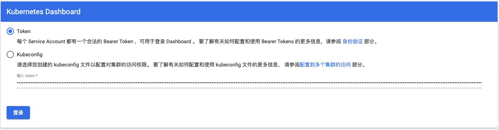

##### 6- 创建一个nginx服务
```shell
kubectl create deployment nginx  --image=nginx:1.14-alpine  
# 暴露端口  
kubectl expose deploy nginx  --port=80 --target-port=80  --type=NodePort  
# 查看服务  pod,svc
root@k8s-master:~# kubectl get svc
NAME         TYPE        CLUSTER-IP      EXTERNAL-IP   PORT(S)        AGE
kubernetes   ClusterIP   172.16.0.1      <none>        443/TCP        32m
nginx        NodePort    172.27.30.174   <none>        80:31685/TCP   2m30s

root@k8s-master:~# kubectl get pod
NAME                     READY   STATUS              RESTARTS   AGE
nginx-7cbb8cd5d8-476z4   0/1     ContainerCreating   0          3m31s
```
###  3 命令行工具 kubectl
#### 3.1 在任意节点使用 kubectl
```shell
# 1. 将 master 节点中 /etc/kubernetes/admin.conf 拷贝到需要运行的服务器的node节点的 /etc/kubernetes 目录中
sudo scp /etc/kubernetes/admin.conf xbu@k8s-node2:/home/xbu
sudo mv admin.conf /etc/kubernetes

# 2. 在对应的服务器上配置环境变量
echo "export KUBECONFIG=/etc/kubernetes/admin.conf" >> ~/.bash_profile
source ~/.bash_profile
```
#### 3.2 资源操作
##### 1 创建对象
```shell
$ kubectl create -f ./my-manifest.yaml           # 创建资源
$ kubectl create -f ./my1.yaml -f ./my2.yaml     # 使用多个文件创建资源
$ kubectl create -f ./dir                        # 使用目录下的所有清单文件来创建资源
$ kubectl create -f https://git.io/vPieo         # 使用 url 来创建资源
$ kubectl run nginx --image=nginx                # 启动一个 nginx 实例
$ kubectl explain pods,svc                       # 获取 pod 和 svc 的文档

# 从 stdin 输入中创建多个 YAML 对象
$ cat <<EOF | kubectl create -f -
apiVersion: v1
kind: Pod
metadata:
  name: busybox-sleep
spec:
  containers:
  - name: busybox
    image: busybox
    args:
    - sleep
    - "1000000"
---
apiVersion: v1
kind: Pod
metadata:
  name: busybox-sleep-less
spec:
  containers:
  - name: busybox
    image: busybox
    args:
    - sleep
    - "1000"
EOF

# 创建包含几个 key 的 Secret
$ cat <<EOF | kubectl create -f -
apiVersion: v1
kind: Secret
metadata:
  name: mysecret
type: Opaque
data:
  password: $(echo "s33msi4" | base64)
  username: $(echo "jane" | base64)
EOF
```
##### 2 显示和查找资源
```shell
# Get commands with basic output
$ kubectl get services                          # 列出所有 namespace 中的所有 service
$ kubectl get pods --all-namespaces             # 列出所有 namespace 中的所有 pod
$ kubectl get pods -o wide                      # 列出所有 pod 并显示详细信息
$ kubectl get deployment my-dep                 # 列出指定 deployment
$ kubectl get pods --include-uninitialized      # 列出该 namespace 中的所有 pod 包括未初始化的

# 使用详细输出来描述命令
$ kubectl describe nodes my-node
$ kubectl describe pods my-pod

$ kubectl get services --sort-by=.metadata.name # List Services Sorted by Name

# 根据重启次数排序列出 pod
$ kubectl get pods --sort-by='.status.containerStatuses[0].restartCount'

# 获取所有具有 app=cassandra 的 pod 中的 version 标签
$ kubectl get pods --selector=app=cassandra rc -o \
  jsonpath='{.items[*].metadata.labels.version}'

# 获取所有节点的 ExternalIP
$ kubectl get nodes -o jsonpath='{.items[*].status.addresses[?(@.type=="ExternalIP")].address}'

# 列出属于某个 PC 的 Pod 的名字
# “jq”命令用于转换复杂的 jsonpath，参考 https://stedolan.github.io/jq/
$ sel=${$(kubectl get rc my-rc --output=json | jq -j '.spec.selector | to_entries | .[] | "\(.key)=\(.value),"')%?}
$ echo $(kubectl get pods --selector=$sel --output=jsonpath={.items..metadata.name})

# 查看哪些节点已就绪
$ JSONPATH='{range .items[*]}{@.metadata.name}:{range @.status.conditions[*]}{@.type}={@.status};{end}{end}' \
 && kubectl get nodes -o jsonpath="$JSONPATH" | grep "Ready=True"

# 列出当前 Pod 中使用的 Secret
$ kubectl get pods -o json | jq '.items[].spec.containers[].env[]?.valueFrom.secretKeyRef.name' | grep -v null | sort | uniq
```
##### 3 更新资源
```shell
$ kubectl rolling-update frontend-v1 -f frontend-v2.json           # 滚动更新 pod frontend-v1
$ kubectl rolling-update frontend-v1 frontend-v2 --image=image:v2  # 更新资源名称并更新镜像
$ kubectl rolling-update frontend --image=image:v2                 # 更新 frontend pod 中的镜像
$ kubectl rolling-update frontend-v1 frontend-v2 --rollback        # 退出已存在的进行中的滚动更新
$ cat pod.json | kubectl replace -f -                              # 基于 stdin 输入的 JSON 替换 pod

# 强制替换，删除后重新创建资源。会导致服务中断。
$ kubectl replace --force -f ./pod.json

# 为 nginx RC 创建服务，启用本地 80 端口连接到容器上的 8000 端口
$ kubectl expose rc nginx --port=80 --target-port=8000

# 更新单容器 pod 的镜像版本（tag）到 v4
$ kubectl get pod mypod -o yaml | sed 's/\(image: myimage\):.*$/\1:v4/' | kubectl replace -f -

$ kubectl label pods my-pod new-label=awesome                      # 添加标签
$ kubectl annotate pods my-pod icon-url=http://goo.gl/XXBTWq       # 添加注解
$ kubectl autoscale deployment foo --min=2 --max=10                # 自动扩展 deployment “foo”
```
##### 4 修补资源
```shell
$ kubectl patch node k8s-node-1 -p '{"spec":{"unschedulable":true}}' # 部分更新节点

# 更新容器镜像； spec.containers[*].name 是必须的，因为这是合并的关键字
$ kubectl patch pod valid-pod -p '{"spec":{"containers":[{"name":"kubernetes-serve-hostname","image":"new image"}]}}'

# 使用具有位置数组的 json 补丁更新容器镜像
$ kubectl patch pod valid-pod --type='json' -p='[{"op": "replace", "path": "/spec/containers/0/image", "value":"new image"}]'

# 使用具有位置数组的 json 补丁禁用 deployment 的 livenessProbe
$ kubectl patch deployment valid-deployment  --type json   -p='[{"op": "remove", "path": "/spec/template/spec/containers/0/livenessProbe"}]'
```
##### 5 编辑资源
```shell
$ kubectl edit svc/docker-registry                      # 编辑名为 docker-registry 的 service
$ KUBE_EDITOR="nano" kubectl edit svc/docker-registry   # 使用其它编辑器
```
##### 6 scale资源
```shell
$ kubectl scale --replicas=3 rs/foo                                 # Scale a replicaset named 'foo' to 3
$ kubectl scale --replicas=3 -f foo.yaml                            # Scale a resource specified in "foo.yaml" to 3
$ kubectl scale --current-replicas=2 --replicas=3 deployment/mysql  # If the deployment named mysql's current size is 2, scale mysql to 3
$ kubectl scale --replicas=5 rc/foo rc/bar rc/baz                   # Scale multiple replication controllers
```
scale机制完成Pod的扩容和缩容
```shell
# scale机制完成Pod的扩容和缩容
xbu@k8s-master:~/k8s$ kubectl scale deploy --replicas=3 nginx
deployment.apps/nginx scaled
xbu@k8s-master:~/k8s$ kubectl get deploy
NAME    READY   UP-TO-DATE   AVAILABLE   AGE
nginx   2/3     3            2           28d
# 查看 pods
xbu@k8s-master:~/k8s$ kubectl get po -o wide
NAME                     READY   STATUS    RESTARTS   AGE   IP            NODE        NOMINATED NODE   READINESS GATES
nginx-7cbb8cd5d8-476z4   1/1     Running   0          28d   192.168.2.3   k8s-node3   <none>           <none>
nginx-7cbb8cd5d8-64qs6   1/1     Running   0          37s   192.168.1.5   k8s-node2   <none>           <none>
nginx-7cbb8cd5d8-fjqzq   1/1     Running   0          36s   192.168.2.4   k8s-node3   <none>           <none>
```
获取配置信息 `kubectl get deploy nginx -o yaml` ，我们自己写配置文件的时候主要是 spec 部分的内容
```shell
xbu@k8s-master:~/k8s$ kubectl get deploy nginx -o yaml
apiVersion: apps/v1
kind: Deployment
metadata:
  annotations:
    deployment.kubernetes.io/revision: "1"
  creationTimestamp: "2023-09-13T10:38:26Z"
  generation: 2
  labels:
    app: nginx
  name: nginx
  namespace: default
  resourceVersion: "3597629"
  uid: 315bb516-d1a6-44b0-aacf-03b034691b31
spec:
  progressDeadlineSeconds: 600
  replicas: 3
  revisionHistoryLimit: 10
  selector:
    matchLabels:
      app: nginx
  strategy:
    rollingUpdate:
      maxSurge: 25%
      maxUnavailable: 25%
    type: RollingUpdate
  template:
    metadata:
      creationTimestamp: null
      labels:
        app: nginx
    spec:
      containers:
      - image: nginx:1.14-alpine
        imagePullPolicy: IfNotPresent
        name: nginx
        resources: {}
        terminationMessagePath: /dev/termination-log
        terminationMessagePolicy: File
      dnsPolicy: ClusterFirst
      restartPolicy: Always
      schedulerName: default-scheduler
      securityContext: {}
      terminationGracePeriodSeconds: 30
status:
  availableReplicas: 3
  conditions:
  - lastTransitionTime: "2023-09-19T03:21:25Z"
    lastUpdateTime: "2023-09-19T03:21:25Z"
    message: ReplicaSet "nginx-7cbb8cd5d8" has successfully progressed.
    reason: NewReplicaSetAvailable
    status: "True"
    type: Progressing
  - lastTransitionTime: "2023-10-12T10:09:56Z"
    lastUpdateTime: "2023-10-12T10:09:56Z"
    message: Deployment has minimum availability.
    reason: MinimumReplicasAvailable
    status: "True"
    type: Available
  observedGeneration: 2
  readyReplicas: 3
  replicas: 3
  updatedReplicas: 3
```
##### 7 删除资源
```shell
$ kubectl delete -f ./pod.json                                              # 删除 pod.json 文件中定义的类型和名称的 pod
$ kubectl delete pod,service baz foo                                        # 删除名为“baz”的 pod 和名为“foo”的 service
$ kubectl delete pods,services -l name=myLabel                              # 删除具有 name=myLabel 标签的 pod 和 serivce
$ kubectl delete pods,services -l name=myLabel --include-uninitialized      # 删除具有 name=myLabel 标签的 pod 和 service，包括尚未初始化的
$ kubectl -n my-ns delete po,svc --all                                      # 删除 my-ns namespace 下的所有 pod 和 serivce，包括尚未初始化的
```

### 3.3 pod 与集群
#### 3.3.1 与运行的pod交互
```shell
$ kubectl logs my-pod                                 # dump 输出 pod 的日志（stdout）
$ kubectl logs my-pod -c my-container                 # dump 输出 pod 中容器的日志（stdout，pod 中有多个容器的情况下使用）
$ kubectl logs -f my-pod                              # 流式输出 pod 的日志（stdout）
$ kubectl logs -f my-pod -c my-container              # 流式输出 pod 中容器的日志（stdout，pod 中有多个容器的情况下使用）
$ kubectl run -i --tty busybox --image=busybox -- sh  # 交互式 shell 的方式运行 pod
$ kubectl attach my-pod -i                            # 连接到运行中的容器
$ kubectl port-forward my-pod 5000:6000               # 转发 pod 中的 6000 端口到本地的 5000 端口
$ kubectl exec my-pod -- ls /                         # 在已存在的容器中执行命令（只有一个容器的情况下）
$ kubectl exec my-pod -c my-container -- ls /         # 在已存在的容器中执行命令（pod 中有多个容器的情况下）
$ kubectl top pod POD_NAME --containers               # 显示指定 pod 和容器的指标度量
```

#### 3.3.2 与节点和集群交互
```shell
$ kubectl cordon my-node                                                # 标记 my-node 不可调度
$ kubectl drain my-node                                                 # 清空 my-node 以待维护
$ kubectl uncordon my-node                                              # 标记 my-node 可调度
$ kubectl top node my-node                                              # 显示 my-node 的指标度量
$ kubectl cluster-info                                                  # 显示 master 和服务的地址
$ kubectl cluster-info dump                                             # 将当前集群状态输出到 stdout                                    
$ kubectl cluster-info dump --output-directory=/path/to/cluster-state   # 将当前集群状态输出到 /path/to/cluster-state

# 如果该键和影响的污点（taint）已存在，则使用指定的值替换
$ kubectl taint nodes foo dedicated=special-user:NoSchedule
```

资源类型与别名
	pods：po
	deployments：deploy
	services：svc
	namespace：ns
	nodes：no
格式化输出
	输出 json 格式：-o json
	仅打印资源名称：-o name
	以纯文本格式输出所有信息：-o wide
	输出 yaml 格式：-o yaml

## 3- 深入 pod
### 3.1 pod 配置文件
#### 3.1.1 写pod配置文件
```yml
apiVersion: v1 # api 文档版本
kind: Pod  # 资源对象类型，也可以配置为像Deployment、StatefulSet这一类的对象
metadata: # Pod 相关的元数据，用于描述 Pod 的数据
  name: nginx-demo # Pod 的名称
  labels: # 定义 Pod 的标签
    type: app # 自定义 label 标签，名字为 type，值为 app
    test: 1.0.0 # 自定义 label 标签，描述 Pod 版本号
  namespace: 'default' # 命名空间的配置
spec: # 期望 Pod 按照这里面的描述进行创建
  containers: # 对于 Pod 中的容器描述
  - name: nginx # 容器的名称
    image: nginx:1.7.9 # 指定容器的镜像
    imagePullPolicy: IfNotPresent # 镜像拉取策略，指定如果本地有就用本地的，如果没有就拉取远程的
    command: # 指定容器启动时执行的命令
    - nginx
    - -g
    - 'daemon off;' # nginx -g 'daemon off;'
    workingDir: /usr/share/nginx/html # 定义容器启动后的工作目录
    ports:
    - name: http # 端口名称
      containerPort: 80 # 描述容器内要暴露什么端口
      protocol: TCP # 描述该端口是基于哪种协议通信的
    env: # 环境变量
    - name: JVM_OPTS # 环境变量名称
      value: '-Xms128m -Xmx128m' # 环境变量的值
    resources:
      requests: # 最少需要多少资源
        cpu: 100m # 限制 cpu 最少使用 0.1 个核心
        memory: 128Mi # 限制内存最少使用 128兆
      limits: # 最多可以用多少资源
        cpu: 200m # 限制 cpu 最多使用 0.2 个核心
        memory: 256Mi # 限制 最多使用 256兆
  restartPolicy: OnFailure # 重启策略，只有失败的情况才会重启
```

#### 3.1.2 使用yaml文件创建 pod
```shell
xbu@k8s-master:~/k8s$ kubectl create -f nginx-demo.yaml 
pod/nginx-demo created
xbu@k8s-master:~/k8s$ kubectl get po
NAME                     READY   STATUS              RESTARTS   AGE
nginx-7cbb8cd5d8-476z4   1/1     Running             0          29d
nginx-7cbb8cd5d8-64qs6   1/1     Running             0          22h
nginx-7cbb8cd5d8-fjqzq   1/1     Running             0          22h
nginx-demo               0/1     ContainerCreating   0          26s

xbu@k8s-master:~/k8s$ kubectl get po -o wide
NAME                     READY   STATUS    RESTARTS   AGE     IP            NODE        NOMINATED NODE   READINESS GATES
nginx-7cbb8cd5d8-476z4   1/1     Running   0          29d     192.168.2.3   k8s-node3   <none>           <none>
nginx-7cbb8cd5d8-64qs6   1/1     Running   0          22h     192.168.1.5   k8s-node2   <none>           <none>
nginx-7cbb8cd5d8-fjqzq   1/1     Running   0          22h     192.168.2.4   k8s-node3   <none>           <none>
nginx-demo               1/1     Running   0          8m50s   192.168.1.6   k8s-node2   <none>           <none>
```

#### 3.1.3 查看指定 pod 信息
```shell
xbu@k8s-master:~/k8s$ kubectl describe po nginx-demo
Name:         nginx-demo
Namespace:    default
Priority:     0
Node:         k8s-node2/10.103.230.21
Start Time:   Fri, 13 Oct 2023 16:28:09 +0800
Labels:       test=1.0.0
              type=app
Annotations:  <none>
Status:       Running
IP:           192.168.1.6
IPs:
  IP:  192.168.1.6
Containers:
  nginx:
    Container ID:  docker://2e95b496056607301198741a308ea2d54eff5c1dae9bfba4ff6a5f7753497c75
    Image:         nginx:1.7.9
    Image ID:      docker-pullable://nginx@sha256:e3456c851a152494c3e4ff5fcc26f240206abac0c9d794affb40e0714846c451
    Port:          80/TCP
    Host Port:     0/TCP
    Command:
      nginx
      -g
      daemon off;
    State:          Running
      Started:      Fri, 13 Oct 2023 16:29:16 +0800
    Ready:          True
    Restart Count:  0
    Limits:
      cpu:     200m
      memory:  256Mi
    Requests:
      cpu:     100m
      memory:  128Mi
    Environment:
      JVM_OPTS:  -Xms128m -Xmx128m
    Mounts:
      /var/run/secrets/kubernetes.io/serviceaccount from kube-api-access-d7xm9 (ro)
Conditions:
  Type              Status
  Initialized       True 
  Ready             True 
  ContainersReady   True 
  PodScheduled      True 
Volumes:
  kube-api-access-d7xm9:
    Type:                    Projected (a volume that contains injected data from multiple sources)
    TokenExpirationSeconds:  3607
    ConfigMapName:           kube-root-ca.crt
    ConfigMapOptional:       <nil>
    DownwardAPI:             true
QoS Class:                   Burstable
Node-Selectors:              <none>
Tolerations:                 node.kubernetes.io/not-ready:NoExecute op=Exists for 300s
                             node.kubernetes.io/unreachable:NoExecute op=Exists for 300s
Events:
  Type    Reason     Age    From               Message
  ----    ------     ----   ----               -------
  Normal  Scheduled  2m34s  default-scheduler  Successfully assigned default/nginx-demo to k8s-node2
  Normal  Pulling    2m32s  kubelet            Pulling image "nginx:1.7.9"
  Normal  Pulled     89s    kubelet            Successfully pulled image "nginx:1.7.9" in 1m3.24745077s
  Normal  Created    88s    kubelet            Created container nginx
  Normal  Started    87s    kubelet            Started container nginx
```

#### 3.1.4 查看路由信息
```shell
xbu@k8s-master:~/k8s$ route -n
Kernel IP routing table
Destination     Gateway         Genmask         Flags Metric Ref    Use Iface
0.0.0.0         10.103.230.1    0.0.0.0         UG    20100  0        0 ens160
10.103.230.0    0.0.0.0         255.255.255.0   U     100    0        0 ens160
169.254.0.0     0.0.0.0         255.255.0.0     U     1000   0        0 ens160
172.17.0.0      0.0.0.0         255.255.0.0     U     0      0        0 docker0
192.168.1.0     192.168.1.0     255.255.255.0   UG    0      0        0 flannel.1
192.168.2.0     192.168.2.0     255.255.255.0   UG    0      0        0 flannel.1
```


### 3.2 探针
容器内应用的监测机制，根据不同的探针来判断容器应用当前的状态。
#### 3.2.1 类型
1. StartupProbe
   k8s 1.16 版本新增的探针，用于判断应用程序 **是否已经启动** 了。当配置了 startupProbe 后，会先禁用其他探针，直到 startupProbe 成功后，其他探针才会继续。

   作用：由于有时候不能准确预估应用一定是多长时间启动成功，因此配置另外两种方式不方便配置初始化时长来检测，而配置了 statupProbe 后，只有在应用启动成功了，才会执行另外两种探针，可以更加方便的结合使用另外两种探针使用。

```yaml
startupProbe:
  httpGet:
    path: /api/startup
    port: 80
```

2. LivenessProbe
   用于探测容器中的应用==**是否运行**==，如果探测失败，kubelet 会根据配置的重启策略进行重启，若没有配置，默认就认为容器启动成功，不会执行重启策略。

```yaml
livenessProbe:
  failureThreshold: 5
  httpGet:
    path: /health
    port: 8080
    scheme: HTTP
  initialDelaySeconds: 60
  periodSeconds: 10
  successThreshold: 1
  timeoutSeconds: 5
```

3. ReadinessProbe
   用于探测容器内的程序==**是否健康**==，它的返回值如果返回 success，那么就认为该容器已经完全启动，并且该容器是可以接收外部流量的。

```yaml
readinessProbe:
  failureThreshold: 3 # 错误次数
  httpGet:
    path: /ready
    port: 8181
    scheme: HTTP
  periodSeconds: 10 # 间隔时间
  successThreshold: 1
  timeoutSeconds: 1
```
#### 3.2.2 探测方式
1. ExecAction
   在容器内部**执行一个命令**，如果返回值为 0，则任务容器是健康的。

```yml
livenessProbe:
  exec:
    command:
      - cat
      - /health
```

2. TCPSocketAction
   通过 **tcp 连接监测**容器内端口是否开放，如果开放则证明该容器健康

```yml
livenessProbe:
  tcpSocket:
    port: 80
```

3. HTTPGetAction
   生产环境用的较多的方式，**发送 HTTP 请求**到容器内的应用程序，如果接口返回的状态码在 200~400 之间，则认为容器健康。

```yml
livenessProbe:
  failureThreshold: 5
  httpGet:
    path: /health
    port: 8080
    scheme: HTTP
    httpHeaders:
      - name: xxx
```

#### 3.2.3 参数配置
其他的一些参数配置
```yml
readinessProbe:
  httpGet:
    path: /ready
    port: 8181
    scheme: HTTP
  initialDelaySeconds: 60 # 初始化时间
  timeoutSeconds: 2 # 超时时间
  periodSeconds: 5 # 监测间隔时间
  successThreshold: 1 # 检查 1 次成功就表示成功
  failureThreshold: 2 # 监测失败 2 次就表示失败
```

### 3.3- 生命周期
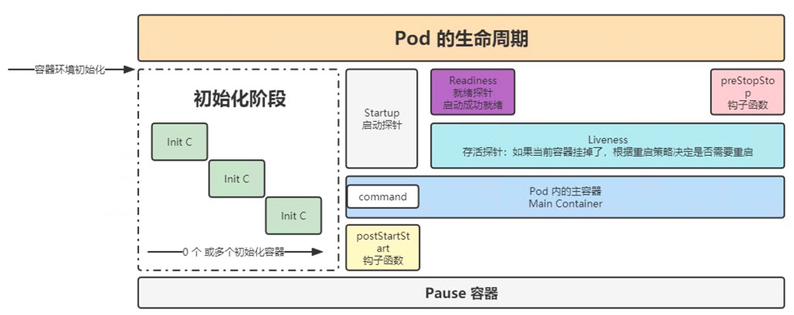

在pod创建完成后还有销毁前都可以执行一些操作：
1- Pod 退出流程的删除操作：

1. Endpoint 删除 pod 的 ip 地址
2. Pod 变成 Terminating 状态
	变为删除中的状态后，会给 pod 一个宽限期，让 pod 去执行一些清理或销毁操作。
	配置参数：
	```yaml
	<<<<<<< Updated upstream
	terminationGracePeriodSeconds: 30 # 作用与 pod 中的所有容器，30秒后再删除
	containers:
	```
	=======
	terminationGracePeriodSeconds: 30 # 作用与 pod 中的所有容器，30秒后再删除
	containers:
3. 执行 preStop 的指令

2- PreStop 的应用：
主要是注册中心下线、数据清理、数据销毁

```yaml
lifecycle:
  postStart: # 容创建完成后执行的动作，不能保证该操作一定在容器的 command 之前执行，一般不使用
    exec: # 可以是 exec / httpGet / tcpSocket
      command:
        - sh
        - -c
        - 'mkdir /data'
  preStop: # 在容器停止前执行的动作，用于资源回收
    httpGet: # 发送一个 http 请求
      path: /
      port: 80
    exec: # 执行一个命令
      command:
        - sh
        - -c
        - sleep 9
```

## 4- 资源调度
### 4.1 Label 和 Selector
#### 4.1.1 label
配置文件：在各类资源的 metadata.labels 中进行配置
使用label的相关命令：
```shell
# 临时创建 label
kubectl label po <资源名称> app=hello

# 修改已经存在的标签
kubectl label po <资源名称> app=hello2 --overwrite

# 查看 label
# selector 按照 label 单值查找节点
kubectl get po -A -l app=hello

# 查看所有节点的 labels
kubectl get po --show-labels
```

#### 4.1.2 选择器selector
配置文件：在各对象的配置 spec.selector 或其他可以写 selector 的属性中编写

有**基于等式和基于集合**的两种表达方式，可以多个条件进行组合使用
```shell
# 匹配单个值，查找 app=hello 的 pod
kubectl get po -A -l app=hello
xbu@k8s-master:~/k8s$ kubectl get po -A -l type=app --show-labels
NAMESPACE   NAME         READY   STATUS    RESTARTS   AGE   LABELS
default     nginx-demo   1/1     Running   0          12d   test=1.0.0,type=app


# 匹配多个值
kubectl get po -A -l 'k8s-app in (metrics-server, kubernetes-dashboard)'
xbu@k8s-master:~/k8s$ kubectl get po -A -l 'test in (1.0.0, 1.0.1)' --show-labels
NAMESPACE   NAME         READY   STATUS    RESTARTS   AGE   LABELS
default     nginx-demo   1/1     Running   0          12d   test=1.0.0,type=app

# 查找 version!=1 and app=nginx 的 pod 信息，与的关系，不是 or 的关系
kubectl get po -l version!=1,app=nginx

# 不等值 + 语句
kubectl get po -A -l version!=1,'app in (busybox, nginx)'
```

### 4.2 deployment
deployment：适用于无状态服务部署的控制器。

RC可以动态更新pod的副本数，但是没有办法使用selector。
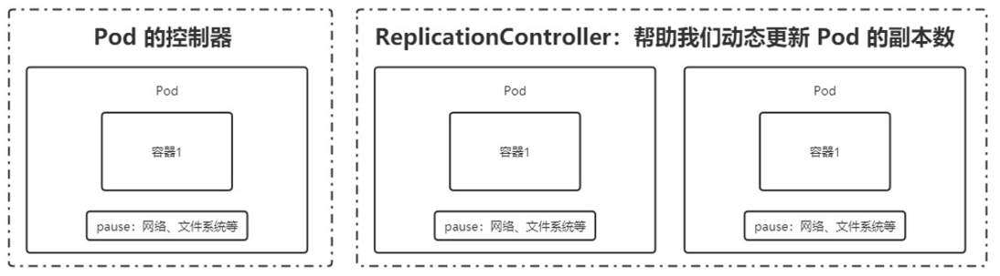

通常使用RS，可以使用selector选择。而deployment是更高的封装。
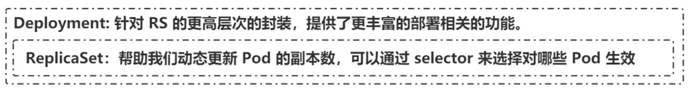

#### 4.2.1 创建 deployment
```shell
# 创建一个 deployment
kubectl create deploy nginx-deploy --image=nginx:1.7.9
# 或执行
kubectl create -f xxx.yaml --record
# --record 会在 annotation 中记录当前命令创建或升级了资源，后续可以查看做过哪些变动操作。

# 查看部署信息 kubectl get deployments
xbu@k8s-master:~/k8s/deployment$ kubectl get deploy
NAME           READY   UP-TO-DATE   AVAILABLE   AGE
nginx          3/3     3            3           42d
nginx-deploy   1/1     1            1           6m3s

# 查看 rs，kubectl get rs
xbu@k8s-master:~/k8s/deployment$ kubectl get rs
NAME                      DESIRED   CURRENT   READY   AGE
nginx-deploy-78d8bf4fd7   1         1         1       8m21s

# 查看 pod 以及展示标签，可以看到是关联的那个 rs，kubectl get pods --show-labels
xbu@k8s-master:~/k8s/deployment$ kubectl get po --show-labels
NAME                            READY   STATUS    RESTARTS   AGE   LABELS
nginx-deploy-78d8bf4fd7-vsl22   1/1     Running   0          12m   app=nginx-deploy,pod-template-hash=78d8bf4fd7

```
从上面分别查看deploy(nginx-deploy)、RS(nginx-deploy-78d8bf4fd7)、pod(nginx-deploy-78d8bf4fd7-vsl22)，可以看到**后缀在不断增加**，它是一层层嵌套，增加后缀来保证唯一性。
#### 4.2.2 滚动更新

只有修改了 deployment 配置文件中的 template 中的属性后，才会触发更新操作
```shell
# 使用更新命令
xbu@k8s-master:~/k8s/deployment$ kubectl edit deploy nginx-deploy
deployment.apps/nginx-deploy edited

# 但是只有修改了 deployment 配置文件中的 template 中的属性后，才会触发更新操作
# 使用 describe 查看信息，发现Events中并没有更新信息
xbu@k8s-master:~/k8s/deployment$ kubectl describe deploy nginx-deploy
Name:                   nginx-deploy
NewReplicaSet:   nginx-deploy-78d8bf4fd7 (1/1 replicas created)
Events:          <none>
```

再来个例子，将副本数 replicas: 3 改为3
```shell
xbu@k8s-master:~/k8s/deployment$ kubectl edit deploy nginx-deploy
apiVersion: apps/v1
kind: Deployment
metadata:
  labels:
    app: nginx-deploy
    test: "123"
  name: nginx-deploy
  namespace: default
spec:
  replicas: 3

deployment.apps/nginx-deploy edited

# 查看 deploy 变为了3
xbu@k8s-master:~/k8s/deployment$ kubectl get deploy --show-labels
NAME           READY   UP-TO-DATE   AVAILABLE   AGE     LABELS
nginx-deploy   3/3     3            3           4h36m   app=nginx-deploy,test=123

# 查看 RS 也变为了3
xbu@k8s-master:~/k8s/deployment$ kubectl get rs --show-labels
NAME                      DESIRED   CURRENT   READY   AGE     LABELS
nginx-deploy-78d8bf4fd7   3         3         3       4h37m   app=nginx-deploy,pod-template-hash=78d8bf4fd7

# 查看 pod 也变为了3个，但是它的 template 用的是同一个 template：78d8bf4fd7 
xbu@k8s-master:~/k8s/deployment$ kubectl get po --show-labels
NAME                            READY   STATUS    RESTARTS   AGE     LABELS
nginx-deploy-78d8bf4fd7-ltvln   1/1     Running   0          4m29s   app=nginx-deploy,pod-template-hash=78d8bf4fd7
nginx-deploy-78d8bf4fd7-vf9pc   1/1     Running   0          4m29s   app=nginx-deploy,pod-template-hash=78d8bf4fd7
nginx-deploy-78d8bf4fd7-vsl22   1/1     Running   0          4h39m   app=nginx-deploy,pod-template-hash=78d8bf4fd7
```

命令：
```shell
修改 nginx 版本号
kubectl set image deployment/nginx-deployment nginx=nginx:1.9.1

或者通过 kubectl edit deployment/nginx-deployment 进行修改

查看滚动更新的过程
kubectl rollout status deploy <deployment_name>

查看部署描述，最后展示发生的事件列表也可以看到滚动更新过程
kubectl describe deploy <deployment_name>
通过 kubectl get deployments 获取部署信息，UP-TO-DATE 表示已经有多少副本达到了配置中要求的数目
通过 kubectl get rs 可以看到增加了一个新的 rs
通过 kubectl get pods 可以看到所有 pod 关联的 rs 变成了新的
```

修改 deployment 配置文件中的 template 中的属性，触发更新操作
```shell
# 修改 nginx 版本号，或者通过 kubectl edit deployment/nginx-deployment 进行修改
kubectl set image deployment/nginx-deployment nginx=nginx:1.9.1
```

查看跟新
```shell
# 查看滚动更新的过程
xbu@k8s-master:~/k8s/deployment$ kubectl rollout status deploy nginx-deploy
deployment "nginx-deploy" successfully rolled out

# 查看部署描述，最后展示发生的 Events 事件列表也可以看到滚动更新过程
xbu@k8s-master:~/k8s/deployment$ kubectl describe deploy nginx-deploy
NewReplicaSet:   nginx-deploy-754898b577 (3/3 replicas created)
Events:
  Type    Reason             Age    From                   Message
  ----    ------             ----   ----                   -------
  Normal  ScalingReplicaSet  12m    deployment-controller  Scaled up replica set nginx-deploy-78d8bf4fd7 to 3
  Normal  ScalingReplicaSet  4m4s   deployment-controller  Scaled up replica set nginx-deploy-754898b577 to 1
  Normal  ScalingReplicaSet  2m55s  deployment-controller  Scaled down replica set nginx-deploy-78d8bf4fd7 to 2
  Normal  ScalingReplicaSet  2m54s  deployment-controller  Scaled up replica set nginx-deploy-754898b577 to 2
  Normal  ScalingReplicaSet  2m7s   deployment-controller  Scaled down replica set nginx-deploy-78d8bf4fd7 to 1
  Normal  ScalingReplicaSet  2m7s   deployment-controller  Scaled up replica set nginx-deploy-754898b577 to 3
  Normal  ScalingReplicaSet  2m4s   deployment-controller  Scaled down replica set nginx-deploy-78d8bf4fd7 to 0


# 通过 kubectl get deployments 获取部署信息，UP-TO-DATE 表示已经有多少副本达到了配置中要求的数目

# 通过 kubectl get rs 可以看到增加了一个新的 rs
xbu@k8s-master:~/k8s/deployment$ kubectl get rs --show-labels
NAME                      DESIRED   CURRENT   READY   AGE     LABELS
nginx-deploy-754898b577   3         3         3       6m16s   app=nginx-deploy,pod-template-hash=754898b577
nginx-deploy-78d8bf4fd7   0         0         0       4h49m   app=nginx-deploy,pod-template-hash=78d8bf4fd7

# 通过 kubectl get pods 可以看到所有 pod 关联的 rs 变成了新的 754898b577
xbu@k8s-master:~/k8s/deployment$ kubectl get po --show-labels
NAME                            READY   STATUS    RESTARTS   AGE     LABELS
nginx-deploy-754898b577-5c6gh   1/1     Running   0          6m8s    app=nginx-deploy,pod-template-hash=754898b577
nginx-deploy-754898b577-j76pk   1/1     Running   0          7m18s   app=nginx-deploy,pod-template-hash=754898b577
nginx-deploy-754898b577-zxkqs   1/1     Running   0          5m21s   app=nginx-deploy,pod-template-hash=754898b577
```

==多个滚动更新并行==
假设当前有 5 个 nginx:1.7.9 版本，你想将版本更新为 1.9.1，当更新成功第三个以后，你马上又将期望更新的版本改为 1.9.2，那么此时会立马删除之前的三个，并且立马开启更新 1.9.2 的任务。

#### 4.2.3 回滚
有时候你可能想回退一个Deployment，例如，当Deployment不稳定时，比如一直crash looping。
默认情况下，kubernetes会在系统中保存前两次的Deployment的rollout历史记录，以便你可以随时会退（你可以修改revision history limit来更改保存的revision数）。

案例：
```shell
# 1.更新 deployment 时参数不小心写错，如 将版本号nginx:1.9.1 写错成了 nginx:1.91
kubectl set image deployment/nginx-deploy nginx=nginx:1.91

# 2.监控滚动升级状态，由于镜像名称错误，下载镜像失败，因此更新过程会卡住
kubectl rollout status deployments nginx-deploy

# 3.结束监听后，获取 rs 信息，我们可以看到新增的 rs 副本数是 2 个
kubectl get rs

# 4.通过 kubectl get pods 获取 pods 信息，我们可以看到关联到新的 rs 的 pod，状态处于 ImagePullBackOff 状态
kubectl get pods

# 5.为了修复这个问题，我们需要找到需要回退的 revision 进行回退
# 6.通过 kubectl rollout history deployment/nginx-deploy 可以获取 revison 的列表
kubectl rollout history deployment/nginx-deploy

# 7.通过 kubectl rollout history deployment/nginx-deploy --revision=2 可以查看详细信息
kubectl rollout history deployment/nginx-deploy --revision=2

# 8.确认要回退的版本后，可以通过 kubectl rollout undo deployment/nginx-deploy 可以回退到上一个版本
kubectl rollout undo deployment/nginx-deploy

# 9.也可以回退到指定的 revision
kubectl rollout undo deployment/nginx-deploy --to-revision=2

# 10.再次通过 kubectl get deployment 和 kubectl describe deployment 可以看到，我们的版本已经回退到对应的 revison 上了
kubectl describe deployment

# 11.可以通过设置 .spec.revisonHistoryLimit 来指定 deployment 保留多少 revison，如果设置为 0，则不允许 deployment 回退了。
```

`kubectl describe deployment` 查看回滚过程：
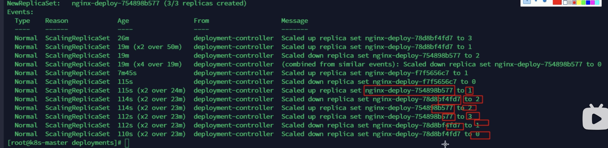

#### 4.2.4 扩容与缩容
通过 kube scale 命令可以进行自动扩容/缩容，以及通过 kube edit 编辑 replicas 也可以实现扩容/缩容。扩容与缩容只是直接创建副本数，没有更新 pod template 因此不会创建新的 rs。

#### 4.2.5  暂停与恢复
由于每次对 pod template 中的信息发生修改后，都会触发更新 deployment 操作，那么此时如果频繁修改信息，就会产生多次更新，而实际上只需要执行最后一次更新即可，当出现此类情况时我们就可以暂停 deployment 的 rollout

```shell
# 通过 kubectl rollout pause deployment <name> 就可以实现暂停，直到你下次恢复后才会继续进行滚动更新

# 尝试对容器进行修改，然后查看是否发生更新操作了
kubectl set image deploy <name> nginx=nginx:1.17.9
kubectl get po 

# 通过以上操作可以看到实际并没有发生修改，此时我们再次进行修改一些属性，如限制 nginx 容器的最大cpu为 0.2 核，最大内存为 128M，最小内存为 64M，最小 cpu 为 0.1 核
kubectl set resources deploy <deploy_name> -c <container_name> --limits=cpu=200m,memory=128Mi --requests=cpu100m,memory=64Mi

# 通过格式化输出 kubectl get deploy <name> -o yaml，可以看到配置确实发生了修改，再通过 kubectl get po 可以看到 pod 没有被更新

# 那么此时我们再恢复 rollout，通过命令 kubectl rollout deploy <name>

# 恢复后，我们再次查看 rs 和 po 信息，我们可以看到就开始进行滚动更新操作了
kubectl get rs
kubectl get po
```

#### 4.2.6 deploy配置文件
通过 ` kubectl get deploy nginx-deploy -o yaml` 获取nginx-deploy的配置文件（输出为yaml信息），分析 deploy.yaml 文件的各项配置参数：
```yaml
apiVersion: apps/v1
kind: Deployment # 资源类型为 deployment
metadata:
  labels:
    app: nginx-deploy
  name: nginx-deploy
  namespace: default
spec:
  replicas: 1 # 期望副本数
  revisionHistoryLimit: 10 # 进行滚动更新后，保留的历史版本数
  selector: # 用于找到匹配的 RS
    matchLabels: 
      app: nginx-deploy # 用来匹配上面的 app=nginx-deploy 的标签
  strategy: # 用来进行更新的策略
    rollingUpdate: # 滚动更新配置
      maxSurge: 25% # 滚动更新时，跟新的个数最多可以超过期望副本数的比例
      maxUnavailable: 25% # 最大不可用更新比例
    type: RollingUpdate # 采用滚动更新
  template: # template 主要就是描述创建的 pod 的信息
    metadata: # pod 元数据
      labels: # 创建pod的时候也有上面 selector 中对用的 label
        app: nginx-deploy
    spec: # 配置镜像
      containers:
      - image: nginx:1.7.9
        imagePullPolicy: IfNotPresent
        name: nginx # 容器名称
      restartPolicy: Always
      terminationGracePeriodSeconds: 30 # pod在删除的时候，在变成terminating状态时等待的时间，等待30秒再删除
```

### 4.3 StatefulSet

针对于**有状态服务**进行部署的控制器。
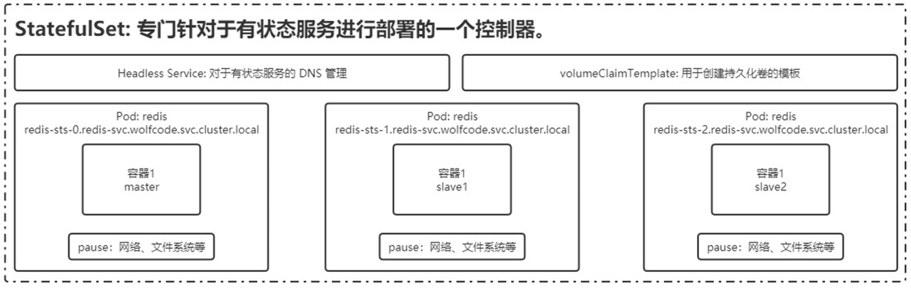

#### 4.3.1 配置文件
```yaml
--- # yaml格式中有三个“-”表示在yaml中嵌套了yaml
apiVersion: v1
kind: Service
metadata:
  name: nginx
  labels:
    app: nginx
spec:
  ports:
  - port: 80
    name: web
  clusterIP: None
  selector:
    app: nginx
---
apiVersion: apps/v1
kind: StatefulSet # 资源类型
metadata:
  name: web # StatefulSet对象的名字
spec:
  # # 使用nginx这个service来管理dns
  serviceName: "nginx" # 与上面嵌套的yaml中名字为nginx的service进行匹配
  replicas: 2
  selector:
    matchLabels:
      app: nginx
  template:
    metadata:
      labels:
        app: nginx
    spec:
      containers:
      - name: nginx
        image: nginx:1.7.9
        ports: # 容器内部要暴露的端口
        - containerPort: 80
          name: web # 该端口配置的名字，端口还有名字？
        volumeMounts: # 加载数据卷
        - name: www # 指定挂载哪个数据卷
          mountPath: /usr/share/nginx/html # 挂载到容器中的哪个目录
  volumeClaimTemplates: # 数据卷模板
  - metadata: # 数据卷描述
      name: www # 数据卷名称
      annotations: # 数据卷的注解
        volume.alpha.kubernetes.io/storage-class: anything
    spec: # 数据卷的规约
      accessModes: [ "ReadWriteOnce" ] # 数据卷的访问模式
      resources:
        requests:
          storage: 1Gi # 需要 1G 存储资源
```

#### 4.3.2 创建
上面的yaml文件进行直接创建是创建不成功的，查看描述信息发现**没有可用的PV，也没有设置存储类**。
```shell
xbu@k8s-master:~/k8s/statefulset$ kubectl describe pvc www-web-0
Name:          www-web-0
Namespace:     default
StorageClass:
Status:        Pending
Volume:
Labels:        app=nginx
Annotations:   volume.alpha.kubernetes.io/storage-class: anything
Finalizers:    [kubernetes.io/pvc-protection]
Capacity:
Access Modes:
VolumeMode:    Filesystem
Used By:       web-0
Events:
  Type    Reason         Age                   From                         Message
  ----    ------         ----                  ----                         -------
  Normal  FailedBinding  63s (x26 over 7m15s)  persistentvolume-controller  no persistent volumes available for this claim and no storage class is set
```

所以先把整个 volumeClaimTemplates 部分和容器挂载 volumeMounts 部分删除，后面讲PV的时候再具体讲。删除之前的，重新创建
```shell
# 删除 sts、svc、pvc
xbu@k8s-master:~/k8s/statefulset$ kubectl delete sts web
statefulset.apps "web" deleted
xbu@k8s-master:~/k8s/statefulset$ kubectl delete svc nginx
service "nginx" deleted
xbu@k8s-master:~/k8s/statefulset$ kubectl delete pvc www-web-0
persistentvolumeclaim "www-web-0" deleted

# 重新创建
xbu@k8s-master:~/k8s/statefulset$ kubectl create -f web.yaml
service/nginx created
statefulset.apps/web created

# 删除 volumeClaimTemplates 部分后会发现没有pvc了，现在先不用了
xbu@k8s-master:~/k8s/statefulset$ kubectl get pvc
No resources found in default namespace.
```

查看创建结果
```shell
xbu@k8s-master:~/k8s/statefulset$ kubectl get po,svc,sts
NAME        READY   STATUS    RESTARTS   AGE
pod/web-0   1/1     Running   0          46s
pod/web-1   1/1     Running   0          44s

NAME                 TYPE        CLUSTER-IP   EXTERNAL-IP   PORT(S)   AGE
service/kubernetes   ClusterIP   172.16.0.1   <none>        443/TCP   42d
service/nginx        ClusterIP   None         <none>        80/TCP    46s

NAME                   READY   AGE
statefulset.apps/web   2/2     46s
```

此时容器外是无法通过主机名来直接 ping 通刚才创建容器的
```shell
xbu@k8s-master:~/k8s/statefulset$ ping web-0
ping: web-0: Temporary failure in name resolution
```

此时我们另外再新创建一个容器，看这个容器能否找到刚才创建的web-0、web-1容器。
```shell
# 运行一个 pod，基础镜像为 busybox 工具包，利用里面的 nslookup 可以看到 dns 信息
# --rm：退出容器会自动删除
xbu@k8s-master:~/k8s/statefulset$ kubectl run -i --tty --image busybox dns-test --restart=Never --rm /bin/sh
If you don't see a command prompt, try pressing enter.
# 看到 / # 表示已经进入容器中，.nginx 是web中的service服务的名字
/ # ping web-0.nginx
PING web-0.nginx (192.168.2.8): 56 data bytes
64 bytes from 192.168.2.8: seq=0 ttl=64 time=0.683 ms
64 bytes from 192.168.2.8: seq=1 ttl=64 time=0.124 ms
64 bytes from 192.168.2.8: seq=2 ttl=64 time=0.131 ms
^C
--- web-0.nginx ping statistics ---
3 packets transmitted, 3 packets received, 0% packet loss
round-trip min/avg/max = 0.124/0.312/0.683 ms
```

ping web-0与web-1会发现IP不一样，是两台容器
```shell
/ # ping web-1.nginx
PING web-1.nginx (192.168.1.10): 56 data bytes
64 bytes from 192.168.1.10: seq=0 ttl=62 time=1.092 ms
64 bytes from 192.168.1.10: seq=1 ttl=62 time=2.027 ms
```

使用 nslookup 获取 dns信息
```shell
/ # nslookup web-0.nginx
Server:         172.16.0.10
Address:        172.16.0.10:53

** server can't find web-0.nginx: NXDOMAIN

*** Can't find web-0.nginx: No answer
```

上面的nslookup没有拿到回应，换个busybox 版本从新解析一下dns
```shell
xbu@k8s-master:~/k8s/statefulset$ kubectl run -it --image busybox:1.28.4 dns-test /bin/sh
If you don't see a command prompt, try pressing enter.
/ # nslookup web-0.nginx
Server:    172.16.0.10
Address 1: 172.16.0.10 kube-dns.kube-system.svc.cluster.local

Name:      web-0.nginx
Address 1: 192.168.2.8 web-0.nginx.default.svc.cluster.local
```

dns格式：web-0.nginx.default.svc.cluster.local
>StatefulSet 中每个 Pod 的 DNS 格式为 :
>statefulSetName-{0...N-1}.serviceName.namespace.svc.cluster.local
	serviceName：Headless Service 的名字
	0..N-1： Pod 所在的序号，从 0 开始到 N-1
	statefulSetName： StatefulSet 的名字
	namespace：服务所在的 namespace，Headless Servic 和 StatefulSet 必须在相同的 namespace
	.cluster.local：Cluster Domain

#### 4.3.3 扩容缩容
```shell
# 扩容
$ kubectl scale statefulset web --replicas=5
xbu@k8s-master:~/k8s/statefulset$ kubectl scale sts web --replicas=5
statefulset.apps/web scaled
xbu@k8s-master:~/k8s/statefulset$ kubectl get sts
NAME   READY   AGE
web    3/5     115m

# 缩容，使用json的写法
$ kubectl patch statefulset web -p '{"spec":{"replicas":3}}'
```

#### 4.3.4 镜像更新
镜像更新（目前还不支持直接更新 image，需要 patch 来间接实现）
```shell
# 操作是把这个 path 的镜像的值替换掉
kubectl patch sts web --type='json' -p='[{"op": "replace", "path": "/spec/template/spec/containers/0/image", "value":"nginx:1.9.1"}]'

# 还可以直接编辑yaml，修改镜像值 - image: nginx:1.9.1
xbu@k8s-master:~/k8s/statefulset$ kubectl edit sts web
statefulset.apps/web edited
```
##### 1. 滚动更新与灰度发布
StatefulSet  也可以采用滚动更新策略，同样是**修改 pod template 属性后会触发更新**，但是由于 pod 是有序的，在 StatefulSet 中更新时是基于 pod 的顺序**倒序更新的**。

==灰度发布(金丝雀发布)==
利用滚动更新中的 partition 属性，可以实现简易的灰度发布的效果
`kubectl edit sts web` 查看 updateStrategy 更新策略，此时 partition 值为0。
```yaml
updateStrategy:
    rollingUpdate:
      partition: 0
    type: RollingUpdate
```
partition 的作用：**只更新其中一部分 pod**。
例如我们有 5 个 pod，如果当前 partition 设置为 3，那么此时滚动更新时，只会更新那些 **序号 >= 3** 的 pod。利用该机制，我们可以通过控制 partition 的值，来决定只**更新其中一部分 pod**，确认没有问题后再主键增大更新的 pod 数量，最终实现全部 pod 更新。

##### 2. OnDelete
**只有在 pod 被删除时会进行更新操作**
通过 `kubectl edit sts web` 将 updateStrategy 更新策略改为 OnDelete
```yaml
updateStrategy:
    type: OnDelete
```
通过 `kubectl edit sts web` 将镜像版本改为 - image: nginx:1.7.9
```shell
# 此时查看 pod 的镜像仍然是 1.9.1
xbu@k8s-master:~/k8s/statefulset$ kubectl describe po web-4
Containers:
  nginx:
    Container ID:   docker://f4288569dfefc363f83c54567bc99625fee09c2b7d2f649ab72a7be81f8eb472
    Image:          nginx:1.9.1

# 当删除 web-4 后它会立即重新创建新的，但此时版本就是 1.7.9 了
xbu@k8s-master:~/k8s/statefulset$ kubectl delete po web-4
pod "web-4" deleted
xbu@k8s-master:~/k8s/statefulset$ kubectl describe po web-4
Containers:
  nginx:
    Container ID:   docker://07034b0545a245fab5f89b34658e0d70cebbc33518021940c5108bd0029e69a5
    Image:          nginx:1.7.9
```

#### 4.3.5 删除
删除 StatefulSet 和 Headless Service

##### 级联删除
删除 statefulset 时会同时删除 pods
```shell
kubectl delete statefulset web
```

##### 非级联删除
删除 statefulset 时**不会删除 pods**，删除 sts 后，pods 就没人管了，此时再删除 pod 不会重建的
```shell
kubectl deelte sts web --cascade=false
```

删除 service
```shell
kubectl delete service nginx
```

#### 4.3.6 删除PVC
StatefulSet删除后PVC还会保留着，数据不再使用的话也需要删除
```shell
kubectl delete pvc www-web-0 www-web-1
```

### 4.4 DaemonSet

DaemonSet：为每一个**匹配的节点**都部署一个**守护进程**。
情景：有多个服务部署在多个节点上，每个服务都会有日志，查看日志时不可能登录到每个节点去查看对应的日志。所以在**某一个节点部署一个elasticsearch**，在**每一个服务节点部署fluentd服务**来收集日志，然后将收集的**日志发给ES**。这种情况就会存在将**某些节点**需要部署一些**特定的服务**，此时就可以使用 DaemonSet 指定节点类型 `nodeSelector: svc_type=microsvc` 来在某些节点部署特定的服务。
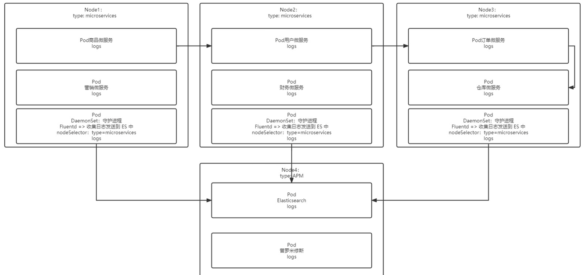

#### 4.4.1 配置文件

```yaml
apiVersion: apps/v1
kind: DaemonSet # 资源对象
metadata:
  name: fluentd
spec:
  selector:
    matchLabels: # 和 pod 形成关联
      app: logging
  template:
    metadata:
      labels:
        app: logging
        id: fluentd
      name: fluentd # pod 名字
    spec:
      containers:
      - name: fluentd-es # 容器名字
        image: agilestacks/fluentd-elasticsearch:v1.3.0
        env: # 环境变量配置
         - name: FLUENTD_ARGS # 环境变量的 key
           value: -qq # 环境变量的 value
        volumeMounts: # 挂载的数据卷
         - name: containers # 数据卷的名字
           mountPath: /var/lib/docker/containers
         - name: varlog
           mountPath: /varlog
      volumes: # 定义数据卷
         - hostPath: # 数据卷类型：主机路径的模式，与 node 共享目录
             path: /var/lib/docker/containers # node中的共享目录
           name: containers # 数据卷的名字
         - hostPath:
             path: /var/log
           name: varlog
```

上面的yaml文件直接进行创建，它会在每个节点上都自动部署fluentd pod，是因为没有指定节点选择器nodeSelector。
```shell
xbu@k8s-master:~/k8s/daemonset$ kubectl get po,sts,svc -o wide
NAME                READY   STATUS    RESTARTS      AGE    IP             NODE        NOMINATED NODE   READINESS GATES
pod/fluentd-82qr7   1/1     Running   0             2m1s   192.168.1.17   k8s-node2   <none>           <none>
pod/fluentd-9mvl2   1/1     Running   0             2m1s   192.168.2.14   k8s-node3   <none>           <none>
```
#### 4.4.2 nodeSelector
首先给node2节点添加标签
```shell
xbu@k8s-master:~/k8s/daemonset$ kubectl label no k8s-node2 type=microservices
node/k8s-node2 labeled

# 查看节点标签，发现 节点2 多了标签 type=microservices
xbu@k8s-master:~/k8s/daemonset$ kubectl get nodes --show-labels
NAME         STATUS   ROLES                  AGE   VERSION   LABELS
k8s-node2    Ready    <none>                 43d   v1.23.6   beta.kubernetes.io/arch=amd64,beta.kubernetes.io/os=linux,kubernetes.io/arch=amd64,kubernetes.io/hostname=k8s-node2,kubernetes.io/os=linux,type=microservices
```

然后在 daemonset 配置中添加节点选择器
```shell
xbu@k8s-master:~/k8s/daemonset$ kubectl edit ds fluentd
daemonset.apps/fluentd edited
```

```yaml
spec:
  template:
    spec:
      nodeSelector: # 容器这一级别添加节点选择器
        type: microservices # 标签是刚才节点2添加的标签
      containers:
```

此时再去查看ds，发现只有有标签的node2节点上部署了fluentd 的 pod。
```shell
xbu@k8s-master:~/k8s/daemonset$ kubectl get ds
NAME      DESIRED   CURRENT   READY   UP-TO-DATE   AVAILABLE   NODE SELECTOR        AGE
fluentd   1         1         1       1            1           type=microservices   139m

xbu@k8s-master:~/k8s/daemonset$ kubectl get po -o wide
NAME            READY   STATUS    RESTARTS      AGE     IP             NODE        NOMINATED NODE   READINESS GATES
fluentd-gb9b5   1/1     Running   0             3m12s   192.168.1.18   k8s-node2   <none>           <none>
```

此时给node3也加上type=microservices标签，会发现自动也给node3创建了一个fluentd 的 pod。
```shell
xbu@k8s-master:~/k8s/daemonset$ kubectl label no k8s-node3 type=microservices
node/k8s-node3 labeled
xbu@k8s-master:~/k8s/daemonset$ kubectl get po -o wide
NAME            READY   STATUS    RESTARTS      AGE     IP             NODE        NOMINATED NODE   READINESS GATES
fluentd-5dl4v   1/1     Running   0             9s      192.168.2.15   k8s-node3   <none>           <none>
fluentd-gb9b5   1/1     Running   0             6m47s   192.168.1.18   k8s-node2   <none>           <none>
```

#### 4.4.3 滚动更新

```shell
# 查看 daemonset fluentd 的配置
xbu@k8s-master:~/k8s/daemonset$ kubectl get ds fluentd -o yaml

# 其中更新策略为滚动更新
updateStrategy:
    rollingUpdate:
      maxSurge: 0
      maxUnavailable: 1
    type: RollingUpdate
```

不过不建议使用 RollingUpdate，建议使用 OnDelete 模式，这样避免频繁更新 ds。如下：
```yaml
updateStrategy:
    type: OnDelete
```

#### 4.4.4 HPA 自动扩/缩容

Horizontal Pod Autoscaler（HPA） 水平pod自动扩容：通过观察 pod 的 cpu、内存使用率或自定义 metrics 指标进行自动的扩容或缩容 pod 的数量。通常用于 Deployment、statefulset，不适用于无法扩/缩容的对象，如 DaemonSet，daemonset是作用于节点，节点是物理主机。
控制管理器每隔30s（可以通过–horizontal-pod-autoscaler-sync-period修改）查询metrics的资源使用情况。

支持三种metrics类型：
- 预定义metrics（比如Pod的CPU）以利用率的方式计算
- 自定义的Pod metrics，以原始值（raw value）的方式计算
- 自定义的object metrics

支持两种metrics查询方式：Heapster和自定义的REST API
支持多metrics
##### 开启指标服务
```shell
# 下载 metrics-server 组件配置文件
wget https://github.com/kubernetes-sigs/metrics-server/releases/latest/download/components.yaml -O metrics-server-components.yaml

# 修改镜像地址为国内的地址
sed -i 's/registry.k8s.io\/metrics-server/registry.cn-hangzhou.aliyuncs.com\/google_containers/g' metrics-server-components.yaml

# 修改容器的 tls 配置，不验证 tls，在 containers 的 args 参数中增加 --kubelet-insecure-tls 参数

# 安装组件
kubectl apply -f metrics-server-components.yaml

# 查看 pod 状态
kubectl get pods --all-namespaces | grep metrics
kube-system            metrics-server-577cb8cd69-dwn6d              1/1     Running   0              53s
```

##### cpu、内存指标监控
实现 cpu 或内存的监控，首先有个前提条件是该对象必须**配置了 resources.requests.cpu 或 resources.requests.memory** 才可以，可以配置当 cpu/memory 达到上述配置的百分比后进行扩容或缩容。
实现过程：
- 创建一个 HPA：
```shell
# 1.先准备一个好一个有做资源限制的 deployment
resources:
  limits:
	cpu: 200m
	memory: 128Mi
  requests:
	cpu: 100m
	memory: 128Mi

# 2.  执行命令，设置HPA自动扩容
xbu@k8s-master:~/k8s/deployment$ kubectl autoscale deploy nginx-deploy --cpu-percent=20 --min=2 --max=5
horizontalpodautoscaler.autoscaling/nginx-deploy autoscaled

# 3.通过 kubectl get hpa 可以获取 HPA 信息
xbu@k8s-master:~/k8s/deployment$ kubectl get hpa
NAME           REFERENCE                 TARGETS         MINPODS   MAXPODS   REPLICAS   AGE
nginx-deploy   Deployment/nginx-deploy   <unknown>/20%   2         5         2          3m16s
```
-  测试：
编写一个 nginx 服务 service用来被请求：
```yaml
apiVersion: v1
kind: Service
metadata:
  name: nginx-svc
  labels:
    app: nginx
spec:
  selector:
    app: nginx-deploy
  ports:
  - port: 80
    targetPort: 80
    name: web
  type: NodePort
```
```shell
xbu@k8s-master:~/k8s/deployment$ kubectl create -f nginx-svc.yaml

# 查看服务
xbu@k8s-master:~/k8s/deployment$ kubectl get svc
NAME         TYPE        CLUSTER-IP       EXTERNAL-IP   PORT(S)        AGE
kubernetes   ClusterIP   172.16.0.1       <none>        443/TCP        43d
nginx-svc    NodePort    172.18.246.227   <none>        80:31168/TCP   12m
```
编写循环测试脚本提升内存与 cpu 负载，在node节点中执行下面的死循环命令来增加负载：
```shell
xbu@k8s-node3:~$ while true; do wget -q -O- http://172.18.246.227:80 > /dev/null ; done
```
- 可以通过多台机器执行上述命令，增加负载，当超过负载后可以查看 pods 的扩容情况 kubectl get pods
```shell
# 查看 hpa 使用情况，已经 206%，副本数已经5个
xbu@k8s-master:~/k8s/deployment$ kubectl get hpa
NAME           REFERENCE                 TARGETS    MINPODS   MAXPODS   REPLICAS   AGE
nginx-deploy   Deployment/nginx-deploy   206%/20%   2         5         5          53m

# 此时可以发现已经自动扩容，增加了 3 个 pod
xbu@k8s-master:~/k8s/deployment$ kubectl get pods
NAME                          READY   STATUS    RESTARTS      AGE
nginx-deploy-c4986b7f-2tjqq   1/1     Running   0             7m58s
nginx-deploy-c4986b7f-87bwz   1/1     Running   0             7m58s
nginx-deploy-c4986b7f-chk5t   1/1     Running   0             9m1s
nginx-deploy-c4986b7f-pt6r8   1/1     Running   0             7m43s
nginx-deploy-c4986b7f-xfv6n   1/1     Running   0             8m57s
```
-  查看 pods 资源使用情况 kubectl top pods
```shell
# 查看 pods 资源使用情况
xbu@k8s-master:~/k8s/deployment$ kubectl top po
NAME                          CPU(cores)   MEMORY(bytes)
dns-test                      0m           0Mi
fluentd-5dl4v                 12m          38Mi
fluentd-gb9b5                 5m           38Mi
nginx-deploy-c4986b7f-2tjqq   5m           1Mi
nginx-deploy-c4986b7f-87bwz   27m          1Mi
nginx-deploy-c4986b7f-chk5t   22m          1Mi
nginx-deploy-c4986b7f-pt6r8   28m          1Mi
nginx-deploy-c4986b7f-xfv6n   5m           1Mi
```
- 扩容测试完成后，再关闭循环执行的指令，让 cpu 占用率降下来，然后过 5 分钟后查看自动缩容情况.

##### 自定义 metrics
- 控制管理器开启–horizontal-pod-autoscaler-use-rest-clients
- 控制管理器的–apiserver指向API Server Aggregator
- 在API Server Aggregator中注册自定义的metrics API

## 5- 服务发布
### 5.1 service
pod与service的区别：
Pod 是容器的封装，**Service 是网络抽象**。Pod 主要用于运行应用程序的容器，而 Service 主要用于**公开和暴露这些应用程序**以便其他应用程序可以访问它们。Service 本身**不是一个运行在容器内的应用程序**，而是 Kubernetes 群集的一部分，用于**管理和路由网络流量**。
在 Kubernetes 中，Service 主要用于以下目的：

- 服务发现：Service 提供了一种稳定的网络标识和 DNS 名称，以便其他应用程序可以轻松发现和访问运行在容器内的应用程序。
- 负载均衡：Service 可以配置为提供负载均衡，从而在一组运行相同应用程序的 Pod 之间均匀分发请求。这有助于提高可用性和扩展性。
- 端口转发：Service 允许将外部流量（例如，来自互联网的流量）路由到运行在 Pod 内的容器。通过 Service，您可以在集群中的多个 Pod 之间**共享相同的端口**。
- 稳定的网络标识：Service 具有稳定的虚拟 IP 地址和 DNS 名称，即使底层 Pod 更改或重新部署，Service 也会保持不变。

1. Service IP

   Service IP 地址用于在 Kubernetes 集群内部进行服务发现和通信。每个服务都分配了一个 IP 地址，客户端可以使用该 IP 地址访问服务，而无需了解服务的具体部署位置。
   Service IP 是通过 `--service-cidr` 标志在创建 Kubernetes 集群时指定的，它定义了服务 IP 地址的分配范围。通常，它是一个 IP 地址段，以 CIDR（Classless Inter-Domain Routing）无类域间路由表示法指定。**Service与其后端的Pod副本集群之间是通过Label Selector来实现“无缝对接”**。

2. Node IP
   Node IP 是集群中每个节点的**物理网卡IP地址**，是真实存在的物理网络，kubernetes集群之外的节点访问kubernetes内的某个节点或TCP/IP服务的时候，需要通过NodeIP进行通信。

3. Pod IP
   Pod IP是每个Pod的IP地址，是Docker Engine根据**docker0网桥的IP段地址进行分配的**，是一个虚拟二层网络，集群中一个Pod的容器访问另一个Pod中的容器，是通过Pod IP进行通信的，而**真实的TCP/IP流量是通过Node IP所在的网卡流出的**。

4. Cluster IP

   Cluster IP 是 Service IP 的一种特定类型，用于服务集群内部的通信。如果你使用默认的 Service 类型或明确指定了  `type: ClusterIP` ，那么 Service IP 就等同于 Cluster IP。

   1. Service的Cluster IP是一个**虚拟IP**，只作用于Service这个对象，由kubernetes管理和分配IP地址（来源于Cluster IP地址池）。
   2. Cluster IP**无法被ping通**，因为没有一个实体网络对象来响应。
   3. **Cluster IP结合Service Port组成的具体通信端口**才具备TCP/IP通信基础，属于kubernetes集群内，集群外访问该IP和端口需要额外处理。
   4. k8s集群内Node IP 、Pod IP、Cluster IP之间的通信采取k8s自己的**特殊的路由规则**，与传统IP路由不同。

首先查看一下之前部署的nginx服务
```shell
# 查看service，注意CLUSTER-IP
xbu@k8s-master:~/k8s/deployment$ kubectl get svc
NAME         TYPE        CLUSTER-IP       EXTERNAL-IP   PORT(S)        AGE
kubernetes   ClusterIP   172.16.0.1       <none>        443/TCP        43d
nginx-svc    NodePort    172.18.246.227   <none>        80:31168/TCP   47m

# 在不同节点的pod，IP也在不同网段
xbu@k8s-master:~/k8s/deployment$ kubectl get po -o wide -l app=nginx-deploy
NAME                          READY   STATUS    RESTARTS   AGE   IP             NODE        NOMINATED NODE   READINESS GATES
nginx-deploy-c4986b7f-2tjqq   1/1     Running   0          24m   192.168.2.19   k8s-node3   <none>           <none>
nginx-deploy-c4986b7f-csmj9   1/1     Running   0          30s   192.168.1.23   k8s-node2   <none>           <none>

# 查看一下 endpoint，是pod IP加上端口
xbu@k8s-master:~/k8s/deployment$ kubectl get ep
NAME         ENDPOINTS                         AGE
kubernetes   10.103.230.24:6443                43d
nginx-svc    192.168.1.23:80,192.168.2.19:80   47m
```

网络访问的具体过程：
发送命令后又api-server根据IP找到service，service找到endpoint，**endpoint会维护服务名与pod的<IP:port>的映射**，endpoint通过 iptables 转发找到目标服务器节点，目标服务器再找到对应的容器。
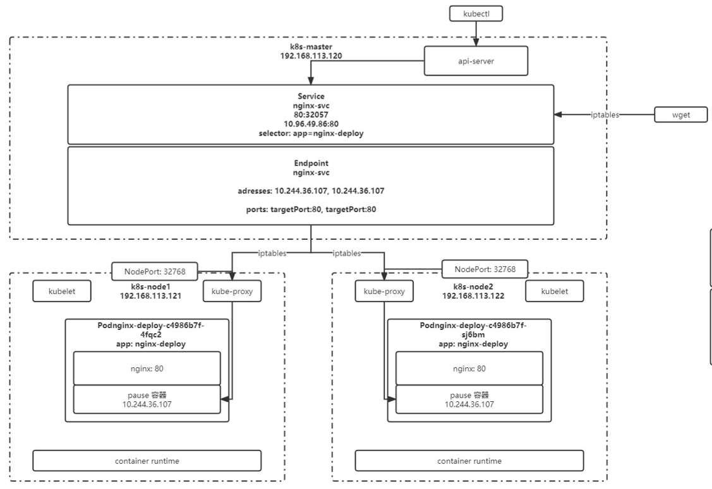


#### 5.1.1 service 定义

```yaml
apiVersion: v1
kind: Service # 资源类型为 service
metadata:
  name: nginx-svc # service 名字
  labels:
    app: nginx # service 自己本身的标签
spec:
  selector: # 选中当前 service 匹配哪些 pod，对哪些 pod 的东西流量进行代理
    app: nginx-deploy # 所有匹配到这个标签的pod都可以通过该service 进行访问
  ports: # 端口映射
  - name: http # service 端口配置的名称
    protocol: TCP # 端口绑定的协议，支持 TCP、UDP、SCTP，默认为 TCP
    port: 80 # service 自己的端口，在使用内网IP访问时使用
    targetPort: 9527 # 目标 pod 的端口
  - name: https
    port: 443
    protocol: TCP
    targetPort: 443
  type: NodePort # 随机启动一个端口(30000-32767)，映射到pod的端口
  # 该端口是直接绑定在 node 上的，并且集群中每一个 node 都会绑定这个端口
  # 也可以用于将服务暴露给外部访问，但是效率低，而且service是四层负载
```

命令操作：
```shell
# 创建 service
kubectl create -f nginx-svc.yaml

# 查看 service 信息，通过 service 的 cluster ip 进行访问
kubectl get svc 

# 查看 pod 信息，通过 pod 的 ip 进行访问
kubectl get po -o wide

# 创建其他 pod 通过 service name 进行访问（推荐）
kubectl exec -it busybox -- sh
curl http://nginx-svc

# 默认在当前 namespace 中访问，如果需要跨 namespace 访问 pod，则在 service name 后面加上 .<namespace> 即可
curl http://nginx-svc.default
```

通过 service name 进行访问（推荐）
```shell
# 创建其他 pod 通过 service name 进行访问（推荐）
xbu@k8s-master:~/k8s/services$ kubectl exec -it dns-test -- sh
/ # wget http://nginx-svc
Connecting to nginx-svc (172.18.246.227:80)
index.html           100% |***********************************************************************************|   612   0:00:00 ETA
/ # cat
.dockerenv  dev/        home/       proc/       sys/        usr/
bin/        etc/        index.html  root/       tmp/        var/
/ # cat index.html
```

默认在当前 namespace 中访问，如果需要跨 namespace 访问 pod，则在 service name 后面加上 .namespace 即可
```shell
curl http://nginx-svc.default
```

查看服务信息：
```shell
xbu@k8s-master:~/k8s/services$ kubectl describe svc nginx-svc
Name:                     nginx-svc
Namespace:                default
Labels:                   app=nginx
Annotations:              <none>
Selector:                 app=nginx-deploy
Type:                     NodePort
IP Family Policy:         SingleStack
IP Families:              IPv4
IP:                       172.18.246.227
IPs:                      172.18.246.227
Port:                     web  80/TCP
TargetPort:               80/TCP
NodePort:                 web  31168/TCP
Endpoints:                192.168.1.23:80,192.168.2.19:80
Session Affinity:         None
External Traffic Policy:  Cluster
Events:                   <none>
```

#### 5.1.2 代理外部服务
##### 1. 代理 k8s 外部服务

一些场景需要代理访问外部服务，如各环境访问名称统一、访问 k8s 集群外的其他服务、项目迁移。

请求service服务名会发现请求被转发到外网，此时访问的是aliyun.com的官网。

编辑 nginx-svc-external.yaml
```yaml
apiVersion: v1
kind: Service
metadata:
  name: nginx-svc-external
  labels:
    app: nginx
spec:
  ports:
  - port: 80
    targetPort: 80
    name: web
  type: ClusterIP
```


```shell
xbu@k8s-master:~/k8s/services$ kubectl create -f nginx-svc-external.yaml
service/nginx-svc-external created
xbu@k8s-master:~/k8s/services$ kubectl get svc
NAME                 TYPE        CLUSTER-IP       EXTERNAL-IP   PORT(S)        AGE
kubernetes           ClusterIP   172.16.0.1       <none>        443/TCP        44d
nginx-svc            NodePort    172.18.246.227   <none>        80:31168/TCP   3h14m
nginx-svc-external   ClusterIP   172.17.132.116   <none>        80/TCP         7s
xbu@k8s-master:~/k8s/services$ kubectl get ep
NAME         ENDPOINTS                         AGE
kubernetes   10.103.230.24:6443                44d
nginx-svc    192.168.1.23:80,192.168.2.19:80   3h15m
```

创建一个服务，发现并没有**对应的endpoint**，需要自己创建。

创建 endpoint 实现方式：

- 编写 service 配置文件时，不指定 selector 属性
endpoint 配置：
```yaml
apiVersion: v1
kind: Endpoints
metadata:
  labels:
    app: nginx # 必须与 service 一致
  name: nginx-svc-external # 与 service 一致
  namespace: default # 与 service 一致
subsets:
- addresses:
  # 106.11.253.83 aliyun.com
  - ip: 106.11.253.83 # 目标ip地址，访问 nginx-svc-external 服务会转发到这个IP上去
  ports: # 必须与 service 一致
  - name: web
    port: 80
    protocol: TCP
```

启动创建的 endpoint 的服务：
```shell
xbu@k8s-master:~/k8s/services$ kubectl create -f nginx-ep-external.yaml
endpoints/nginx-svc-external created
xbu@k8s-master:~/k8s/services$ kubectl get svc,ep
NAME                             TYPE           CLUSTER-IP       EXTERNAL-IP   PORT(S)        AGE
service/kubernetes               ClusterIP      172.16.0.1       <none>        443/TCP        46d
service/nginx-svc                NodePort       172.18.246.227   <none>        80:31168/TCP   2d19h
service/nginx-svc-external       ClusterIP      172.25.229.178   <none>        80/TCP         2d15h

NAME                           ENDPOINTS                         AGE
endpoints/kubernetes           10.103.230.24:6443                46d
endpoints/nginx-svc            192.168.1.23:80,192.168.2.19:80   2d19h
endpoints/nginx-svc-external   106.11.253.83:80                  2d15h

xbu@k8s-master:~/k8s/services$ kubectl describe ep nginx-svc-external
Name:         nginx-svc-external
Namespace:    default
Labels:       app=nginx
Annotations:  <none>
Subsets:
  Addresses:          106.11.253.83
  NotReadyAddresses:  <none>
  Ports:
    Name  Port  Protocol
    ----  ----  --------
    web   80    TCP

Events:  <none>
```

再次去请求服务名会发现此时访问的是aliyun.com的官网，请求被转发到外网。
```shell
/ # wget http://nginx-svc-external
Connecting to nginx-svc-external (172.25.229.178:80)
Connecting to www.taobao.com (112.132.36.116:80)
Connecting to www.taobao.com (150.138.252.179:443)
index.html           100% |***********************************************************************************| 95470   0:00:00 ETA

```

##### 2. 反向代理外部域名

大多数场景还是不写IP，而是访问域名。此时在创建服务时，直接配置service类型是ExternalName，就不用在创建对应的endpoint了，它会有一个对应的外部域名。
```yaml
apiVersion: v1
kind: Service
metadata:
  labels:
    app: aliyun-external-domain
  name: aliyun-external-domain
spec:
  type: ExternalName
  externalName: aliyun.com # 注意不是 www.aliyun.com
```

创建启动服务，发现它没有CLUSTER-IP，而是有一个EXTERNAL-IP(域名)
```shell
xbu@k8s-master:~/k8s/services$ kubectl create -f nginx-svc-externalname.yaml
service/aliyun-external-domain created

xbu@k8s-master:~/k8s/services$ kubectl get svc
NAME                     TYPE           CLUSTER-IP       EXTERNAL-IP      PORT(S)        AGE
aliyun-external-domain   ExternalName   <none>           www.aliyun.com   <none>         8s
nginx-svc-external       ClusterIP      172.25.229.178   <none>           80/TCP         17m
```

再次进入 busybox 容器中进行请求 aliyun-external-domain 服务名，发现会直接转发请求：
```shell
xbu@k8s-master:~/k8s/services$ kubectl exec -it dns-test -- sh
/ # wget aliyun-external-domain
Connecting to aliyun-external-domain (106.11.249.99:80)
Connecting to www.taobao.com (150.138.252.178:80)
Connecting to www.taobao.com (112.132.36.117:443)
index.html           100% |***********************************************************************************| 95295   0:00:00 ETA
```

#### 5.1.3 service常用类型
##### 1. ClusterIP
只能在集群内部使用，不配置类型的话默认就是 ClusterIP。
##### 2. ExternalName
返回定义的 CNAME 别名，可以配置为域名。
##### 3. NodePort
会在所有安装了 kube-proxy 的**节点都绑定一个端口**，此端口可以代理至对应的 Pod，集群外部可以使用任意节点 ip + NodePort 的端口号访问到集群中对应 Pod 中的服务。

当类型设置为 NodePort 后，可以在 ports 配置中增加 nodePort 配置指定端口，需要在下方的端口范围内，如果不指定会随机指定端口。

端口范围：30000~32767
端口范围配置在 /usr/lib/systemd/system/kube-apiserver.service 文件中

##### 4. LoadBalancer
使用云服务商（阿里云、腾讯云等）提供的负载均衡器服务，部署在aws上的wnm项目用的是这个服务类型。

### 5.2 Ingress

Ingress 做**外部服务的统一入口**，大家可以理解为也是一种 LoadBalancer 的抽象，它的实现也是支持 nginx、haproxy 等负载均衡服务的。Ingress相当于是nginx的一层封装，可以看成就是nginx。

Ingress 提供从集群外部到集群内服务的 HTTP 和 HTTPS 路由。 流量路由由 Ingress 资源所定义的规则来控制。

下面是 Ingress 的一个简单示例，可将所有流量都发送到同一 Service：

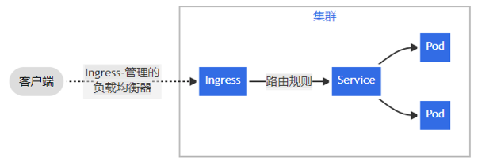

通过配置，Ingress 可为 Service 提供外部可访问的 URL、对其流量作负载均衡、 终止 SSL/TLS，以及基于名称的虚拟托管等能力。

ingress控制器。

如下有一些ingress控制器：

- [AKS 应用程序网关 Ingress 控制器](https://docs.microsoft.com/zh-cn/azure/application-gateway/tutorial-ingress-controller-add-on-existing?toc=https%3A%2F%2Fdocs.microsoft.com%2Fen-us%2Fazure%2Faks%2Ftoc.json&bc=https%3A%2F%2Fdocs.microsoft.com%2Fen-us%2Fazure%2Fbread%2Ftoc.json) 是一个配置 [Azure 应用程序网关](https://docs.microsoft.com/zh-cn/azure/application-gateway/overview) 的 Ingress 控制器。
- [阿里云 MSE Ingress](https://www.alibabacloud.com/help/zh/mse/user-guide/overview-of-mse-ingress-gateways) 是一个 Ingress 控制器，它负责配置[阿里云原生网关](https://www.alibabacloud.com/help/en/mse/product-overview/cloud-native-gateway-overview?spm=a2c63.p38356.0.0.20563003HJK9is)， 也是 [Higress](https://github.com/alibaba/higress) 的商业版本。
- [Apache APISIX Ingress 控制器](https://github.com/apache/apisix-ingress-controller) 是一个基于 [Apache APISIX 网关](https://github.com/apache/apisix) 的 Ingress 控制器。
- [HAProxy Ingress](https://haproxy-ingress.github.io/) 是一个针对 [HAProxy](https://www.haproxy.org/#desc) 的 Ingress 控制器。
- [Higress](https://github.com/alibaba/higress) 是一个基于 [Envoy](https://www.envoyproxy.io/) 的 API 网关， 可以作为一个 Ingress 控制器运行。
- [用于 Kubernetes 的 HAProxy Ingress 控制器](https://github.com/haproxytech/kubernetes-ingress#readme) 也是一个针对 [HAProxy](https://www.haproxy.org/#desc) 的 Ingress 控制器。
- [Istio Ingress](https://istio.io/latest/zh/docs/tasks/traffic-management/ingress/kubernetes-ingress/) 是一个基于 [Istio](https://istio.io/zh/) 的 Ingress 控制器。
- [用于 Kubernetes 的 NGINX Ingress 控制器](https://www.nginx.com/products/nginx-ingress-controller/) 能够与 [NGINX](https://www.nginx.com/resources/glossary/nginx/) 网页服务器（作为代理）一起使用。

简单扇出
一个扇出（Fanout）配置根据请求的 HTTP URI 将来**自同一 IP 地址的流量路由到多个 Service**。 Ingress 允许你将负载均衡器的数量降至最低。例如，这样的设置：

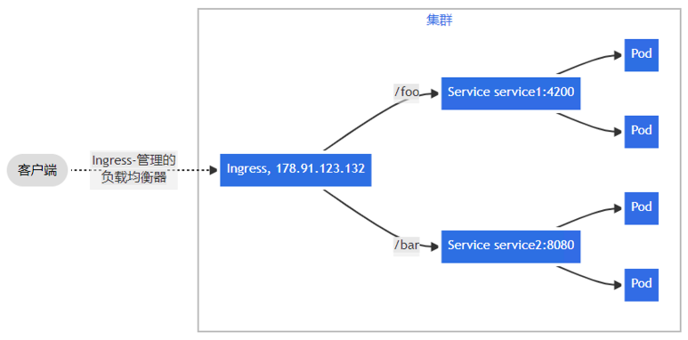

这将需要一个如下所示的 Ingress：

```yaml
apiVersion: networking.k8s.io/v1
kind: Ingress
metadata:
  name: simple-fanout-example
spec:
  rules:
  - host: foo.bar.com
    http:
      paths:
      - path: /foo
        pathType: Prefix
        backend:
          service:
            name: service1
            port:
              number: 4200
      - path: /bar
        pathType: Prefix
        backend:
          service:
            name: service2
            port:
              number: 8080
```

**基于名称的虚拟主机服务**
基于名称的虚拟主机支持将针对多个主机名的 HTTP 流量路由到同一 IP 地址上。

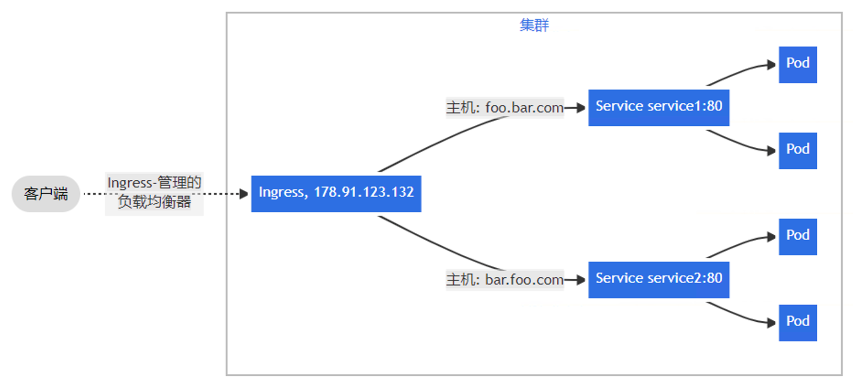

以下 Ingress 让后台负载均衡器基于 host 头部字段来路由请求。

```yaml
apiVersion: networking.k8s.io/v1
kind: Ingress
metadata:
  name: name-virtual-host-ingress
spec:
  rules:
  - host: foo.bar.com
    http:
      paths:
      - pathType: Prefix
        path: "/"
        backend:
          service:
            name: service1
            port:
              number: 80
  - host: bar.foo.com
    http:
      paths:
      - pathType: Prefix
        path: "/"
        backend:
          service:
            name: service2
            port:
              number: 80
```


#### 5.2.1 安装 ingress-nginx
1. 添加 helm 仓库

```shell
# 添加仓库
helm repo add ingress-nginx https://kubernetes.github.io/ingress-nginx

# 查看仓库列表
helm repo list

# 搜索 ingress-nginx
helm search repo ingress-nginx
```
2. 下载包

```shell
# 下载安装包
helm pull ingress-nginx/ingress-nginx
```
3. 配置参数

```shell
# 将下载好的安装包解压
tar xf ingress-nginx-xxx.tgz

# 解压后，进入解压完成的目录
cd ingress-nginx

# 修改 values.yaml
镜像地址：修改为国内镜像
registry: registry.cn-hangzhou.aliyuncs.com
image: google_containers/nginx-ingress-controller
image: google_containers/kube-webhook-certgen
tag: "v1.9.4"
# 仓库改了，把hash值也注释掉
#digest: sha256:5b161f051d017e55d358435f295f5e9a297e66158f136321d9b04520ec6c48a3
#digestChroot: sha256:5976b1067cfbca8a21d0ba53d71f83543a73316a61ea7f7e436d6cf84ddf9b26
# tag修改和上面的tag相同版本
tag: "v1.9.4"

修改部署配置的 kind: DaemonSet
nodeSelector:
  ingress: "true" # 增加选择器，如果 node 上有 ingress=true 就部署
  
hostNetwork: true
dnsPolicy: ClusterFirstWithHostNet

将 service 中的 type 由 LoadBalancer 修改为 ClusterIP，如果服务器是云平台才用 LoadBalancer
将 admissionWebhooks.enabled 修改为 false
```
4. 创建 Namespace

```shell
# 为 ingress 专门创建一个 namespace
kubectl create ns ingress-nginx
root@k8s-master:/opt/k8s/helm/ingress-nginx# kubectl create ns ingress-nginx
namespace/ingress-nginx created
```
5. 安装 ingress 控制器

```shell
# 为需要部署 ingress 的节点上加标签
kubectl label node k8s-node2 ingress=true

# 安装 ingress-nginx
helm install ingress-nginx ./ingress-nginx -n ingress-nginx
```

查看ingress-nginx空间的pod，可以看到创建了ingress 控制器：

```shell
root@k8s-master:/opt/k8s/helm# kubectl get po -n ingress-nginx -o wide
NAME                             READY   STATUS    RESTARTS   AGE    IP              NODE        NOMINATED NODE   READINESS GATES
ingress-nginx-controller-hx4q9   1/1     Running   0          106s   10.103.230.21   k8s-node2   <none>           <none>
```

#### 5.2.2 创建ingress

1. 编写配置ingress文件wolfcode-ingress.yaml，功能类似于创建了一个nginx服务。

```yaml
apiVersion: networking.k8s.io/v1 # 官方网络配置的api
kind: Ingress # 资源类型为 Ingress
metadata:
  name: wolfcode-nginx-ingress
  annotations:
    kubernetes.io/ingress.class: "nginx"
    nginx.ingress.kubernetes.io/rewrite-target: / # 匹配不到会重定向
spec:
  rules: # ingress 规则配置，可以配置多个
    - host: k8s.wolfcode.cn # 域名配置，可以使用通配符 *
    http:
      paths: # 相当于 nginx 的 location 配置，可以配置多个
      - pathType: Prefix # 路径类型，按照路径类型进行匹配 ImplementationSpecific 需要指定 IngressClass，具体匹配规则以 IngressClass 中的规则为准。Exact：精确匹配，URL需要与path完全匹配上，且区分大小写的。Prefix：以 / 作为分隔符来进行前缀匹配
        backend:
          service: 
            name: nginx-svc # 代理到哪个 service
            port: 
              number: 80 # service 的端口
        path: /api # 等价于 nginx 中的 location 的路径前缀匹配，可以使用正则表达
```

2. 创建ingress服务

```bash
 kubectl create -f wolfcode-ingress.yaml
# 查看ingress服务
xbu@k8s-master:~/k8s/ingress$ kubectl get ingress
NAME                     CLASS    HOSTS             ADDRESS         PORTS   AGE
wolfcode-nginx-ingress   <none>   k8s.wolfcode.cn   172.18.50.202   80      43d
```

3. 浏览器请求服务

在浏览器请求 k8s.wolfcode.cn/api，ingress会按照路径前缀匹配把请求转发给 nginx-svc 服务，如果匹配不到就会返回404。

>注意
>
>请求的时候要使用k8s.wolfcode.cn/api，如果使用 nodeIp/api请求，请求只会停留在ingress-nginx控制器，根本都没有到 nginx-svc 服务，猜测：虽然浏览器是使用IP向节点发送请求，但是ingress-nginx控制器收到请求后会根据请求头中携带的host做域名匹配，而IP根本匹配不到ingress服务中的规则里的host，所以请求根本到不了 nginx-svc 服务。

使用 `nginx.ingress.kubernetes.io/rewrite-target: /` 可以在匹配不到的时候重定向到k8s.wolfcode.cn/根目录，此时显示的就是nginx服务的初始页面。

#### 5.2.3 多域名配置

可以配置多路径和多host，ingress配置文件wolfcode-multi-ingress.yaml 如下：

```yaml
apiVersion: networking.k8s.io/v1
kind: Ingress # 资源类型为 Ingress
metadata:
  name: wolfcode-nginx-ingress
  annotations:
    kubernetes.io/ingress.class: "nginx"
    nginx.ingress.kubernetes.io/rewrite-target: /
spec:
  rules: # ingress 规则配置，可以配置多个
  - host: k8s.wolfcode.cn # 域名配置，可以使用通配符 *
    http:
      paths: # 相当于 nginx 的 location 配置，可以配置多个
      - pathType: Prefix # 路径类型，按照路径类型进行匹配 ImplementationSpecific 需要指定 IngressClass，具体匹配规则以 IngressClass 中的规则为准。Exact：精确匹配，URL需要与path完全匹配上，且区分大小写的。Prefix：以 / 作为分隔符来进行前缀匹配
        backend:
          service: 
            name: nginx-svc # 代理到哪个 service
            port: 
              number: 80 # service 的端口
        path: /api # 等价于 nginx 中的 location 的路径前缀匹配
      - pathType: Exec # 路径类型，按照路径类型进行匹配 ImplementationSpecific 需要指定 IngressClass，具体匹配规则以 IngressClass 中的规则为准。Exact：精确匹配>，URL需要与path完全匹配上，且区分大小写的。Prefix：以 / 作为分隔符来进行前缀匹配
        backend:
          service:
            name: nginx-svc # 代理到哪个 service
            port:
              number: 80 # service 的端口
        path: /
  - host: api.wolfcode.cn # 域名配置，可以使用通配符 *
    http:
      paths: # 相当于 nginx 的 location 配置，可以配置多个
      - pathType: Prefix # 路径类型，按照路径类型进行匹配 ImplementationSpecific 需要指定 IngressClass，具体匹配规则以 IngressClass 中的规则为准。Exact：精确匹配>，URL需要与path完全匹配上，且区分大小写的。Prefix：以 / 作为分隔符来进行前缀匹配
        backend:
          service:
            name: nginx-svc # 代理到哪个 service
            port:
              number: 80 # service 的端口
        path: /
```

## 6. 配置与存储

### 6.1. 配置管理

#### 6.1.1 ConfigMap

##### 1. 创建configMap

使用 kubectl create configmap -h 查看示例，构建 configmap 对象

```bash
xbu@k8s-master:~/k8s/configMap$ kubectl create configmap -h
Examples:
  # Create a new config map named my-config based on folder bar
  kubectl create configmap my-config --from-file=path/to/bar

  # Create a new config map named my-config with specified keys instead of file basenames on disk
  kubectl create configmap my-config --from-file=key1=/path/to/bar/file1.txt --from-file=key2=/path/to/bar/file2.txt

  # Create a new config map named my-config with key1=config1 and key2=config2
  kubectl create configmap my-config --from-literal=key1=config1 --from-literal=key2=config2

  # Create a new config map named my-config from the key=value pairs in the file
  kubectl create configmap my-config --from-file=path/to/bar

  # Create a new config map named my-config from an env file
  kubectl create configmap my-config --from-env-file=path/to/foo.env --from-env-file=path/to/bar.env
```

1. 基于文件夹创建一个名为my-config的配置映射，它是将目录下所有文件都加载为配置文件

   ```bash
   kubectl create configmap my-config --from-file=path/to/bar
   ```

2. 基于文件创建（用的最多）

   ```bash
   # key 是对源文件做了重命名，
   xbu@k8s-master:~/k8s/configMap$ kubectl create cm spring-boot-test-alises-yaml --from-file=app.yml=/home/xbu/k8s/configMap/application.yml
   configmap/spring-boot-test-alises-yaml created
   xbu@k8s-master:~/k8s/configMap$ kubectl get cm
   NAME                           DATA   AGE
   kube-root-ca.crt               1      96d
   spring-boot-test-alises-yaml   1      45s
   # 将 application.yml 重命名为 app.yml
   xbu@k8s-master:~/k8s/configMap$ kubectl describe configmaps spring-boot-test-alises-yaml
   Name:         spring-boot-test-alises-yaml
   Namespace:    default
   Labels:       <none>
   Annotations:  <none>
   
   Data
   ====
   app.yml:
   ----
   sping:
     application:
       name: test-app
   server:
     port: 8080
   
   
   BinaryData
   ====
   
   Events:  <none>
   ```

   

##### 2. 使用 configMap

1. 创建pod时将configMap中的键值用到容器中的变量中，编写 env-test-pod.yml 文件

   ```yaml
   apiVersion: v1
   kind: Pod
   metadata:
     name: test-env-po
   spec:
     restartPolicy: Never
     containers:
       - name: env-test
         image: alpine
         command: ["/bin/sh", "-c", "env;sleep 3600"]
         imagePullPolicy: IfNotPresent
         env: # 设置容器中的环境变量
         - name: JAVA_VM_OPIS # 容器中环境变量的 key
           valueFrom: # 容器中环境变量 key 的 value
             configMapKeyRef: # value 来自于 configMap 的键引用
               name: test-env-config # 来自于 test-env-config configMap
               key: JAVA_OPIS_TEST  # 来自于 test-env-config 的 JAVA_OPIS_TEST 键的值
         - name: APP
           valueFrom:
             configMapKeyRef:
               name: test-env-config
               key: APP_NAME 
   ```

   创建pod

   ```bash
   kubectl create -f env-test-pod.yml
   ```

创建 pod

2. 使用目录创建的configMap会将目录下的所有文件加载为配置文件，现在将configMap中的文件加载到容器中

   ```yaml
   apiVersion: v1
   kind: Pod
   metadata:
     name: test-configfile-po
   spec:
     restartPolicy: Never
     containers:
       - name: config-test
         image: alpine
         command: ["/bin/sh", "-c", "env;sleep 3600"]
         imagePullPolicy: IfNotPresent
         env: # 设置容器中的环境变量
         - name: JAVA_VM_OPIS # 容器中环境变量的 key
           valueFrom: # 容器中环境变量 key 的 value
             configMapKeyRef: # value 来自于 configMap 的键引用
               name: test-env-config # 来自于 test-env-config configMap
               key: JAVA_OPIS_TEST  # 来自于 test-env-config 的 JAVA_OPIS_TEST 键的值
         - name: APP
           valueFrom:
             configMapKeyRef:
               name: test-env-config
               key: APP_NAME
         volumeMounts: # 为容器挂载数据卷
         - name: db-config # 指定是哪一个数据卷
           mountPath: "/usr/local/mysql/conf" # 将数据卷挂载到容器的哪个目录
           readOnly: true # 是否只读
     volumes: # 数据卷挂载：configMap、secret
       - name: db-config # 数据卷的名字，可以随意设置
         configMap: # 数据卷类型为 configMap
           name: test-dir-config # 具体是哪一个configMap
           items: # 对 configMap 中的key进行映射，如果不指定，默认会讲configMap中所有的key全部转换为一个个同名的文件
           - key: "db.properties" # configMap 中的 key，（这个key的值是一个文件）
             path: "db.properties" # 将该 key 的值转换为文件
   ```

   创建 pod

   ```bash
   kubectl create -f file-test-pod.yml
   ```

#### 6.1.2 secret

用的不多，主要是加密

```bash
xbu@k8s-master:~/k8s/configMap$ kubectl create secret -h
Create a secret using specified subcommand.

Available Commands:
  docker-registry Create a secret for use with a Docker registry # 这种用的最多
  generic         Create a secret from a local file, directory, or literal value
  tls             Create a TLS secret

Usage:
  kubectl create secret [flags] [options]

Use "kubectl <command> --help" for more information about a given command.
Use "kubectl options" for a list of global command-line options (applies to all commands).
```

##### 1. docker-registry

```bash
xbu@k8s-master:~/k8s/configMap$ kubectl create secret docker-registry -h
Create a new secret for use with Docker registries.

  Dockercfg secrets are used to authenticate against Docker registries.

  When using the Docker command line to push images, you can authenticate to a given registry by running:
      '$ docker login DOCKER_REGISTRY_SERVER --username=DOCKER_USER --password=DOCKER_PASSWORD --email=DOCKER_EMAIL'.

 That produces a ~/.dockercfg file that is used by subsequent 'docker push' and 'docker pull' commands to authenticate to the registry. The email address is optional.

  When creating applications, you may have a Docker registry that requires authentication.  In order for the
  nodes to pull images on your behalf, they must have the credentials.  You can provide this information
  by creating a dockercfg secret and attaching it to your service account.

Examples:
  # If you don't already have a .dockercfg file, you can create a dockercfg secret directly by using:
  kubectl create secret docker-registry my-secret --docker-server=DOCKER_REGISTRY_SERVER --docker-username=DOCKER_USER
--docker-password=DOCKER_PASSWORD --docker-email=DOCKER_EMAIL

  # Create a new secret named my-secret from ~/.docker/config.json
  kubectl create secret docker-registry my-secret --from-file=.dockerconfigjson=path/to/.docker/config.json


Usage:
  kubectl create secret docker-registry NAME --docker-username=user --docker-password=password --docker-email=email
[--docker-server=string] [--from-file=[key=]source] [--dry-run=server|client|none] [options]
```

如何利用秘钥将远程仓库中的私有镜像拉取下来：

1. 创建一个secret

   ```bash
   xbu@k8s-master:~/k8s/configMap$ kubectl create secret docker-registry harbor-secret --docker-username=admin --docker-password=password --docker-email=buxuehu2017@gmail.com --docker-server=10.103.12.238:8858
   secret/harbor-secret created
   
   # 查看刚刚创建的secret
   xbu@k8s-master:~/k8s/configMap$ kubectl edit secret/harbor-secret
   # Please edit the object below. Lines beginning with a '#' will be ignored,
   # and an empty file will abort the edit. If an error occurs while saving this file will be
   # reopened with the relevant failures.
   #
   apiVersion: v1
   data:
     .dockerconfigjson: eyJhdXRocyI6eyIxMC4xMDMuMTIuMjM4Ojg4NTgiOnsidXNlcm5hbWUiOiJhZG1pbiIsInBhc3N3b3JkIjoicGFzc3dvcmQiLCJlbWFpbCI6ImJ1eHVlaHUyMDE3QGdtYWlsLmNvbSIsImF1dGgiOiJZV1J0YVc0NmNHRnpjM2R2Y21RPSJ9fX0=
   kind: Secret
   metadata:
     creationTimestamp: "2023-12-25T09:47:33Z"
     name: harbor-secret
     namespace: default
     resourceVersion: "13248456"
     uid: 22b45247-d06c-4ef3-902d-b6411bab1c3f
   type: kubernetes.io/dockerconfigjson
   
   # 解密 .dockerconfigjson 信息
   xbu@k8s-master:~/k8s/configMap$ echo 'eyJhdXRocyI6eyIxMC4xMDMuMTIuMjM4Ojg4NTgiOnsidXNlcm5hbWUiOiJhZG1pbiIsInBhc3N3b3JkIjoicGFzc3dvcmQiLCJlbWFpbCI6ImJ1eHVlaHUyMDE3QGdtYWlsLmNvbSIsImF1dGgiOiJZV1J0YVc0NmNHRnpjM2R2Y21RPSJ9fX0=' | base64 --decode
   {"auths":{"10.103.12.238:8858":{"username":"admin","password":"password","email":"buxuehu2017@gmail.com","auth":"YWRtaW46cGFzc3dvcmQ="}}}
   ```

2. 配置使用创建的 secret 拉取远程私有仓库镜像

   ```yaml
   apiVersion: v1
   kind: Pod
   metadata:
     name: private-image-pull-pod
   spec:
     restartPolicy: Never
     imagePullSecrets: # 配置登录仓库 docker registry 的 secret
     - name: harbor-secret # secret 为刚才创建的 harbor-secret
     containers:
       - name: nginx
         image: 10.103.12.238:8858/opensource/nginx:1.9.1 # 使用私有仓库镜像
         command: ["/bin/sh", "-c", "env;sleep 3600"]
         imagePullPolicy: IfNotPresent
         env: # 设置容器中的环境变量
         - name: JAVA_VM_OPIS # 容器中环境变量的 key
           valueFrom: # 容器中环境变量 key 的 value
             configMapKeyRef: # value 来自于 configMap 的键引用
               name: test-env-config # 来自于 test-env-config configMap
               key: JAVA_OPIS_TEST  # 来自于 test-env-config 的 JAVA_OPIS_TEST 键的值
         - name: APP
           valueFrom:
             configMapKeyRef:
               name: test-env-config
               key: APP_NAME
         volumeMounts: # 为容器挂载数据卷
         - name: db-config # 指定是哪一个数据卷
           mountPath: "/usr/local/mysql/conf" # 将数据卷挂载到容器的哪个目录
           readOnly: true # 是否只读
     volumes: # 数据卷挂载：configMap、secret
       - name: db-config # 数据卷的名字，可以随意设置
         configMap: # 数据卷类型为 configMap
           name: test-dir-config # 具体是哪一个configMap
           items: # 对 configMap 中的key进行映射，如果不指定，默认会讲configMap中所有的key全部转换为一个个同名的文件
           - key: "db.properties" # configMap 中的 key，（这个key的值是一个文件）
             path: "db.properties" # 将该 key 的值转换为文件
   ```

   

#### 6.1.3 SubPath

使用 ConfigMap 或 Secret 挂载到目录的时候，会将容器中源目录给覆盖掉，此时我们可能只想覆盖目录中的某一个文件，但是这样的操作会覆盖整个文件，因此需要使用到 SubPath。

配置方式：
定义 volumes 时需要增加 items 属性，配置 key 和 path，且 path 的值不能从 / 开始
在容器内的 volumeMounts 中增加 subPath 属性，该值与 volumes 中 items.path 的值相同

```yaml
containers:
  ......
  volumeMounts:
  - mountPath: /etc/nginx/nginx.conf # 挂载到哪里
    name: config-volume # 使用哪个 configmap 或 secret
    subPath: etc/nginx/nginx.conf # 与 volumes.[0].items.path 相同
volumes:
- configMap:
  name: nginx-conf # configMap 名字
  items: # subPath 配置
    key: nginx.conf # configMap 中的文件名
    path: etc/nginx/nginx.conf # subPath 路径
```


## helm 包管理器

### 2. helm架构


### 3. 安装helm

1. 下载二进制文件：https://get.helm.sh/helm-v3.2.3-linux-amd64.tar.gz
2. 解压(tar -zxvf helm-v3.10.2-linux-amd64.tar.gz)
3. 将解压目录下的 helm 程序移动到 usr/local/bin/helm
4. 添加阿里云 helm 仓库


