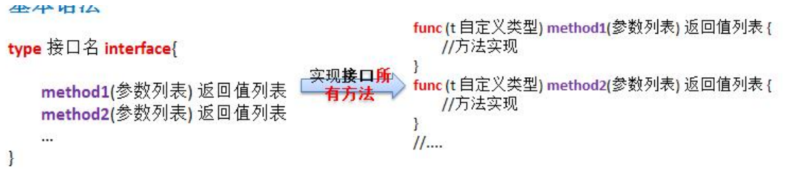
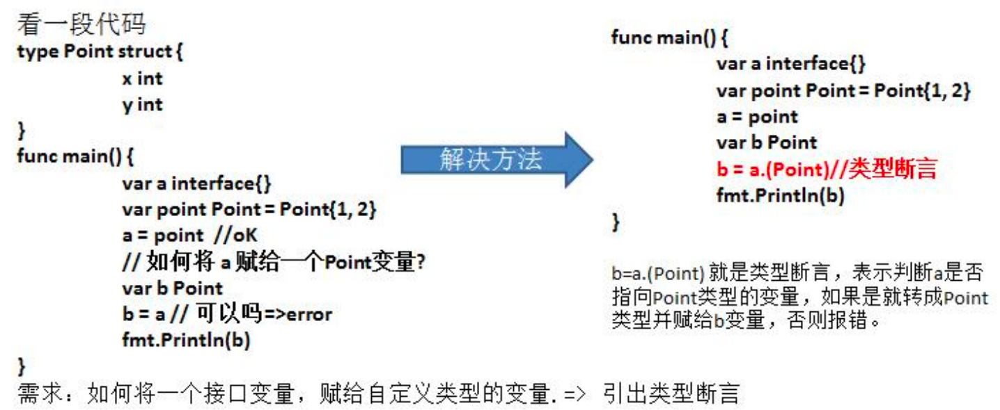
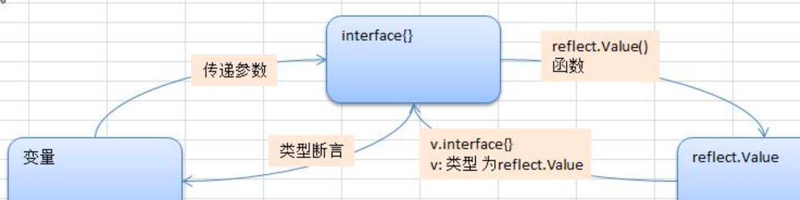
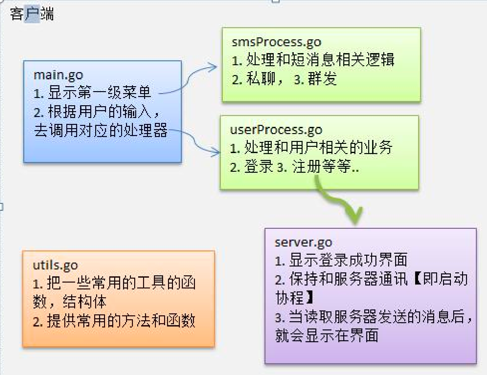

## 环境准备

### 1. 环境变量

在 `/etc/profile` 中配置环境变量：

```go
export GOROOT=/opt/go
export PATH=$PATH:$GOROOT/bin
export GOPATH=/Users/wirelessdev/code/go_project
```

### 2. 代理设置

在 Linux 或 macOS ，需要`运行下面命令`（或者，把以下命令写到 `.bashrc` 或 `.bash_profile` 文件中）：

```shell
# 启用 Go Modules 功能
go env -w GO111MODULE=on

# 配置 GOPROXY 环境变量，以下三选一
go env -w  GOPROXY=https://goproxy.cn,direct # 1. 七牛 CDN
go env -w GOPROXY=https://mirrors.aliyun.com/goproxy/,direct
#我是在.zshrc 中加上代理，export GOPROXY=https://mirrors.aliyun.com/goproxy/,direct
go env -w  GOPROXY=https://goproxy.io,direct # 3. 官方
```

Windows运行以下命令：

```shell
# 启用 Go Modules 功能
$env:GO111MODULE="on"

# 配置 GOPROXY 环境变量，以下三选一
$env:GOPROXY="https://goproxy.cn,direct"
$env:GOPROXY="https://mirrors.aliyun.com/goproxy/,direct"
$env:GOPROXY="https://goproxy.io,direct"
```

终端输入命令，确认配置成功

```shell
go env | grep GOPROXY
GOPROXY="https://goproxy.cn"
```

### 3. 私有模块

如果你使用的 Go 版本 >=1.13, 你可以通过设置 GOPRIVATE 环境变量来控制哪些私有仓库和依赖 (公司内部仓库) 不通过 proxy 来拉取，直接走本地，设置如下

```shell
# Go version >= 1.13
go env -w GOPROXY=https://goproxy.cn,direct
# 设置不走 proxy 的私有仓库，多个用逗号相隔
go env -w GOPRIVATE=*.corp.example.com
```

### 4. 清除模块缓存

`GO111MODULE=on` 以后，下载的模块内容会缓存在 `$GOPATH/pkg/mod` 目录中：


使用以下命令可清空缓存：`go clean --modcache`

### 5. 解决 sum.golang.org 连接超时

默认 GOSUMDB 的值为：`sum.golang.org`

使用 `go get` 或者 `go install` 命令时，即使我们设置了 `GOPROXY` 加速镜像，偶尔还是会遇到：

```shell
dlv: failed to install dlv(github.com/go-delve/delve/cmd/dlv@latest): Error: Command failed: /usr/local/bin/go install -v github.com/go-delve/delve/cmd/dlv@latest
go: downloading github.com/go-delve/delve v1.8.2
go: github.com/go-delve/delve/cmd/dlv@latest: github.com/go-delve/delve@v1.8.2: verifying module: github.com/go-delve/delve@v1.8.2: Get "https://sum.golang.org/lookup/github.com/go-delve/delve@v1.8.2": dial tcp 142.251.43.17:443: i/o timeout
```

原因
首先需要弄懂，执行以上提到的两个命令时，除了会从 GOPROXY 下载压缩包，还会调用 GOSUMDB 来检测文件哈希是否正确。此乃 Go Module 提供的安全机制，能有效防止代码被篡改。因国内访问外网不稳定 sum.golang.org 连接超时了，导致无法完成整个下载流程。

解决
解决方法同修改 GOPROXY 一样，我们设置一个国内能访问到的 GOSUMDB 即可。执行以下命令：

```shell
# linux或mac
go env -w GOSUMDB=sum.golang.google.cn
# Windows下
$env:GOPROXY="sum.golang.google.cn"
```

## Go 语言指针

### 1. 基础介绍

#### 1. 指针声明

指针声明格式如下：

```go
var var_name *var-type
```

var-type 为指针类型，var_name 为指针变量名，* 号用于指定变量是作为一个指针。以下是有效的指针声明：

```go
var ip *int        /* 指向整型*/
var fp *float32    /* 指向浮点型 */
```

#### 2. 如何使用指针

指针使用流程：

- 定义指针变量。
- 为指针变量赋值。
- 访问指针变量中指向地址的值。

在指针类型前面加上 * 号（前缀）来**获取指针所指向的内容**。

```go
package main

import "fmt"

func main() {
   var a int= 20   /* 声明实际变量 */
   var ip *int        /* 声明指针变量 */

   ip = &a  /* 指针变量的存储地址 */
   fmt.Printf("a 变量的地址是: %x\n", &a  )
   /* 指针变量的存储地址 */
   fmt.Printf("ip 变量储存的指针地址: %x\n", ip )
   /* 使用指针访问值 */
   fmt.Printf("*ip 变量的值: %d\n", *ip )
}
/*
a 变量的地址是: 20818a220
ip 变量储存的指针地址: 20818a220
*ip 变量的值: 20
*/
```

#### 3. 空指针

当一个指针被定义后没有分配到任何变量时，它的值为 nil。nil 指针也称为空指针。

nil在概念上和其它语言的null、None、nil、NULL一样，都指代零值或空值。

```go
package main

import "fmt"

func main() {
   var  ptr *int

   fmt.Printf("ptr 的值为 : %x\n", ptr)//ptr 的值为 : 0
}
```

空指针判断：

```go
if(ptr != nil)     /* ptr 不是空指针 */
if(ptr == nil)    /* ptr 是空指针 */
```

### 2. 指针数组

有一种情况，我们可能需要保存数组，这样我们就需要使用到指针。以下声明了整型指针数组：

```go
var ptr [MAX]*int;//数组中存放的是三个地址
```

ptr 为整型指针数组。因此每个元素都指向了一个值。以下实例的三个整数将存储在指针数组中：

```go
package main

import "fmt"

const MAX int = 3

func main() {
   a := []int{10,100,200}
   var i int
   var ptr [MAX]*int;

   for  i = 0; i < MAX; i++ {
      ptr[i] = &a[i] /* 整数地址赋值给指针数组 */
   }

   for  i = 0; i < MAX; i++ {
      fmt.Printf("a[%d] = %d\n", i,*ptr[i] )
   }
}
/*
a[0] = 10
a[1] = 100
a[2] = 200
*/
```

### 3. 指向指针的指针

指向指针的指针变量声明格式如下：

```go
var ptr **int;
```

访问指向指针的指针变量值需要使用两个 * 号，如下所示：

```go
package main

import "fmt"

func main() {

   var a int
   var ptr *int
   var pptr **int

   a = 3000

   /* 指针 ptr 地址 */
   ptr = &a

   /* 指向指针 ptr 地址 */
   pptr = &ptr

   /* 获取 pptr 的值 */
   fmt.Printf("变量 a = %d\n", a )
   fmt.Printf("指针变量 *ptr = %d\n", *ptr )
   fmt.Printf("指向指针的指针变量 **pptr = %d\n", **pptr)
}
/*
变量 a = 3000
指针变量 *ptr = 3000
指向指针的指针变量 **pptr = 3000
*/
```

### 4. 指针作为函数参数

Go 语言允许向函数传递指针，只需要在函数定义的参数上设置为指针类型即可。

以下实例演示了如何向函数传递指针，并在函数调用后修改函数内的值：

```go
package main

import "fmt"

func main() {
   /* 定义局部变量 */
   var a int = 100
   var b int= 200

   fmt.Printf("交换前 a 的值 : %d\n", a )
   fmt.Printf("交换前 b 的值 : %d\n", b )

   /* 调用函数用于交换值
   * &a 指向 a 变量的地址
   * &b 指向 b 变量的地址
   */
   swap(&a, &b);

   fmt.Printf("交换后 a 的值 : %d\n", a )
   fmt.Printf("交换后 b 的值 : %d\n", b )
}

func swap(x *int, y *int) {
   var temp int
   temp = *x    /* 保存 x 地址的值 */
   *x = *y      /* 将 y 赋值给 x */
   *y = temp    /* 将 temp 赋值给 y */
}
/*
交换前 a 的值 : 100
交换前 b 的值 : 200
交换后 a 的值 : 200
交换后 b 的值 : 100
*/
```

## 6. 函数、错误处理

#### 6.20 参数传递

函数的参数传递：值类型传的是值的拷贝(函数不会改变原值)，引用类型传递的是地址的拷贝（原值改变了）

#### 6.21 变量的作用域

age := 50 是等价于声明再赋值，与var age int = 50并不等价，**函数体外不能用赋值语句**

```go
var age int = 50
// 等价于==》
var age int
age = 50
// 并不等价于
var age int = 50
```

fmt.Print(" ") // Print函数结尾不会换行，Println打印结尾会换行

#### 6.23 字符串常用的系统函数

1、统计字符串长度，按字节 len(str)

golang的编码统一为utf-8 (ascii的字符(字母和数字) 占一个字节，汉字占用3个字节)

2、r: = []rune(str)，遍历输出有中文的字符串

```go
str2 := "hello北京"
    //字符串遍历，同时处理有中文的问题 r := []rune(str)
    r := []rune(str2) // r 是一个切片，里面存储的是字符对应的ascii码（utf-8）
    fmt.Printf("%T, %v\n", r, r)
    for i := 0; i < len(r); i++ {
        fmt.Printf("字符=%v\n", r[i])
    }
// %v输出，%c输出的是原本的字符
[]int32, [104 101 108 108 111 21271 20140]
字符=104
字符=101
字符=108
字符=108
字符=111
字符=21271
字符=20140
```

3、字符串转整数， n, err := strconv.Atoi("12")

4、整数转字符串，  str := strconv.Itoa(1234)

5、字符串转 []byte：var bytes = []byte("hello go")

```go
// byte 与 rune的作用一样？？？
var bytes = []byte("hello go") // bytes=[104 101 108 108 111 32 103 111]
```

6、[]byte 转字符串，str = string([]byte{97, 98, 99})

```go
r := []byte{97, 98, 99} // r=[97 98 99]
str = string(r) // str=abc
```

7、10进制转 2, 8, 16进制:  str = strconv.FormatInt(123, 2),返回对应的字符串

```go
str = strconv.FormatInt(123, 2)
fmt.Printf("123对应的二进制是=%v\n", str)
str = strconv.FormatInt(123, 16)
fmt.Printf("123对应的16进制是=%v\n", str)
```

8、查找子串是否在指定的字符串中: strings.Contains("seafood", "foo") //true

9、统计一个字符串有几个指定的子串 ： strings.Count("ceheese", "e") //4

10、不区分大小写的字符串比较: fmt.Println(strings.EqualFold("abc", "Abc")) // true(注意==是区分字母大小写的)

```go
b = strings.EqualFold("abc", "Abc")
fmt.Printf("b=%v\n", b) //true
fmt.Println("结果", "abc" == "Abc") // false //区分字母大小写
```

11、返回子串在字符串第一次出现的index值，如果没有返回-1

```go
strings.Index("NLT_abc", "abc") // 4
```

12、返回子串在字符串最后一次出现的index，如没有返回-1 : strings.LastIndex("go golang", "go")

```go
index = strings.LastIndex("go golang", "go") //3
```

13、将指定的子串替换成 另外一个子串: strings.Replace("go go hello", "go", "go语言", n)，n可以指定你希望替换几个，如果n=-1表示全部替换

```go
str2 = "go go hello"
str = strings.Replace(str2, "go", "北京", -1)
```

14、按照指定的某个字符，为分割标识，将一个字符串拆分成字符串数组：strings.Split("hello,wrold,ok", ",")

```go
strArr := strings.Split("hello,wrold,ok", ",")
for i := 0; i < len(strArr); i++ {
fmt.Printf("str[%v]=%v\n", i, strArr[i])
}
fmt.Printf("strArr=%v\n", strArr) // strArr=[hello wrold ok]
// type of strArr: []string，strArr是[]string，这个叫字符串数组？
```

15、将字符串的字母进行大小写的转换:strings.ToLower("Go") 、 strings.ToUpper("Go")

```go
str = "goLang Hello"
str = strings.ToLower(str)
str = strings.ToUpper(str)
```

16、将字符串左右两边的空格去掉： strings.TrimSpace(" tn a lone gopher ntrn   ")

```go
// python中的strip()
str = strings.TrimSpace(" tn a lone gopher ntrn   ")
fmt.Printf("str=%q\n", str) //str="tn a lone gopher ntrn", %q是输出什么格式？？？
```

17、将字符串左右两边指定的字符去掉 ：strings.Trim("! hello! ", " !")  // ["hello"] //将左右两边 ! 和 " "去掉

```go
str = strings.Trim("! he!llo! ", " !")
fmt.Printf("str=%q\n", str)// str="he!llo"， ! 和 " "的位置无所谓么？？怎么“! ”也能去掉？
```

18、将字符串左边指定的字符去掉 ：strings.TrimLeft("! hello! ", " !")  // ["hello"] //将左边 ! 和 " "去掉

19、将字符串右边指定的字符去掉 ：strings.TrimRight("! hello! ", " !")  // ["hello"] //将右边 ! 和 " "去掉

20、判断字符串是否以指定的字符串开头: strings.HasPrefix("ftp://192.168.10.1", "ftp") // true

```go
// 类似 startswith()、endswith()
b = strings.HasPrefix("ftp://192.168.10.1", "hsp") //true
fmt.Printf("b=%v\n", b)
```

21、判断字符串是否以指定的字符串结尾: strings.HasSuffix("ftp://192.168.10.1", "ftp") // false

#### 6.24 时间与日期函数

time.Time类型，用于表示时间

格式化日期时间

```go
// 方式一：使用Printf 或者 Sprintf
//当前年月日 2022-8-11 19:33:37 
fmt.Printf("当前年月日 %d-%d-%d %d:%d:%d \n", now.Year(), 
           now.Month(), now.Day(), now.Hour(), now.Minute(), now.Second())
// fmt.Sprintf()有返回值
dateStr := fmt.Sprintf("当前年月日 %d-%d-%d %d:%d:%d \n", now.Year(), 
                       now.Month(), now.Day(), now.Hour(), now.Minute(), now.Second())
fmt.Printf("dateStr=%v\n", dateStr)

// 方式二：使用 now.Format()
fmt.Printf(now.Format("2006-01-02 15:04:05"))// 2022-08-11 19:33:37
fmt.Printf(now.Format("2006-01-02"))// 2022-08-11
fmt.Printf(now.Format("15:04:05"))// 19:33:37
fmt.Printf(now.Format("2006"))// 2022
```

Unix和UnixNano的使用

#### 6.26错误处理

下面的代码实现了 ProtectRun() 函数，该函数传入一个匿名函数或闭包后的执行函数，当传入函数以任何形式发生 panic 崩溃后，可以将崩溃发生的错误打印出来，同时允许后面的代码继续运行，不会造成整个进程的崩溃。

保护运行函数：

```go
package main

import (
    "fmt"
    "runtime"
)

// 崩溃时需要传递的上下文信息
type panicContext struct {
    function string // 所在函数
}

// 保护方式允许一个函数
func ProtectRun(entry func()) {

    // 延迟处理的函数
    defer func() {
        // 发生宕机时，获取panic传递的上下文并打印
        err := recover()

        switch err.(type) {
        case runtime.Error: // 运行时错误
            fmt.Println("runtime error:", err)
        default: // 非运行时错误
            fmt.Println("error:", err)
        }
    }()
    entry()
}

func main() {
    fmt.Println("运行前")
    // 允许一段手动触发的错误
    ProtectRun(func() {
        fmt.Println("手动宕机前")
        // 使用panic传递上下文
        panic(&panicContext{
            "手动触发panic",
        })
        fmt.Println("手动宕机后")
    })

    // 故意造成空指针访问错误
    ProtectRun(func() {
        fmt.Println("赋值宕机前")
        var a *int
        *a = 1
        fmt.Println("赋值宕机后")
    })
    fmt.Println("运行后")
}
```

代码输出结果：

```
运行前
手动宕机前
error: &{手动触发panic}
赋值宕机前
runtime error: runtime error: invalid memory address or nil pointer dereference
运行后
```

对代码的说明：

- 第 9 行声明描述错误的结构体，保存执行错误的函数。
- 第 17 行使用 defer 将闭包延迟执行，当 panic 触发崩溃时，ProtectRun() 函数将结束运行，此时 defer 后的闭包将会发生调用。
- 第 20 行，recover() 获取到 panic 传入的参数。
- 第 22 行，使用 switch 对 err 变量进行类型断言。
- 第 23 行，如果错误是有 Runtime 层抛出的运行时错误，如空指针访问、除数为 0 等情况，打印运行时错误。
- 第 25 行，其他错误，打印传递过来的错误数据。
- 第 44 行，使用 panic 手动触发一个错误，并将一个结构体附带信息传递过去，此时，recover 就会获取到这个结构体信息，并打印出来。
- 第 57 行，模拟代码中空指针赋值造成的错误，此时会由 Runtime 层抛出错误，被 ProtectRun() 函数的 recover() 函数捕获到。

##### panic 和 recover 的关系

panic 和 recover 的组合有如下特性：

- 有 panic 没 recover，程序宕机。
- 有 panic 也有 recover，程序不会宕机，执行完对应的 defer 后，从宕机点退出当前函数后继续执行。

##### 提示

虽然 panic/recover 能模拟其他语言的异常机制，但并不建议在编写普通函数时也经常性使用这种特性。

在 panic 触发的 defer 函数内，可以继续调用 panic，进一步将错误外抛，直到程序整体崩溃。

如果想在捕获错误时设置当前函数的返回值，可以对返回值使用命名返回值方式直接进行设置。

## 7. 数组与切片

#### 1. 数组和切片的区别

##### 数组语法：

```go
//value := [数据长度]类型 {}
arr := [1]string{"1"}// 声明并且赋值
arr = [1]string{}// 声明未赋值
arr[0]="1"
```

数组类型的值（以下简称数组）的长度是固定的数组的长度在声明它的时候就必须给定，并且在之后不会再改变。可以说，数组的长度是其类型的一部分（数组的容量永远等于其长度，都是不可变的）

##### 切片语法：

```go
//value := []类型 {}

// 创建长度容量都为0的切片
value :=[]string{}// []string{"1"} 长度容量为1的切片
value :=append(value,"1")

//数据转切片
arr := [1]string{"1"}
slice :=arr[:]

// 创建长度容量为1的切片
slice = make([]string, 1)
// 创建长度为1，容量为2的切片
slice = make([]string, 1，2)
```

切片类型的值是可变长的。而切片的类型字面量中只有其元素的类型，而没有其长度。切片的长度可以自动地随着其中元素数量的增长而增长，但不会随着元素数量的减少而减少。

在每一个切片的底层数据结构中，会包含一个数组，可以被叫做底层数据，而切片就是对底层数组的引用，故而**切片类型属于引用类型**。

##### 切片理解

底层数据类似一个窗户，窗户的宽度就类似与底层数据的长度，而切片就是窗口（该窗口只能往一个方向移动），可以通过该窗口看到一个数组，但不一定能看到该数组中所有的元素，有时候只能看待连续的一部分元素。


代码：

```go
arr := [8]int{1, 2, 3, 4, 5, 6, 7, 8}//定义一个数组，作为底层数组
/*
// 切片的结构体
type slice struct {
    array unsafe.Pointer // 底层数据的指针
    len   int // 切的长度
    cap   int // 截取底层数据的容量
}
*/
sli := arr[3:6]
fmt.Printf("slice: %d\n", sli)//slice: [4 5 6]
/*
    进行切片操作，将 索引为3开始到后面的元素截取出来
    sli := slice{
        array: unsafe.Pointer(&arr),
        len:   6 - 3,
        cap:   cap(arr) - 3,
    }
    sli容量 表示arr中的 { 4, 5, 6, 7, 8}这部分元素
    sli：表示arr中的 {4，5，6}，因为长度是3 就取容量表示的三个元素
*/
fmt.Printf("slice: %d\n", sli[:cap(sli)])//slice: [4 5 6 7 8]
/*
    再进行切片操作的时候，
    sli[:cap(sli)]
    slitemp := slice{
        array: unsafe.Pointer(&sli),
        len:   cap(sli) - 0, // 5 -0
        cap:   cap(arr) - 0,// 5-0
    }
    slitemp: 表示arr中的 { 4, 5, 6, 7, 8}这部分元素

*/
```

##### 共同点：

都属于集合类的类型，它们的值也都可以用来存储某一种类型的值（或者说元素）。

##### 扩展：

一个切片在扩容时它并不会改变原来的切片，而是会生成一个容量更大的切片，然后将把原有的元素和新元素一并拷贝到新切片中。
在一般的情况下，你可以简单地认为新切片的容量（以下简称新容量）将会是原切片容量（以下
简称原容量）的 2 倍。但是，当原切片的长度（以下简称原长度）大于或等于1024时，Go 语言将会以原容量的1.25倍作为新容量的基准（以下新容量基准）。新容量基准会被调整（不断地与1.25相乘），直到结果不小于原长度与要追加的元素数量之和（以下简称新长度）。

只要新长度不会超过切片的原容量，那么使用append函数对其追加元素的时候就不会引起扩容。这只会使紧邻切片窗口右边的（底层数组中的）元素被新的元素替换掉。

## 10. 结构体

### 10.2 方法

#### 10.2.9 方法与函数的区别

（1）调用方式不同：

函数的调用方式：函数名（实参列表）

方法的调用方式：变量.方法名（实参列表）

（2）参数传递不同

对于普通函数，接收者是值类型就只能传值类型，是指针类型就只能传指针类型。接收者为值类型时，不能将指针类型的数据直接传递，反之亦然。

对于方法（如struct的方法），接收者为值类型结构体变量时，可以直接用指针类型的结构体变量调用方法，反过来同样也可以。**虽然可以调用，但是接收者是值类型，本质上仍然是值拷贝。**

```go
type Person struct {
    Name string
}

//函数
//普通函数，这里接收为值类型结构体
func test01(p Person) {
    fmt.Println(p.Name)
}
//普通函数，这里接收为指针类型结构体
func test02(p *Person) {
  p.Name = "alis"
    fmt.Println("test02() =", p.Name)
}

//对于方法（如struct的方法），
//这里是和值类型结构体绑定，可以直接用指针类型的结构体变量调用方法，反过来同样也可以
func (p Person) test03() {
    p.Name = "jack"
    fmt.Println("test03() =", p.Name) // jack
}
//这里是和指针类型结构体绑定，也可以直接用值类型的结构体变量调用方法
func (p *Person) test04() {
    p.Name = "mary"
    fmt.Println("test04() =", p.Name) // mary
}

func main() {

    p := Person{"tom"}
  // 调用的时候值类型就只能传值类型结构体变量，如果是test01(&p)就会报错
    test01(p)
  // 调用的时候指针类型就只能传指针类型的结构体变量，如果是test01(p)就会报错
    test02(&p)
  fmt.Println("main() p.name=", p.Name) // alis

    p.test03()
    fmt.Println("main() p.name=", p.Name) // alis
    //接收者为值类型结构体变量，使用指针类型的结构体变量也可以直接调用。虽然可以调用，但是接收者是值类型，本质上仍然是值拷贝，所以main中输出仍然是tom。
    (&p).test03()                         // 从形式上是传入地址，但是本质仍然是值拷贝
    fmt.Println("main() p.name=", p.Name) // alis

    (&p).test04()
    fmt.Println("main() p.name=", p.Name) // mary
  // 注意：接收者为指针类型结构体变量，写p.test04()是等价于(&p).test04的, 从形式上是传入值类型，但是本质仍然是地址拷贝，所以main中输出变为了mary。
    p.test04()   // test04() = mary                       

}
```

总结：

1）不管调用形式如何，真正决定是值拷贝还是地址拷贝，是看这个方法是和哪个类型绑定（绑定的是值类型结构体还是指针类型结构体）。

2）如果是和值类型绑定（如(p Person)），则是值拷贝；如果是和指针类型绑定（如(p *Person)），则是地址拷贝。

#### 10.2.-- 类型的方法

在Go语言里，我们为一些简单的数值、字符串、slice、map来定义一些附加行为很方便。我们可以给同一个包内的**任意命名类型定义方法**，只要这个命名类型的底层类型**不是指针或者interface**（这个例子里，底层类型是指[]Point这个slice，Path就是命名类型）。

```go
package main

import (
    "fmt"
    "math"
)

type Point struct{ X, Y float64 }

// same thing, but as a method of the Point type
func (p Point) Distance(q Point) float64 {
    //两点间距离
    return math.Hypot(q.X-p.X, q.Y-p.Y)
}

type Path []Point

// 方法是类型的方法，不只是只有结构体才有方法，定义了一个 Path 的切片类型，也可以定义 Path 的方法
func (p Path) Distance() float64 {
    sum := 0.0
    for i, j := range p {
        if i > 0 {
            sum += p[i-1].Distance(j)
        }
    }
    return sum
}

func main() {
    //切片中赋初值时没有指明是 Point 也可以？
    points := Path{
        Point{1, 1},
        {5, 1},
        {5, 4},
        {1, 1},
    }
  //计算三角形周长
    fmt.Println(points.Distance())//12
}
```

#### 10.2.--基于指针对象的方法

在现实的程序里，一般会约定如果Point这个类**有一个指针**作为接收器的方法，那么**所有Point的方法都必须有一个指针接收器**，即使是那些并不需要这个指针接收器的函数。

只有类型（Point）和指向他们的指针`(*Point)`，才可能是出现在接收器声明里的两种接收器。此外，为了避免歧义，在声明方法时，如果一个**类型名本身是一个指针**的话，是不允许其出现在接收器中的，比如下面这个例子：

```go
type P *int
func (P) f() { /* ... */ } // compile error: invalid receiver type
```

想要调用指针类型方法`(*Point).ScaleBy`，只要提供一个Point类型的指针即可（用指针调用方法，也就是Point类型的地址）。

```go
r := &Point{1, 2}
r.ScaleBy(2)
fmt.Println(*r) // "{2, 4}"
```

如果接收器p是一个Point类型的变量，并且其方法需要一个Point指针作为接收器，我们可以用下面这种简短的写法：

```go
p := Point{1, 2}
p.ScaleBy(2)//这种写法也可以，编译器会隐式地帮我们用&p去调用ScaleBy这个方法
```

**编译器会隐式地帮我们用&p去调用ScaleBy这个方法**。这种简写方法只适用于“变量”，包括struct里的字段比如p.X，以及array和slice内的元素比如perim[0]。我们不能通过一个无法取到地址的接收器来调用指针方法，比如**临时变量的内存地址就无法获取得到**：

```go
Point{1, 2}.ScaleBy(2) // compile error: can't take address of Point literal
```

总结一下：

在每一个合法的方法调用表达式中，也就是下面三种情况里的任意一种情况都是可以的：

要么接收器的实际参数和其形式参数是相同的类型，比如两者都是类型T或者都是类型`*T`：

```go
Point{1, 2}.Distance(q) //  Point
pptr.ScaleBy(2)         // *Point
```

或者接收器实参是类型T，但接收器形参是类型`*T`，这种情况下编译器会隐式地为我们取变量的地址：

```go
p.ScaleBy(2) // implicit (&p)，调用ScaleBy方法需要指针变量，编译器会隐式的用(&p).ScaleBy调用
```

或者接收器实参是类型`*T`，形参是类型T。编译器会隐式地为我们解引用，取到指针指向的实际变量：

```go
pptr.Distance(q) // implicit (*pptr)，调用Distance方法需要结构体变量，编译器会隐式的用(*pptr).Distance调用
```

> 也就是不管定义的方法是类型方法还是指针类型方法，调用的时候随便用类型变量或者指针类型变量都可以直接调用，编译器会隐式的帮我们解引用。

其实有两点：

1. 不管你的method的receiver是指针类型还是非指针类型，都是可以通过指针/非指针类型进行调用的，编译器会帮你做类型转换。
2. 在声明一个method的receiver该是指针还是非指针类型时，你需要考虑两方面的因素，第一方面是这个对象本身是不是特别大，如果声明为非指针变量时，调用会产生一次拷贝；第二方面是如果你用指针类型作为receiver，那么你一定要注意，这种指针类型指向的始终是一块内存地址，就算你对其进行了拷贝，拷贝对象可能也只是别名而已，实际上它们指向的对象是一样的。紧接着对拷贝后的变量进行修改可能也会修改原有对象的值。

### 10.3 面向对象编程应用实例

练习

```go
//矩阵转置
type MethodUtils struct {
    arr [3][3]int
}

func (m MethodUtils) Transpose() {
    trans_arr := [3][3]int{}
    for i := 0; i < len(m.arr); i++ {
        for j := 0; j < 3; j++ {
            trans_arr[j][i] = m.arr[i][j]
        }
    }
    fmt.Println("trans_arr: ", trans_arr)
}
//计算长方体体积
type Box struct {
    length int
    width  int
    height int
}

func (b *Box) Volume() int {
    return b.length * b.width * b.height
}

func main() {
    // var m MethodUtils
    // m.arr = [3][3]int{
    //     {1, 2, 3},
    //     {4, 5, 6},
    //     {7, 8, 9},
    // }
    var m = MethodUtils{
        arr: [3][3]int{
            {1, 2, 3},
            {4, 5, 6},
            {7, 8, 9},
        },
    }
    m.Transpose()

    // var length int
    // var width int
    // var height int
    // length, _ = fmt.Scanf("%d", &length)
    // width, _ = fmt.Scanf("%d", &width)
    // height, _ = fmt.Scanf("%d", &height)

    // var b = Box{
    //     length: length,
    //     width:  width,
    //     height: height,
    // }

    //这种写法更简单，直接在变量的字段的地址中键盘输入
    var b = Box{}
    fmt.Scanf("%d", &b.length)
    fmt.Scanf("%d", &b.width)
    fmt.Scanf("%d", &b.height)

    res := b.Volume()
    fmt.Printf("Volume: %v\n", res)
}
```

### 10.4 创建结构体变量时指定字段值

方式一

```go
type Stu struct {
    Name string
    Age int
}

func main() {

    //方式1
    //在创建结构体变量时，就直接指定字段的值
    var stu1 = Stu{"小明", 19} // stu1---> 结构体数据空间
    stu2 := Stu{"小明~", 20}

    //在创建结构体变量时，把字段名和字段值写在一起, 这种写法，就不依赖字段的定义顺序.
    var stu3 = Stu{
            Name :"jack",
            Age : 20,
        }
    stu4 := Stu{
        Age : 30,
        Name : "mary",
    }

    fmt.Println(stu1, stu2, stu3, stu4)
}
```

方式二：**返回结构体的指针类型(!!!)**

```go
func main() {
    //方式2， 返回结构体的指针类型(!!!)
  //声明指针类型的结构体变量
    var stu5 *Stu = &Stu{"小王", 29}  // stu5--> 地址 ---》 结构体数据[xxxx,xxx]
    stu6 := &Stu{"小王~", 39}

    //在创建结构体指针变量时，把字段名和字段值写在一起, 这种写法，就不依赖字段的定义顺序.
    var stu7 = &Stu{
        Name : "小李",
        Age :49,
    }
    stu8 := &Stu{
        Age :59,
        Name : "小李~",
    }
    fmt.Println(*stu5, *stu6, *stu7, *stu8) //
}
```

### 10.5 工厂模式

#### 10.5.2 需求

创建的student结构体首字母是小写，因此是只能在当前模块使用，其他包导入后不能直接使用，怎么办？

可以使用工厂模式解决问题。

#### 10.5.3 工厂模式解决小写不能外部使用的问题

```go
package model

//定义一个结构体
type student struct{
    Name string
    score float64 //score也是小写
}

//因为student结构体首字母是小写，因此是只能在model使用
//我们通过工厂模式来解决，返回一个指针
func NewStudent(n string, s float64) *student {
    return &student{
        Name : n,
        score : s,
    }
}

//如果score字段首字母小写，则，在其它包不可以直接方法，我们可以提供一个方法
func (s *student) GetScore() float64{
    return s.score //ok
}
```

```go
package main
import (
    "fmt"
    "go_code/chapter10/factory/model"
)

func main() {
    //创建要给Student实例
    // var stu = model.Student{
    //     Name :"tom",
    //     Score : 78.9,
    // }

    //定student结构体是首字母小写，我们可以通过工厂模式来解决
    var stu = model.NewStudent("tom~", 98.8)

    fmt.Println(*stu) //&{....}
  //直接写stu.score会报错没有定义
    fmt.Println("name=", stu.Name, " score=", stu.GetScore())
}
```

## 11. 面向对象编程

### 11.3 封装

#### 11.3.7 练习题

```go
package model

import (
    "fmt"
)

type account struct {
    accountId string
    password  string
    balance   float64
}

func NewAccount(accountId string, password string, balance float64) *account {
    idLen := len(accountId)
    if idLen < 6 || idLen > 10 {
        fmt.Println("length of accountId is error.")
        return nil
    }
    if len(password) != 6 {
        fmt.Println("length of password is incorrect.")
        return nil
    }
    if balance < 20 {
        fmt.Println("balance is incorrect.")
        return nil
    }
    return &account{
        accountId: accountId,
        password:  password,
        balance:   balance,
    }
}

func (a *account) SetFeild(accountId string, password string, balance float64) {
    a.accountId = accountId
    a.password = password
    a.balance = balance
}

func (a *account) GetAccountInfo() (string, string, float64) {
    return a.accountId, a.password, a.balance
}
```

```go
package main

import (
    "fmt"
    "go_code/chapter10/factory_exercise/model"
)

func main() {
    account := model.NewAccount("12345678", "666666", 40)
    fmt.Println("Account init info:", account)

    account.SetFeild("32165488", "123456", 80)
    fmt.Println("Account set info:", account)

    id, password, balance := account.GetAccountInfo()
    fmt.Println("id, password, balance of account info:", id, password, balance)

}
```

### 11.4 继承

#### 11.4.3嵌套匿名结构体

在go中，如果一个struct嵌套了另一个匿名结构体，那么这个结构体可以**直接访问**匿名结构体的**字段和方法**，从而实现继承特性。首字母大小写的字段方法都可以使用。

```go
type Student struct {
    Name string
    Age int
    Score int
}
//将Pupil 和 Graduate 共有的方法也绑定到 *Student
func (stu *Student) ShowInfo() {
    fmt.Printf("学生名=%v 年龄=%v 成绩=%v\n", stu.Name, stu.Age, stu.Score)
}
func (stu *Student) SetScore(score int) {
    //业务判断
    stu.Score = score
}
//给 *Student 增加一个方法，那么 Pupil 和 Graduate都可以使用该方法
func (stu *Student) GetSum(n1 int, n2 int) int {
    return n1 + n2
}
```

```go
//小学生
type Pupil struct { 
    Student //嵌入了Student匿名结构体，可以直接访问Student的字段和方法
}

//显示他的成绩
//这时Pupil结构体特有的方法，保留
func (p *Pupil) testing() {
    fmt.Println("小学生正在考试中.....")
}
```

```go
//大学生
type Graduate struct {
    Student //嵌入了Student匿名结构体
}

//显示他的成绩
//这时Graduate结构体特有的方法，保留
func (p *Graduate) testing() {
    fmt.Println("大学生正在考试中.....")
}
```

```go
package main

import (
    "fmt"
)

type A struct {
    Name string
    age int
}

func (a *A) SayOk() {
    fmt.Println("A SayOk", a.Name)
}

func (a *A) hello() {
    fmt.Println("A hello", a.Name)
}

type B struct {
    A
    Name string 
}

func (b *B) SayOk() {
    fmt.Println("B SayOk", b.Name)
}

func main() {
    var b B
    b.Name = "jack" 
    b.A.Name = "scott"
    b.age = 100  
    b.SayOk()  // B SayOk  jack
    b.A.SayOk() //  A SayOk scott
    b.hello() //  A hello scott
}
```

总结：当我们直接通过b访问字段或方法时，执行流程如下（比如b.Name）：

编译器首先会看B对应的类型有没有Name，如果有则直接调用B类型的Name字段；如果没有就去看B中嵌套的匿名结构体 A 有没有声明Name字段，如果有就调用，没有继续查找，找不到就报错。

3）当结构体和匿名结构体有相同的字段或者方法时，编译器采用就近原则访问。如果希望访问匿名结构体的字段或方法，可以通过匿名结构体名来区分。（`b.Name 和 b.A.Name`）

4）结构体嵌入多个匿名结构体，如两个匿名结构体有相同的字段和方法（同时结构体本身没有同名的字段和方法），就必须明确指定匿名结构体的名字，否则报错。

5）如果一个struct 嵌套了一个`有名的结构体`，这种模式称为`组合`。如果是组合关系，那么在访问组合的结构体的字段或方法时，`必须带上结构体的名字`。

```go
type A struct {
    Name string
    age int
}
type D struct{
    a A //有名结构体
}

var d D
d.a.Name = "JACK"
```

6）嵌套匿名结构体后，也可以在创建结构体变量(实例)时，直接指定各个匿名结构体字段的值。

```go
package main
import (
    "fmt"
)

type Goods struct {
    Name string
    Price float64
}

type Brand struct {
    Name string
    Address string
}

type TV struct {
    Goods
    Brand    
}

type TV2 struct {
    *Goods
    *Brand    
}

func main() {

    //嵌套匿名结构体后，也可以在创建结构体变量(实例)时，直接指定各个匿名结构体字段的值
    tv := TV{ Goods{"电视机001", 5000.99},  Brand{"海尔", "山东"}, }

    //演示访问Goods的Name
    fmt.Println(tv.Goods.Name)
    fmt.Println(tv.Price) 

    tv2 := TV{ 
        Goods{
            Price : 5000.99,
            Name : "电视机002", 
        },  
        Brand{
            Name : "夏普", 
            Address :"北京",
        }, 
    }

    fmt.Println("tv", tv)
    fmt.Println("tv2", tv2)

    tv3 := TV2{ &Goods{"电视机003", 7000.99},  &Brand{"创维", "河南"}, }

    tv4 := TV2{ 
            &Goods{
                Name : "电视机004", 
                Price : 9000.99,
            },  
            &Brand{
                Name : "长虹", 
                Address : "四川",
            }, 
        }

    fmt.Println("tv3", *tv3.Goods, *tv3.Brand)
    fmt.Println("tv4", *tv4.Goods, *tv4.Brand)
}
```

7）结构体的匿名字段是基本数据类型，如何访问？

```go
type Monster struct  {
    Name string
    Age int
}

type E struct {
    Monster
    int
    n int
}

func main() {
    //演示一下匿名字段时基本数据类型的使用
    var e E
    e.Name = "狐狸精"
    e.Age = 300
    e.int = 20
    e.n = 40
    fmt.Println("e=", e) // e= {{狐狸精 300} 20 40}
}
```

说明：如果一个结构体有 int 类型的匿名字段，就不能有第二个；如果需要有多个 int 的字段，则必须给 int 字段指定名字，即不能匿名。

#### 11.4.8 多重继承

一个struct嵌套了多个匿名结构体，从而实现多重嵌套。

```go
type Goods struct {
    Name string
    Price float64
}

type Brand struct {
    Name string
    Address string
}

type TV struct {
    Goods
    Brand    
}
```

嵌套的匿名结构体有`相同的`字段名或方法名，访问时需要通过匿名结构体的类型名来区分。

```go
fmt.Println(tv.Goods.Name)
fmt.Println(tv.Price) //Price 只有一个
```

### 11.5 接口

#### 11.5.5 基本语法

案例

```go
package main
import (
    "fmt"
)

//声明/定义一个接口
type Usb interface {
    //声明了两个没有实现的方法
    Start() 
    Stop()
}
//声明/定义一个接口
type Usb2 interface {
    //声明了两个没有实现的方法
    Start() 
    Stop()
    Test()
}

type Phone struct {
}  
//让Phone 实现 Usb接口的方法
func (p Phone) Start() {
    fmt.Println("手机开始工作。。。")
}
func (p Phone) Stop() {
    fmt.Println("手机停止工作。。。")
}

type Camera struct {
}
//让Camera 实现   Usb接口的方法
func (c Camera) Start() {
    fmt.Println("相机开始工作~~~。。。")
}
func (c Camera) Stop() {
    fmt.Println("相机停止工作。。。")
}

//计算机
type Computer struct {
}
//编写一个方法Working 方法，接收一个Usb接口类型变量
//只要是实现了 Usb接口 （所谓实现Usb接口，就是指实现了 Usb接口声明所有方法）
func (c Computer) Working(usb Usb) {
    //通过usb接口变量来调用Start和Stop方法
    usb.Start()
    usb.Stop()
}

func main() {
    //测试
    //先创建结构体变量
    computer := Computer{}
    phone := Phone{}
    camera := Camera{}

    //关键点
    computer.Working(phone)
    computer.Working(camera) //
}
```

通过结构体的方法来实现接口定义的方法。



小结说明：

1）接口里的所有方法都没有方法体，即接口的方法都是没有实现的方法。接口体现了程序设计的多态和高内聚低耦合的思想。

2）go中的接口，不需要显示的实现。只要一个变量，含有接口类型中的所有方法，那么这个变量就实现这个接口。因此，go中没有implement 这样的关键字。

#### 11.5.7 注意事项和细节

1. 接口本身`不能创建实例`，但是可以指向一个实现了该接口的自定义类型的结构体变量（实例）。

2. 接口中所有的方法都没有方法体，即都是没有实现的方法。 
3) 在 Golang 中，一个自定义类型需要将某个接口的`所有方法都实现`，我们说这个自定义类型实现了该接口。 

4) 一个自定义类型`只有实现了某个接口`，才能将该自定义类型的实例(变量)赋给接口类型 。（将结构体变量赋值给接口类型时还要注意结构体方法中的`结构体名称的类型`，如果是指针类型，应该赋值`结构体变量的地址`。）
   
   

5) 只要是`自定义数据类型`，就可以实现接口，不仅仅是结构体类型。 

```go
type integer int

func (i integer) Say() {
    fmt.Println("integer Say i =" ,i )
}

func main() {
    var i integer = 10
    var b AInterface = i
    b.Say() // integer Say i = 10
}
```

6. 一个自定义类型可以实现多个接口

7. Golang 接口中不能有任何变量

8. 一个接口(比如 A 接口)可以继承多个别的接口(比如 B,C 接口)，这时如果要实现 A 接口，也必 
   
   须将 B,C 接口的方法也全部实现。

```go
type BInterface interface {
    test01()
}
type CInterface interface {
    test02()
}
type AInterface interface {
    BInterface
    CInterface
    test03()
}
//如果需要实现AInterface,就需要将BInterface CInterface的方法都实现
type Stu struct {
}
func (stu Stu) test01() {
}
func (stu Stu) test02() {
}
func (stu Stu) test03() {    
}

func main() {
    var stu Stu
    var a AInterface = stu
    a.test01()
}
```

注意：继承多个接口时，继承的接口不能同时有同一个方法

```go
type BInterface interface {
    test01()
  test02()
}
type CInterface interface {
    test01()
  test03()
}
type AInterface interface {
    BInterface
    CInterface
}
//这里编译会出错误，因为 AInterface 会有两个test01()，编译器不能通过，报告重复定义。
```

9. interface 类型默认是一个指针(引用类型)，如果没有对 interface 初始化就使用，那么会输出 nil 。

10. 空接口 interface{} 没有任何方法，**所以所有类型都实现了空接**口, 即我们可以**把任何一个变量** 
    
    **赋给空接口**。
    
    ```go
    type T  interface{
    
    }
    
    func main() {
      var stu Stu
        var t T = stu //ok
        fmt.Println(t)
        var t2 interface{}  = stu
        var num1 float64 = 8.8
        t2 = num1
        t = num1
        fmt.Println(t2, t)
    }
    ```

#### 11.5.9 接口编程实践

实现对 Hero 结构体切片的排序: sort.Sort(data Interface)

注意：sort.Sort(heroes)源码中显示传入的是(data Interface)，这个 Interface 接口中声明了Len()、Less(i, j int)和Swap(i, j int)三个方法，如果是自定义结构体的数据使用Sort排序，需要在结构体中实现 Interface 接口声明的三个方法才行。

```go
package main

import (
    "fmt"
    "math/rand"
    "sort"
)

//1.声明Hero结构体
type Hero struct {
    Name string
    Age  int
}
//2.声明一个Hero结构体切片类型
type HeroSlice []Hero

//3.实现Interface 接口
func (hs HeroSlice) Len() int {
    return len(hs)
}
//Less方法就是决定你使用什么标准进行排序
//1. 按Hero的年龄从小到大排序!!
func (hs HeroSlice) Less(i, j int) bool {
    return hs[i].Age < hs[j].Age
    //修改成对Name排序
    //return hs[i].Name < hs[j].Name
}
func (hs HeroSlice) Swap(i, j int) {
    //交换
    // temp := hs[i]
    // hs[i] = hs[j]
    // hs[j] = temp
    //下面的一句话等价于三句话
    hs[i], hs[j] = hs[j], hs[i]
}

func main() {

    // //先定义一个数组/切片
    // var intSlice = []int{0, -1, 10, 7, 90}
    // //要求对 intSlice切片进行排序
    // //1. 冒泡排序...
    // //2. 也可以使用系统提供的方法
    // sort.Ints(intSlice)
    // fmt.Println(intSlice)

    //请大家对结构体切片进行排序
    //1. 冒泡排序...
    //2. 也可以使用系统提供的方法

    //测试看看我们是否可以对结构体切片进行排序
    var heroes HeroSlice
    for i := 0; i < 10; i++ {
        hero := Hero{
            Name: fmt.Sprintf("英雄|%d", rand.Intn(100)),
            Age:  rand.Intn(100),
        }
        //将 hero append到 heroes切片
        heroes = append(heroes, hero)
    }

    //看看排序前的顺序
    for _, v := range heroes {
        fmt.Println(v)
    }

    //调用sort.Sort
    sort.Sort(heroes)
    fmt.Println("-----------排序后------------")
    //看看排序后的顺序
    for _, v := range heroes {
        fmt.Println(v)
    }
}
```

课后练习：将 Student 的切片，安 Score 从大到小排序!!

```go
type Student struct {
    Name  string
    Age   int
    Score float64
}
```

如果要同时实现 Student 和 Hero 两个结构体切片的排序，就要分别实现三个方法，有点重复，有没有只用写三个的写法？？？**这三个方法可以和不同的结构体变量绑定**

### 11.6 多态

在 Go 语言，多态特征是通过接口实现的。

#### 11.6.3 接口体现多态的两种形式

多态参数

在前面11.5.5 的 Usb 接口案例，Usb usb ，即可以接收手机变量，又可以接收相机变量，就体现了 Usb 接口多态。

多态数组

演示一个案例：给 Usb 数组中，存放 Phone 结构体 和 Camera 结构体变量 。

```go
//声明/定义一个接口
type Usb interface {
    //声明了两个没有实现的方法
    Start()
    Stop()
}

type Phone struct {
    name string
}  

//让Phone 实现 Usb接口的方法
func (p Phone) Start() {
    fmt.Println("手机开始工作。。。")
}
func (p Phone) Stop() {
    fmt.Println("手机停止工作。。。")
}

type Camera struct {
    name string
}
//让Camera 实现   Usb接口的方法
func (c Camera) Start() {
    fmt.Println("相机开始工作。。。")
}
func (c Camera) Stop() {
    fmt.Println("相机停止工作。。。")
}

func main() {
    //定义一个Usb接口数组，可以存放Phone和Camera的结构体变量
    //这里就体现出多态数组
    var usbArr [3]Usb
  usbArr[0] = Phone{"vivo"} //相当于 ph := Phone{"vivo"}; usb = ph
    usbArr[1] = Phone{"小米"}
    usbArr[2] = Camera{"尼康"}

    fmt.Println(usbArr) //[{vivo} {小米} {尼康}]
}
```

### 11.7 类型断言



#### 11.7.2 基本介绍

由于接口是一般类型，不知道具体类型，如果要转成具体类型，就需要使用类型断言。

```go
var x interface{}
var b2 float32 = 1.1
x = b2 //空接口，可以接收任意类型
// x=>float32 [使用类型断言]
y := x.(float32)
fmt.Printf("y 的类型是 %T 值是=%v", y, y) //y 的类型是 float32 值是=1.1
```

在进行类型断言时，如果类型不匹配，就会报 panic, 因此进行类型断言时，要确保原来的空接口 指向的就是断言的类型. 

如何在进行断言时，带上检测机制，如果成功就 ok,否则也不要报 panic。

```go
//类型断言(带检测的)
var x interface{}
var b2 float32 = 2.1
x = b2 //空接口，可以接收任意类型
// x=>float32 [使用类型断言]

//类型断言(带检测的)
if y, ok := x.(float32); ok {
  fmt.Println("convert success")
  fmt.Printf("y 的类型是 %T 值是=%v", y, y)
} else {
  fmt.Println("convert fail")
}
fmt.Println("继续执行...")
```

#### 11.7.3 类型断言实践

上面11.5.5 的usb案例就可以使用到这一点，如果usb是指向Phone结构体变量，则还需要调用Call方法。

```go
type Computer struct {

}

func (computer Computer) Working(usb Usb) {
    usb.Start()
    //如果usb是指向Phone结构体变量，则还需要调用Call方法
    //类型断言..[注意体会!!!]
    if phone, ok := usb.(Phone); ok {
        phone.Call()
    }
    usb.Stop()
}

func main() {
    //定义一个Usb接口数组，可以存放Phone和Camera的结构体变量
    //这里就体现出多态数组
    var usbArr [3]Usb
    usbArr[0] = Phone{"vivo"}
    usbArr[1] = Phone{"小米"}
    usbArr[2] = Camera{"尼康"}

    //遍历usbArr
    //Phone还有一个特有的方法call()，请遍历Usb数组，如果是Phone变量，
    //除了调用Usb 接口声明的方法外，还需要调用Phone 特有方法 call. =》类型断言
    var computer Computer
    for _, v := range usbArr{
        computer.Working(v)
        fmt.Println()
    }
    //fmt.Println(usbArr)
}
```

实践二：写一函数，循环判断传入参数的类型。

```go
//定义Student类型
type Student struct {
}

//编写一个函数，可以判断输入的参数是什么类型
func TypeJudge(items ...interface{}) {
    for index, x := range items {
        fmt.Printf("x Type is %T\n", x)
        switch x.(type) {
        case bool:
            fmt.Printf("第%v个参数是 bool 类型，值是%v\n", index, x)
        case float32:
            fmt.Printf("第%v个参数是 float32 类型，值是%v\n", index, x)
        case float64:
            fmt.Printf("第%v个参数是 float64 类型，值是%v\n", index, x)
        case int, int32, int64:
            fmt.Printf("第%v个参数是 整数 类型，值是%v\n", index, x)
        case string:
            fmt.Printf("第%v个参数是 string 类型，值是%v\n", index, x)
        case Student:
            fmt.Printf("第%v个参数是 Student 类型，值是%v\n", index, x)
        case *Student:
            fmt.Printf("第%v个参数是 *Student 类型，值是%v\n", index, x)
        default:
            fmt.Printf("第%v个参数是  类型 不确定，值是%v\n", index, x)
        }
    }
}

func main() {
    var n1 float32 = 1.1
    var n2 float64 = 2.3
    var n3 int32 = 30
    var name string = "tom"
    address := "北京"
    n4 := 300

    stu1 := Student{}
    stu2 := &Student{}

    TypeJudge(n1, n2, n3, name, address, n4, stu1, stu2)
}
/* 输出
x Type is float32
第0个参数是 float32 类型，值是1.1
x Type is float64
第1个参数是 float64 类型，值是2.3
x Type is int32
第2个参数是 整数 类型，值是30
x Type is string
第3个参数是 string 类型，值是tom
x Type is string
第4个参数是 string 类型，值是北京
x Type is int
第5个参数是 整数 类型，值是300
x Type is main.Student
第6个参数是 Student 类型，值是{}
x Type is *main.Student
第7个参数是 *Student 类型，值是&{}
*/
```

这里 `x.(type) 只能和switch搭配使用`，单独使用会报错。

`fmt.Printf("x Type is %T\n", x)`输出的stu1, stu2的类型是main.Student、*main.Student。

## 12 家庭收支项目

1) 模拟实现基于文本界面的《家庭记账软件》 

2) 该软件能够记录家庭的收入、支出，并能够打印收支明细表

```go
package utils

import (
    "fmt"
)

type FamilyAccount struct {
    username string
    password string

    //声明一个变量，保存接收用户输入的选项
    key string
    //声明一个变量，控制是否退出for
    loop bool

    //定义账户的余额 []
    balance float64
    //每次收支的金额
    money float64
    //每次收支的说明
    note string
    //定义个变量，记录是否有收支的行为
    flag bool
    //收支的详情使用字符串来记录
    //当有收支时，只需要对details 进行拼接处理即可
    details          string
    transfer_account string
}

//类似于python中的__init__(self)，初始化实例属性
func InitFamilyAccount() *FamilyAccount {
    return &FamilyAccount{
        username:         "admin",
        password:         "password",
        key:              "",
        loop:             true,
        balance:          10000.0,
        money:            0.0,
        note:             "",
        flag:             false,
        details:          "收支\t账户金额\t收支金额\t说明",
        transfer_account: "",
    }
}

func (fa *FamilyAccount) show_details() {
    fmt.Println("-----------------当前收支明细记录-----------------")
    if fa.flag {
        fmt.Println(fa.details)
    } else {
        fmt.Println("当前没有收支明细... 来一笔吧!")
    }
}

func (fa *FamilyAccount) income() {
    fmt.Println("plese input revenue amount:")
    fmt.Scanln(&fa.money)
    fa.balance += fa.money
    fmt.Println("input income note:")
    fmt.Scanln(&fa.note)
    fa.details += fmt.Sprintf("\ndetails\t%v\t%v\t%v", fa.balance, fa.money, fa.note)
    fa.flag = true
}

func (fa *FamilyAccount) pay() {
    fmt.Println("plese input pay amount:")
loop:
    fmt.Scanln(&fa.money)
    if fa.money > fa.balance {
        fmt.Println("pay amount more than balance, please re-enter...")
        goto loop
    }
    fa.balance -= fa.money
    fmt.Println("input pay note:")
    fmt.Scanln(&fa.note)
    fa.details += fmt.Sprintf("\ndetails\t%v\t%v\t%v", fa.balance, fa.money, fa.note)
    fa.flag = true
}

func (fa *FamilyAccount) transfer() {
    fmt.Println("plese input transfer account:")
    fmt.Scanln(&fa.transfer_account)
    fmt.Println("plese input transfer amount:")
loop:
    fmt.Scanln(&fa.money)
    if fa.money > fa.balance {
        fmt.Println("transfer amount more than balance, please re-enter...")
        goto loop
    }
    fa.balance -= fa.money
    fmt.Println("input transfer note:")
    fmt.Scanln(&fa.note)
    fa.note += "[transfer account: " + fa.transfer_account + "]"
    fa.details += fmt.Sprintf("\ndetails\t%v\t%v\t%v", fa.balance, fa.money, fa.note)
    fa.flag = true
}

func (fa *FamilyAccount) exit() {
    fmt.Println("你确定要退出吗? y/n")
    choice := ""
    for {
        fmt.Scanln(&choice)
        if choice == "y" || choice == "n" {
            break
        }
        fmt.Println("你的输入有误，请重新输入 y/n")
    }

    if choice == "y" {
        fa.loop = false
    }
}

func (fa *FamilyAccount) Main_menu() {
    count := 0
    var username string
    var password string
    for {
        count += 1
        fmt.Print("please input username: ")
        fmt.Scanln(&username)
        fmt.Print("please input password: ")
        fmt.Scanln(&password)
        if username == fa.username && password == fa.password {
            fmt.Println("login success")
            break
        } else {
            fmt.Println("username or password incorrect, please re-enter...")
        }
        if count >= 3 {
            fmt.Println("username or password error 3 times, end diag!")
            return
        }

    }
    for {
        fmt.Println("\n-----------------家庭收支记账软件-----------------")
        fmt.Println("                  1 收支明细")
        fmt.Println("                  2 登记收入")
        fmt.Println("                  3 登记支出")
        fmt.Println("                  4 退出软件")
        fmt.Println("                  5 转账")
        fmt.Print("请选择(1-5): ")
        fmt.Scanln(&fa.key)

        switch fa.key {
        case "1":
            fa.show_details()
        case "2":
            fa.income()
        case "3":
            fa.pay()
        case "4":
            fa.exit()
        case "5":
            fa.transfer()
        default:
            fmt.Println("Unknown key: ", fa.key)
        }
        if !fa.loop {
            break
        }
    }
}

//在utils中写main是没有用的，在go中，程序需要从main包开始执行，无法从当前脚本执行
func main() {
    fmt.Println("Starting...")
    fa := InitFamilyAccount()
    fa.Main_menu()
}
```

vscode中，在项目根目录创建go.mod文件，文件中`module go_code`来声明当前项目的名称，导包的时候就可以直接写相对路径了，如`go_code/chapter12/familyaccount-my/utils`

```go
module go_code
go 1.17
```

```go
package main

import (
    "fmt"
    "go_code/chapter12/familyaccount-my/utils"
)

func main() {

    fmt.Println("这个是面向对象的方式完成~~")
  // utils.NewFamilyAccount().MainMenu()
  // 类似在python中，先初始化返回一个实例，然后用实例调用方法
    fa := utils.InitFamilyAccount()
    fa.Main_menu()
}
```

## 14. 文件操作

### 获取文件路径

在python中有相应的os.path库

- os.path.basename 获取文件名

- os.path.dirname 获取文件目录名

- os.path.join 拼接文件路径

- os.path.splitext 拆分文件，获取文件名和扩展名

- os.path.adspath 获取文件绝对路径

- os.path.exists 判断文件或者文件夹是否存在
  
  在go语言中操作文件路径主要使用 `filepath` 这个包

```go
package main

import (
    "fmt"
    "os"
    "path/filepath"
)


func main() {
    pwd,_ := os.Getwd() // 获取到当前目录，相当于python里的os.getcwd()，这不是当前文件的路径，就是pwd
    fmt.Println("当前的操作路径为:",pwd)

  // 获取当前文件的路径
  ex, err := os.Executable()
    if err != nil {
        panic(err)
    }
  fmt.Println("当前文件的绝对路径: ", ex)

    //文件路径拼接
    f1 := filepath.Join(pwd,"test","1.txt")
    fmt.Println("文件的路径为:",f1)

    //文件的目录名
    fmt.Println("文件的目录名:",filepath.Dir(f1))
    //文件的文件名
    fmt.Println("文件的文件名:",filepath.Base(f1))

    //文件的绝对路径
    adspath,_ := filepath.Abs("evn/3.txt")
    fmt.Println("文件的绝对路径为:",adspath)

    //拆分路径
    dirname,filename := filepath.Split(f1)
    fmt.Println("目录名为:",dirname,"文件名为",filename)

    //扩展名相关
    fmt.Println("f1的扩展名为:",filepath.Ext(f1))

    //通过os.Stat()函数返回的文件状态，如果有错误则根据错误状态来判断文件或者文件夹是否存在
    fileinfo,err :=os.Stat(f1)
    if err!=nil{
        fmt.Println(err.Error())
        if os.IsNotExist(err){
            fmt.Println("file:",f1," not exist！")
        }
    }else{
        //判断路径是否为文件夹
        fmt.Println(fileinfo.IsDir())
        fmt.Println(!fileinfo.IsDir())
        fmt.Println(fileinfo.Name())
    }
}
```

### 14.1 文件的基本介绍

输入流和输出流 


os.File 封装所有文件相关操作，File 是一个结构体

### 14.2 打开关闭文件

```go
file , err := os.Open("d:/test.txt")
if err != nil {
fmt.Println("open file err=", err)
}
err = file.Close()
if err != nil {
fmt.Println("close file err=", err)
}
```

### 14.3 读文件-os.Open

1. **读取文件的内容**并**显示在终端**(带**缓冲区**的方式)，使用 `os.Open, file.Close, bufio.NewReader(), reader.ReadString` 函数和方法. （注意与 os.OpenFile 的区别）

```go
package main
import (
    "fmt"
    "os"
    "bufio"
    "io" 
)
func main() {
    //打开文件
    //概念说明: file 的叫法
    //1. file 叫 file对象
    //2. file 叫 file指针
    //3. file 叫 file 文件句柄
    file , err := os.Open("d:/test.txt")
    if err != nil {
        fmt.Println("open file err=", err)
    }

    //当函数退出时，要及时的关闭file
    defer file.Close() //要及时关闭file句柄，否则会有内存泄漏.

    // 创建一个 *Reader  ，是带缓冲的
    /*
    const (
    defaultBufSize = 4096 //默认的缓冲区为4096
    )
    */
    reader := bufio.NewReader(file)
    //循环的读取文件的内容
    for {
        str, err := reader.ReadString('\n') // 读到一个换行就结束
        if err == io.EOF { // io.EOF表示文件的末尾
            break
        }
        //输出内容
        fmt.Printf(str)
    }

    fmt.Println("文件读取结束...")
}
```

2) 读取文件的内容并显示在终端(使用 ioutil 一次将整个文件读入到内存中)，这种**方式适用于文件** 

**不大的情况**。相关方法和函数(`ioutil.ReadFile`) 

```go
func main() {
  ex, err := os.Executable()
    if err != nil {
        panic(err)
    }
    fmt.Println("当前文件的绝对路径: ", ex)
    exPath := filepath.Dir(ex)

    //使用ioutil.ReadFile一次性将文件读取到位
    // file := "../test.txt"
    file := filepath.Join(filepath.Dir(exPath), "test.txt")
    fmt.Println("文件的路径为:", file)

    content, err := ioutil.ReadFile(file)
    if err != nil {
        fmt.Printf("read file err=%v", err)
    }
    //把读取到的内容显示到终端
    //fmt.Printf("%v", content) // []byte
    fmt.Printf("%v", string(content)) // []byte
    //我们没有显式的Open文件，因此也不需要显式的Close文件
    //因为，文件的Open和Close被封装到 ReadFile 函数内部
}
```

### 14.4 写操作

#### 14.4.1 介绍-os.OpenFile 函数


#### 14.4.2 应用-os.OpenFile

1) 创建一个新文件，写入内容 5 句 "hello, Gardon"
2) 打开一个存在的文件中，将原来的内容覆盖成新的内容 10 句 "你好，尚硅谷!"
3) 打开一个存在的文件，在原来的内容**追加内容** 'ABC! ENGLISH!'
4) 打开一个存在的文件，将原来的内容**读出**显示在终端，并且**追加** 5 句"hello,北京!"

```go
func main() {
    //创建一个新文件，写入内容 5句 "hello, Gardon"
    filePath := "d:/abc.txt"

  // 方式一：创建一个新文件，写入内容
    file, err := os.OpenFile(filePath, os.O_WRONLY | os.O_CREATE, 0666)
  // 方式二：打开一个存在的文件，覆盖原内容
  file, err := os.OpenFile(filePath, os.O_WRONLY | os.O_TRUNC, 0666)//O_TRUNC清空文件
  // 方式3：打开一个存在的文件，追加内容
  file, err := os.OpenFile(filePath, os.O_WRONLY | os.O_APPEND, 0666)

    if err != nil {
        fmt.Printf("open file err=%v\n", err)
        return 
    }
    //及时关闭file句柄
    defer file.Close()

  //先读取原来文件的内容，并显示在终端.
    reader := bufio.NewReader(file)
    for {
        str, err := reader.ReadString('\n')
        if err == io.EOF { //如果读取到文件的末尾
            break
        }
        //显示到终端
        fmt.Print(str)
    }

    //准备写入5句 "hello, Gardon"
    str := "hello,Gardon\r\n" // \r\n 表示换行
    //写入时，使用带缓存的 *Writer
    writer := bufio.NewWriter(file)
    for i := 0; i < 5; i++ {
        writer.WriteString(str)
    }
    //因为writer是带缓存，因此在调用WriterString方法时，其实
    //内容是先写入到缓存的,所以需要调用Flush方法，将缓冲的数据
    //真正写入到文件中， 否则文件中会没有数据!!!
    writer.Flush()
}
```

#### 14.4.3 应用-ioutil.ReadFile / ioutil.WriteFile

编程一个程序，将一个文件的内容，写入到另外一个文件。注：这两个文件已经存在了。

说明：使用 ioutil.ReadFile / ioutil.WriteFile 完成写文件的任务. 

```go
package main
import (
    "fmt"
    "io/ioutil" 
)
func main() {
    //将d:/abc.txt 文件内容导入到  e:/kkk.txt
    //1. 首先将  d:/abc.txt 内容读取到内存
    //2. 将读取到的内容写入 e:/kkk.txt
    file1Path := "d:/abc.txt" 
    file2Path := "e:/kkk.txt" 
    data, err := ioutil.ReadFile(file1Path)
    if err != nil {
        //说明读取文件有错误
        fmt.Printf("read file err=%v\n", err)
        return
    }
    err = ioutil.WriteFile(file2Path, data, 0666)
    if err != nil {
        fmt.Printf("write file error=%v\n", err)
    }
}
```

#### 14.4.4 判断文件是否存在

通过os.Stat()函数返回的文件状态，如果有错误则根据错误状态来判断文件或者文件夹是否存在

```go
func main(){
    fileinfo,err :=os.Stat(file_path)
    if err!=nil{
        fmt.Println(err.Error())
        if os.IsNotExist(err){
            fmt.Println("file:",f1," not exist！")
        }
    }else{
        //判断路径是否为文件夹
        fmt.Println(fileinfo.IsDir())
        fmt.Println(!fileinfo.IsDir())
        fmt.Println(fileinfo.Name())
    }
}
```

### 14.5 文件应用

#### 14.5.1 拷贝文件

```go
func CopyFile(dstFileName string, srcFileName string) (written int64, err error) {

    srcFile, err := os.Open(srcFileName)
    if err != nil {
        fmt.Printf("open file err=%v\n", err)
    }
    //通过srcfile ,获取到 Reader
    reader := bufio.NewReader(srcFile)
  defer srcFile.Close()

    //打开dstFileName
    dstFile, err := os.OpenFile(dstFileName, os.O_WRONLY | os.O_CREATE, 0666)
    if err != nil {
        fmt.Printf("open file err=%v\n", err)
        return 
    }
    //通过dstFile, 获取到 Writer
    writer := bufio.NewWriter(dstFile)
    defer dstFile.Close()

    return io.Copy(writer, reader)
}
```

#### 14.5.2 统计字符

**说明**：统计一个文件中含有的英文、数字、空格及其它字符数量 

```go
//定义一个结构体，用于保存统计结果
type CharCount struct {
    ChCount    int // 记录英文个数
    NumCount   int // 记录数字的个数
    SpaceCount int // 记录空格的个数
    OtherCount int // 记录其它字符的个数
}

func main() {

    //思路: 打开一个文件, 创一个Reader
    //每读取一行，就去统计该行有多少个 英文、数字、空格和其他字符
    //然后将结果保存到一个结构体
    fileName := "./test.txt"
    file, err := os.Open(fileName)
    if err != nil {
        fmt.Printf("open file err=%v\n", err)
        return
    }
  //创建一个Reader
    reader := bufio.NewReader(file)
    defer file.Close()

    //定义个CharCount 实例
    var count CharCount
    //开始循环的读取fileName的内容
    for {
        str, err := reader.ReadString('\n')
        fmt.Println("str: ", str)
        //遍历 str ，进行统计
        for _, v := range str {

            switch {
            case v >= 'a' && v <= 'z':
                fallthrough //穿透到下一个case
            case v >= 'A' && v <= 'Z':
                count.ChCount++
            case v == ' ' || v == '\t':
                count.SpaceCount++
            case v >= '0' && v <= '9':
                count.NumCount++
            default:
                count.OtherCount++
            }
        }
    //先统计再执行break退出，不然一行的结尾直接退出了，还没有统计呢
        if err == io.EOF { //读到文件末尾就退出
            fmt.Println("读到文件末尾就退出")
            break
        }
    }

    //输出统计的结果看看是否正确
    fmt.Printf("字符的个数为=%v 数字的个数为=%v 空格的个数为=%v 其它字符个数=%v",
        count.ChCount, count.NumCount, count.SpaceCount, count.OtherCount)
}
```

### 14.6 命令行参数

**os.Args** 是一个 string 的切片，用来存储所有的命令行参数

```go
import (
    "fmt"
    "os"
)

func main() {

    fmt.Println("命令行的参数有", len(os.Args))
    //遍历os.Args切片，就可以得到所有的命令行输入参数值
    for i, v := range os.Args {
        fmt.Printf("args[%v]=%v\n", i, v)
    }
}
```

#### 14.6.4 flag 包用解析命令行参数

说明: 前面的方式是比较原生的方式，对解析参数不是特别的方便，特别是带有指定参数形式的命令行。

比如：`cmd>main.exe -f c:/aaa.txt -p 200 -u root` 这样的形式命令行，go 设计者给我们提供了 flag 包，可以方便的解析命令行参数，而且参数顺序可以随意

```go
package main

import (
    "flag"
    "fmt"
)

func main() {

    //定义几个变量，用于接收命令行的参数值
    var user string
    var pwd string
    var host string
    var port int

    //&user 就是接收用户命令行中输入的 -u 后面的参数值
    //"u" ,就是 -u 指定参数
    //"" , 默认值
    //"用户名,默认为空" 说明
    flag.StringVar(&user, "u", "", "用户名,默认为空")
    flag.StringVar(&pwd, "pwd", "", "密码,默认为空")
    flag.StringVar(&host, "h", "localhost", "主机名,默认为localhost")
    flag.IntVar(&port, "p", 3306, "端口号，默认为3306")
    //这里有一个非常重要的操作,转换， 必须调用该方法
    flag.Parse()

    //输出结果
    fmt.Printf("user=%v pwd=%v host=%v port=%v", user, pwd, host, port)
}
```

### 14.7 json 基本介绍


### 14.10 json 的序列化

这里我们介绍一下**结构体、map和切片**的序列化，其它数据类型的序列化类似。

`json.Marshal(&monster)` 结构体输入的是变量的地址，map和切片输入的是变量，为啥？？

对于结构体的序列化，如果我们希望序列化后的 key的名字，又我们自己重新制定，那么可以给struct 指定一个 tag 标签.

```go
package main
import (
    "fmt"
    "encoding/json"
)

//定义一个结构体
type Monster struct {
    Name string `json:"monster_name"` //反射机制
    Age int `json:"monster_age"`
    Birthday string //....
    Sal float64
    Skill string
}
func testStruct() {
    //演示
    monster := Monster{
        Name :"牛魔王",
        Age : 500 ,
        Birthday : "2011-11-11",
        Sal : 8000.0,
        Skill : "牛魔拳",
    }
    //将monster 序列化
    data, err := json.Marshal(&monster) //这里为什么要输入地址？直接输入变量有什么区别么？
    data1, err := json.Marshal(monster)
    if err != nil {
        fmt.Printf("序列号错误 err=%v\n", err)
    }
    //输出序列化后的结果
    fmt.Printf("monster序列化后=%v\n", string(data))//输出的data是byte数组，需要转成字符串
    fmt.Printf("monster序列化后=%v\n", string(data1))
  //monster序列化后={"monster_name":"牛魔王","monster_age":500,"Birthday":"2011-11-11","Sal":8000,"Skill":"牛魔拳"}
    //monster序列化后={"monster_name":"牛魔王","monster_age":500,"Birthday":"2011-11-11","Sal":8000,"Skill":"牛魔拳"}
}

//将map进行序列化
func testMap() {
    //定义一个map
    var a map[string]interface{}
    //使用map,需要make
    a = make(map[string]interface{})
    a["name"] = "红孩儿"
    a["age"] = 30
    a["address"] = "洪崖洞"

    //将a这个map进行序列化
    //将monster 序列化
    data, err := json.Marshal(a)
    if err != nil {
        fmt.Printf("序列化错误 err=%v\n", err)
    }
    //输出序列化后的结果
    fmt.Printf("a map 序列化后=%v\n", string(data))
    //a map 序列化后={"address":"洪崖洞","age":30,"name":"红孩儿"}
}

//演示对切片进行序列化, 我们这个切片 []map[string]interface{}
func testSlice() {
    var slice []map[string]interface{}
    var m1 map[string]interface{}
    //使用map前，需要先make
    m1 = make(map[string]interface{})
    m1["name"] = "jack"
    m1["age"] = "7"
    m1["address"] = "北京"
    slice = append(slice, m1)

    var m2 map[string]interface{}
    //使用map前，需要先make
    m2 = make(map[string]interface{})
    m2["name"] = "tom"
    m2["age"] = "20"
    m2["address"] = [2]string{"墨西哥","夏威夷"}
    slice = append(slice, m2)

    //将切片进行序列化操作
    data, err := json.Marshal(slice)
    if err != nil {
        fmt.Printf("序列化错误 err=%v\n", err)
    }
    //输出序列化后的结果
    fmt.Printf("slice 序列化后=%v\n", string(data))
    //slice 序列化后=[{"address":"北京","age":"7","name":"jack"},{"address":["墨西哥","夏威夷"],"age":"20","name":"tom"}]
}

//对基本数据类型序列化，对基本数据类型进行序列化意义不大
func testFloat64() {
    var num1 float64 = 2345.67

    //对num1进行序列化
    data, err := json.Marshal(num1)
    if err != nil {
        fmt.Printf("序列化错误 err=%v\n", err)
    }
    //输出序列化后的结果
    fmt.Printf("num1 序列化后=%v\n", string(data))
}
```

### 14.11  json 的反序列化

json 反序列化是指，将 json 字符串反序列化成对应的数据类型(比如结构体、map、切片)的操作。

这里我们介绍一下将 json 字符串反序列化成结构体、map 和切片。

`json.Unmarshal([]byte(str), &monster)` 第一个参数是`字符串的asc码数组`，第二个参数是`变量的地址`。

```go
//定义一个结构体
type Monster struct {
    Name string  
    Age int 
    Birthday string //....
    Sal float64
    Skill string
}
//演示将json字符串，反序列化成struct
func unmarshalStruct() {
    //说明str 在项目开发中，是通过网络传输获取到.. 或者是读取文件获取到
    str := "{\"Name\":\"牛魔王~~~\",\"Age\":500,\"Birthday\":\"2011-11-11\",\"Sal\":8000,\"Skill\":\"牛魔拳\"}"

    //定义一个Monster实例
    var monster Monster

    err := json.Unmarshal([]byte(str), &monster)
    if err != nil {
        fmt.Printf("unmarshal err=%v\n", err)
    }
    fmt.Printf("反序列化后 monster=%v monster.Name=%v \n", monster, monster.Name)
    //反序列化后 monster={牛魔王~~~ 500 2011-11-11 8000 牛魔拳} monster.Name=牛魔王~~~ 
}

//演示将json字符串，反序列化成map
func unmarshalMap() {
    str := "{\"address\":\"洪崖洞\",\"age\":30,\"name\":\"红孩儿\"}"
    //str := testMap()
    //定义一个map
    var a map[string]interface{} 

    //反序列化
    //注意：反序列化map,不需要make,因为make操作被封装到 Unmarshal函数
    err := json.Unmarshal([]byte(str), &a)
    if err != nil {
        fmt.Printf("unmarshal err=%v\n", err)
    }
    fmt.Printf("反序列化后 a=%v\n", a)
    //反序列化后 a=map[address:洪崖洞 age:30 name:红孩儿~~~~~~]
}

//演示将json字符串，反序列化成切片
func unmarshalSlice() {
    str := "[{\"address\":\"北京\",\"age\":\"7\",\"name\":\"jack\"}," + 
        "{\"address\":[\"墨西哥\",\"夏威夷\"],\"age\":\"20\",\"name\":\"tom\"}]"

    //定义一个slice
    var slice []map[string]interface{}
    //反序列化，不需要make,因为make操作被封装到 Unmarshal函数
    err := json.Unmarshal([]byte(str), &slice)
    if err != nil {
        fmt.Printf("unmarshal err=%v\n", err)
    }
    fmt.Printf("反序列化后 slice=%v\n", slice)
  //反序列化后 slice=[map[address:北京 age:7 name:jack] map[address:[墨西哥 夏威夷] age:20 name:tom]]
}
```

## 第 15 章单元测试

### 15.3 介绍

Go 语言中自带有一个轻量级的测试框架 testing 和自带的 go test 命令来实现单元测试和性能测试，testing 框架和其他语言中的测试框架类似，可以基于这个框架写针对相应函数的测试用例，也可以基于该框架写相应的压力测试用例。通过单元测试，可以解决如下问题: 

1) 确保**每个函数是可运行，并且运行结果是正确**的 

2) 确保写出来的代码**性能是好**的， 

3) 单元测试能及时的发现程序设计或实现的**逻辑错误**，使问题及早暴露，便于问题的定位解决， 而**性能测试**的重点在于发现程序设计上的一些问题，让程序能够在高并发的情况下还能保持稳定。

### 15.4 快速入门

**单元测试的运行原理示意图**：


**总结** 

1) 测试用例文件名必须以 _test.go 结尾。 比如 cal_test.go , cal 不是固定的。 

2) 测试用例函数必须以 Test 开头，一般来说就是 Test+被测试的函数名，比如 TestAddUpper 

3) TestAddUpper(t *tesing.T) 的形参类型必须是 *testing.T 【看一下手册】 

4) 一个测试用例文件中，可以有多个测试用例函数，比如 TestAddUpper、TestSub 

5) 运行测试用例指令 

(1) cmd>go test ，[如果运行正确，无日志，错误时，会输出日志] 

(2) cmd>go test -v ，[运行正确或是错误，都输出日志] 

6) 当出现错误时，可以使用 t.Fatalf 来格式化输出错误信息，并退出程序 

7) t.Logf 方法可以输出相应的日志 

8) 测试用例函数，并没有放在 main 函数中，也执行了，这就是测试用例的方便之处[原理图]. 

9) PASS 表示测试用例运行成功，FAIL 表示测试用例运行失败 

10) 测试单个文件，一定要带上被测试的原文件 ：go test -v cal_test.go cal.go 

11) 测试单个方法 ：go test -v -test.run TestAddUpper

### 15.5 综合案例


```go
package monster

import (
    "bufio"
    "encoding/json"
    "fmt"
    "io/ioutil"
    "os"
)

type Monster struct {
    Name  string
    Age   int
    Skill string
}

func InitMonster() *Monster {
    return &Monster{
        Name:  "abc",
        Age:   22,
        Skill: "catch fish",
    }
}

func (m *Monster) Store() bool {
    arr_data, err := json.Marshal(m)//这里输入的是一个指针变量，直接就是地址了
    if err != nil {
        fmt.Println("Error marshallingMonster: ", err)
        return false
    }
    data := string(arr_data)
    fmt.Println("Marshaling data: ", data)

    file_path := "./monster.json"
    file, err := os.OpenFile(file_path, os.O_WRONLY|os.O_CREATE, 0666)
    if err != nil {
        fmt.Println("Error marshallingMonster: ", err)
        return false
    }
    defer file.Close()

    writer := bufio.NewWriter(file)
    writer.WriteString(data)
    writer.Flush()
    return true
}

func (m *Monster) Restore() bool {
    file_path := "./monster.json"
    data, err := ioutil.ReadFile(file_path) //返回的data是 byte 数组
    if err != nil {
        fmt.Println("Error opening file: ", err)
        return false
    }
    // fmt.Println("json data: ", data)
    err = json.Unmarshal(data, m) //这里输入的是一个指针变量，就是地址
    if err != nil {
        fmt.Printf("unmarshal err=%v\n", err)
        return false
    }
    fmt.Println("Monster Unmarshal: ", *m) //这里输出的是一个指针，就是地址里的值
  // Monster Unmarshal:  {abc 22 catch fish}
    return true
}
```

测试用例文件，在同一个包下，可以直接测试写的函数方法

```go
package monster

import (
    "testing"
)

func TestStore(t *testing.T) {
    m := InitMonster()
    res := m.Store()
    if !res {
        t.Fatalf("Test Store() failed: %v", res)
    }
    t.Logf("Test Store() success: %v", res)
}

func TestRestore(t *testing.T) {
    m := Monster{}
    res := m.Restore()
    if !res {
        t.Fatalf("Test Store() failed: %v", res)
    }
    t.Logf("Test Store() success: %v", res)
}
```

## 第 16 章goroutine 和 channel

### 16.1 goroutine-需求

需求：要求统计 1-9000000000 的数字中，哪些是素数？ 

分析思路： 

1) 传统的方法，就是使用一个循环，循环的判断各个数是不是素数。[很慢] 

2) 使用`并发或者并行的方式`，将统计素数的任务分配给`多个 goroutine 去完成`，这时就会使用到 goroutine.【速度提高 4 倍】

### 16.2 goroutine-基本介绍

#### 16.2.1 进程和线程


#### 16.2.2  程序、进程和线程的关系示意图


#### 16.2.3  并发和并行

并发和并行 

1) 多线程程序在单核上运行，就是并发 

2) 多线程程序在多核上运行，就是并行 

3) 示意图:
   
   

#### 16.2.4 Go 协程和 Go 主线程

Go 主线程(有程序员直接称为线程/也可以理解成进程): 一个 Go 线程上，可以起多个协程。你可以这样理解，协程是轻量级的线程[编译器做优化]。

Go 协程的特点：

1) 有独立的栈空间 

2) 共享程序堆空间 

3) 调度由用户控制 

4) 协程是轻量级的线程


### 16.3 goroutine-入门案例

**案例说明** 

请编写一个程序，完成如下功能: 

1) 在主线程(可以理解成进程)中，开启一个 goroutine, 该协程每隔 1 秒输出 "hello,world" 

2) 在主线程中也每隔一秒输出"hello,golang", 输出 10 次后，退出程序 

3) 要求主线程和 goroutine 同时执行. 

4) 画出**主线程和协程执行流程图**

```go
package main

import (
    "fmt"
    "strconv"
    "time"
)

func test() {
    for i := 1; ; i++ {
        fmt.Println("test () hello,world " + strconv.Itoa(i))
        time.Sleep(time.Second) // 有sleep才会导致线程堵塞，继而cup去执行其他线程，不然会一直for循环
    }
}

func main() {
    go test() // 这就开启了一个协程

    for i := 1; i <= 10; i++ {
        fmt.Println(" main() hello,golang" + strconv.Itoa(i))
        time.Sleep(time.Second) // 有sleep才会导致线程堵塞，继而cup去执行其他线程
    }
}
```

快速入门小结 

1) 主线程是一个物理线程，直接作用在 cpu 上的。是重量级的，非常耗费 cpu 资源。 

2) 协程从主线程开启的，是轻量级的线程，是逻辑态。对资源消耗相对小。 

3) Golang 的协程机制是重要的特点，可以轻松的**开启上万个协程**。其它编程语言的并发机制是一般基于线程的，开启过多的线程，资源耗费大，这里就突显 Golang 在并发上的优势了。

### 16.4  goroutine 的调度模型

#### 16.4.1 MPG 模式

M：操作系统的主线程（是物理线程）

P：协程执行需要的上下文（可以根据实际情况去开启协程）

G：协程

#### 16.4.2 MPG 模式运行状态 1


#### 16.4.3 MPG 模式运行状态 2


### 16.5 设置 Golang 运行的 cpu 数

介绍：为了充分了利用多 cpu 的优势，在 Golang 程序中，设置运行的 cpu 数目

```go
import (
    "runtime"
    "fmt"
)

func main() {
  //获取当前系统cpu的数量
    cpuNum := runtime.NumCPU()
    fmt.Println("cpuNum=", cpuNum)

    //可以设置程序使用几个cpu
    runtime.GOMAXPROCS(cpuNum - 1)
    fmt.Println("ok")
}
```

go1.8后，默认让程序运行在多个核上，可以不用设置。go1.8以前，还是要设置一下。

### 16.6 channel(管道)

**需求**：现在要计算 1-200 的各个数的阶乘，并且把各个数的阶乘放入到 map 中。最后显示出来。 要求使用 goroutine 完成 。

分析思路： 这里就提出了不同 goroutine 如何通信的问题

代码实现 ：

1) 使用 goroutine 来完成(看看使用 gorotine 并发完成会出现什么问题? 然后我们会去解决) 
   
   致命错误：并发map迭代和map写入。并发写入map引发错误，使用锁机制。
   
   ```go
   import (
       "fmt"
       "sync"
       _ "time"
   )
   
   var (
       myMap = make(map[int]int, 10)
       //声明一个全局的互斥锁
       //lock 是一个全局的互斥锁，
       //sync 是包: synchornized 同步
       //Mutex : 是互斥
       lock sync.Mutex
   )
   
   // test 函数就是计算 n!, 让将这个结果放入到 myMap
   func test(n int) {
       res := 1
       for i := 1; i <= n; i++ {
           res *= i
       }
   
       //这里我们将 res 放入到myMap
       //加锁
       lock.Lock()
       myMap[n] = res //concurrent map writes，并发写入
       //解锁
       lock.Unlock()
   }
   
   func main() {
   
       // 我们这里开启多个协程完成这个任务[200个]
       for i := 1; i <= 20; i++ {
           go test(i)
       }
   
       //休眠10秒钟【第二个问题 】，没有加入锁的时候，协程还没有结束主线程就先结束了，所以在主线程中设置先等待
       //time.Sleep(time.Second * 5)
   
       //这里我们输出结果,变量这个结果
       lock.Lock()
       for i, v := range myMap {
           fmt.Printf("map[%d]=%d\n", i, v)
       }
       lock.Unlock()
   }
   ```

2) 在运行某个程序时，如何知道是否存在资源竞争问题。 方法很简单，在编译该程序时，增加一个参数 -race 即可 [示意图] 
   
   ```
   go build --race main.go
   ```
   
   编译完之后执行可执行文件，显示有4个数据在竞争资源。
   
   

#### 16.6.3 为什么需要 channel

1) 前面使用全局变量加锁同步来解决 goroutine 的通讯，但不完美 

2) 主线程在等待所有 goroutine 全部完成的时间很难确定，我们这里设置 10 秒，仅仅是估算。 

3) 如果主线程休眠时间长了，会加长等待时间，如果等待时间短了，可能还有 goroutine 处于工作 状态，这时也会随主线程的退出而销毁 

4) 通过全局变量加锁同步来实现通讯，也并不利用多个协程对全局变量的读写操作。 

上面种种分析都在呼唤一个新的通讯机制-channel

#### 16.6.4 channel 的基本介绍

1) channle 本质就是一个数据结构-队列【示意图】 

2) 数据是先进先出【FIFO : first in first out】 

3) 线程安全，多 goroutine 访问时，不需要加锁，就是说 channel 本身就是线程安全的 

4) channel 有类型的，一个 string 的 channel 只能存放 string 类型数据。 

5) 示意图：


#### 16.6.5 定义/声明 channel

var 变量名 chan 数据类型 

举例： 

```go
var intChan chan int (intChan 用于存放 int 数据) 
var mapChan chan map[int]string (mapChan 用于存放 map[int]string 类型) 
var perChan chan Person 
var perChan2 chan *Person
```

通道（channel）是用来传递数据的一个数据结构。

通道可用于两个 goroutine 之间通过传递一个指定类型的值来同步运行和通讯。操作符 `<-` 用于指定通道的方向，发送或接收。如果未指定方向，则为双向通道。

声明一个通道很简单，我们使用chan关键字即可，通道在使用前必须先创建：

```go
ch := make(chan int)
```

**注意**：默认情况下，通道是不带缓冲区的。发送端发送数据，同时必须有接收端相应的接收数据。

通道可以设置缓冲区，通过 make 的第二个参数指定缓冲区大小：

```go
ch := make(chan int, 100)
```

说明

channel 是引用类型 

channel 必须初始化才能写入数据, 即 make 后才能使用 

管道是有类型的，intChan 只能写入 整数 int

#### 16.6.6 基本注意事项

管道的初始化，写入数据到管道，从管道读取数据及基本的注意事项

```go
func main() {

    //演示一下管道的使用
    //1. 创建一个可以存放3个int类型的管道
    var intChan chan int
    intChan = make(chan int, 3)

    //2. 看看intChan是什么
    fmt.Printf("intChan 的值=%v intChan本身的地址=%p\n", intChan, &intChan)

    //3. 向管道写入数据
    intChan <- 10
    num := 211
    intChan <- num
    intChan <- 50
    // //如果从channel取出数据后，可以继续放入
    <-intChan
    intChan <- 98 //注意点, 当我们给管写入数据时，不能超过其容量

    //4. 看看管道的长度和cap(容量)
    fmt.Printf("channel len= %v cap=%v \n", len(intChan), cap(intChan)) // 3, 3

    //5. 从管道中读取数据

    var num2 int
    num2 = <-intChan
    fmt.Println("num2=", num2)
    fmt.Printf("channel len= %v cap=%v \n", len(intChan), cap(intChan)) // 2, 3

    //6. 在没有使用协程的情况下，如果我们的管道数据已经全部取出，再取就会报告 deadlock
    num3 := <-intChan
    num4 := <-intChan

    //num5 := <-intChan
    fmt.Println("num3=", num3, "num4=", num4 /*, "num5=", num5*/)
}
```

1) channel 中只能存放指定的数据类型 

2) channle 的数据**放满后，就不能再放入了** 

3) 如果从 channel 取出数据后，可以继续放入 

4) 在没有使用协程的情况下，如果 channel 数据取完了，再取，就会报 dead lock

#### 16.6.8 读写 channel 案例

```go
type Cat struct {
    Name string
    Age  int
}

func main() {

    //定义一个存放任意数据类型的管道 3个数据
    //var allChan chan interface{}
    allChan := make(chan interface{}, 3)

    allChan <- 10
    allChan <- "tom jack"
    cat := Cat{"小花猫", 4}
    allChan <- cat

    //我们希望获得到管道中的第三个元素，则先将前2个推出
    <-allChan
    <-allChan

    newCat := <-allChan //从管道中取出的Cat是什么?
    fmt.Printf("newCat=%T , newCat=%v\n", newCat, newCat)//newCat=main.Cat , newCat={小花猫 4}

    //下面的写法是错误的!编译不通过，取出的newCat是interface，需要转成Cat结构体才具有Name属性
    //fmt.Printf("newCat.Name=%v", newCat.Name)
    //使用类型断言
    a := newCat.(Cat)
    fmt.Printf("newCat.Name=%v", a.Name)//newCat.Name=小花猫
}
```

### 16.7 管道的课后练习题

要求统计1-8000的数字中，哪些是素数？

```go
//向 intChan放入 1-8000个数
func putNum(intChan chan int) {
    for i := 1; i <= 80000; i++ {
        intChan <- i
    }
    //关闭intChan
    close(intChan)
}

// 从 intChan取出数据，并判断是否为素数,如果是，就放入到primeChan
func primeNum(intChan chan int, primeChan chan int, exitChan chan bool) {
    //使用for 循环
    // var num int
    var flag bool //
    for {
        //time.Sleep(time.Millisecond * 10)
        num, ok := <-intChan //intChan 取不到..
        if !ok {
            break
        }
        flag = true //假设是素数
        //判断num是不是素数
        for i := 2; i < num; i++ {
            if num%i == 0 { //说明该num不是素数
                flag = false
                break
            }
        }

        if flag {
            //将这个数就放入到primeChan
            primeChan <- num
        }
    }

    fmt.Println("有一个primeNum 协程因为取不到数据，退出")
    //因为还有其他协程向primeChan写入数据，所以这里我们还不能关闭 primeChan
    //向 exitChan 写入true
    exitChan <- true

}

func main() {
    //声明channel，设置缓冲区
    intChan := make(chan int, 1000)
    primeChan := make(chan int, 20000) //放入结果
    //标识退出的管道
    exitChan := make(chan bool, 8) // 4个

    start := time.Now().Unix()

    //开启一个协程，向 intChan放入 1-8000个数
    go putNum(intChan)
    //开启4个协程，从 intChan取出数据，并判断是否为素数,如果是，就
    //放入到primeChan
  g_num := 8
    for i := 0; i < g_num; i++ {
        go primeNum(intChan, primeChan, exitChan)
    }

    //这里我们主线程，进行处理
    //直接
    go func() {
        for i := 0; i < g_num; i++ {
            <-exitChan //这里前面没有关闭exitChan，是因为刚好设置循环8次，才不会报 deadlock 错误
        }

        end := time.Now().Unix()
        fmt.Println("使用协程耗时=", end-start)

        //当我们从exitChan 取出了4个结果，就可以放心的关闭 prprimeChan
        close(primeChan)
    }()

    //遍历我们的 primeChan ,把结果取出
    for {
        _, ok := <-primeChan
        if !ok {
            break
        }
        //将结果输出
        //fmt.Printf("素数=%d\n", res)
    }
    fmt.Println("main线程退出")
}
```

### 16.9 channel 注意事项

1) channel 可以声明为只读，或者只写性质
   
   在默认情况下下，管道是双向 `var chan1 chan int` 可读可写。声明为只读：`var chan3 <-chan int`；声明为只写：`var chan2 chan<- int`
   
   ```go
   func main() {    
       //2 声明为只写
       var chan2 chan<- int
       chan2 = make(chan int, 3)
       chan2<- 20
       //num := <-chan2 //error
   
       fmt.Println("chan2=", chan2)
   
       //3. 声明为只读
       var chan3 <-chan int
       num2 := <-chan3
       //chan3<- 30 //err
       fmt.Println("num2", num2)
   }
   ```

2) channel 只读和只写的最佳实践案例

```go
func send(ch chan<- int, exite_chan chan struct{}) {
    for i := 0; i < 10; i++ {
        ch <- i
    }
    close(ch)
    var a struct{}
    exite_chan <- a
}

func recv(ch <-chan int, exite_chan chan struct{}) {
    for {
        v, ok := <-ch
        if !ok {
            break
        }
        fmt.Println("recv: ", v)
    }
    var a struct{}
    exite_chan <- a
}

func main() {
    var ch chan int
    ch = make(chan int, 10)
    exite_chan := make(chan struct{}, 2)
    go send(ch, exite_chan)
    go recv(ch, exite_chan)

    var total = 0
    for _ = range exite_chan {
        total++
        if total == 2 {
            break
        }
    }
    fmt.Println("end!!!")
}
```

##### 3. 使用 select 解决从管道取数据的阻塞问题

传统的方法在遍历管道时，如果不关闭会阻塞而导致 deadlock，但是在实际开发中，可能我们不好确定什么关闭该管道，可以使用select 方式可以解决

```go
func main() {
    //1.定义一个管道 10个数据int
    intChan := make(chan int, 10)
    for i := 0; i < 10; i++ {
        intChan<- i
    }
    //2.定义一个管道 5个数据string
    stringChan := make(chan string, 5)
    for i := 0; i < 5; i++ {
        stringChan <- "hello" + fmt.Sprintf("%d", i)
    }

    //label:
    for {
        select {
            //注意: 这里，如果intChan一直没有关闭，不会一直阻塞而导致deadlock
            //会自动到下一个case匹配
            case v := <-intChan : 
                fmt.Printf("从intChan读取的数据%d\n", v)
                time.Sleep(time.Second)
            case v := <-stringChan :
                fmt.Printf("从stringChan读取的数据%s\n", v)
                time.Sleep(time.Second)
            default :
                fmt.Printf("都取不到了，不玩了, 程序员可以加入逻辑\n")
                time.Sleep(time.Second)
                return 
                //break label
        }
    }
}
```

4. goroutine 中使用 recover，解决协程中出现 panic，导致程序崩溃问题


```go
func sayHello() {
    for i := 0; i < 10; i++ {
        time.Sleep(time.Second)
        fmt.Println("hello,world", i)
    }
}

func test() {
    //这里我们可以使用defer + recover
    defer func() {
        //捕获test抛出的panic
        if err := recover(); err != nil {
            fmt.Println("test() 发生错误", err)
        }
    }()
    //定义了一个map
    var myMap map[int]string
  //error，没有使用 make 初始化map分配内存，此时创建的是 nil map，nil map 不能用来存放键值对
    myMap[0] = "golang" 
}

func main() {

    go sayHello()
    go test()

    for i := 0; i < 10; i++ {
        fmt.Println("main() ok=", i)
        time.Sleep(time.Second)
    }
}
```

## 第 17 章反射

### 17.3 反射的基本介绍

17.3.1 基本介绍 

1) 反射可以在运行时**动态获取变量的各种信息**, 比如变量的类型(type)，类别(kind) 

2) 如果是结构体变量，还可以获取到结构体本身的信息(包括结构体的**字段**、**方法**) 

3) 通过反射，可以修改变量的值，可以调用关联的方法。 

4) 使用反射，需要 import (“**reflect**”) 

5) 示意图

#### 17.3.2 反射的应用场景


#### 17.3.3 反射的函数

1. reflect.TypeOf(变量名)：获取变量的类型，返回 reflect.Type 类型
2. reflect.ValueOf(变量名)：获取变量的值，返回 reflect.Value 类型，reflect.Value 是一个结构体类型。


3) 变量、interface{} 和 reflect.Value 是可以相互转换的，这点在实际开发中，会经常使用到。画出示意图


```go
func reflectTest02(b interface{}) {
    //通过反射获取的传入的变量的 type , kind, 值
    //1. 先获取到 reflect.Type
    rTyp := reflect.TypeOf(b)
    fmt.Println("rType=", rTyp)//rType= main.Student

    //2. 获取到 reflect.Value，此时interface{}转成了reflect.Value
    rVal := reflect.ValueOf(b)

    //下面我们将 reflect.Value 转成 interface{}
    iV := rVal.Interface()
    fmt.Printf("iv=%v iv type=%T \n", iV, iV)
    //将 interface{} 通过断言转成需要的类型
    //这里，我们就简单使用了一带检测的类型断言，同学们可以使用 swtich 的断言形式来做的更加的灵活
    stu, ok := iV.(Student)
    if ok {
        fmt.Printf("stu.Name=%v\n", stu.Name)
    }
}
```



### 17.4 反射的快速入门

请编写一个案例，演示对(基本数据类型、interface{}、reflect.Value)进行反射的基本操作 代码演示： 

请编写一个案例，演示对(结构体类型、interface{}、reflect.Value)进行反射的基本操作 代码演示： 

```go
package main
import (
    "reflect"
    "fmt"
)

////[对基本数据类型的反射]
func reflectTest01(b interface{}) {
    //通过反射获取的传入的变量的 type , kind, 值
    //1. 先获取到 reflect.Type
    rTyp := reflect.TypeOf(b)
    fmt.Println("rType=", rTyp)

    //2. 获取到 reflect.Value
    rVal := reflect.ValueOf(b)

    n2 := 2 + rVal.Int()
    //n3 := rVal.Float() // 类型不匹配，会报错
    fmt.Println("n2=", n2)
    //fmt.Println("n3=", n3)

    fmt.Printf("rVal=%v rVal type=%T\n", rVal, rVal)

    //下面我们将 rVal 转成 interface{}
    iV := rVal.Interface()
    //将 interface{} 通过断言转成需要的类型
    num2 := iV.(int)
    fmt.Println("num2=", num2)


}

//[对结构体的反射]
func reflectTest02(b interface{}) {
    //通过反射获取的传入的变量的 type , kind, 值
    //1. 先获取到 reflect.Type
    rTyp := reflect.TypeOf(b)
    fmt.Println("rType=", rTyp)

    //2. 获取到 reflect.Value
    rVal := reflect.ValueOf(b)

    //3. 获取 变量对应的Kind
    //(1) rVal.Kind() ==> 
    kind1 := rVal.Kind()
    //(2) rTyp.Kind() ==>
    kind2 := rTyp.Kind()
    fmt.Printf("kind =%v kind=%v\n", kind1, kind2)

    //下面我们将 rVal 转成 interface{}
    iV := rVal.Interface()
    fmt.Printf("iv=%v iv type=%T \n", iV, iV)
    //将 interface{} 通过断言转成需要的类型
    stu, ok := iV.(Student)
    if ok {
        fmt.Printf("stu.Name=%v\n", stu.Name)
    }
}

type Student struct {
    Name string
    Age int
}

type Monster struct {
    Name string
    Age int
}

func main() {
    //1. 先定义一个int
    var num int = 100
    reflectTest01(num)

    //2. 定义一个Student的实例
    stu := Student{
        Name : "tom",
        Age : 20,
    }
    reflectTest02(stu)
}
```

### 17.5 反射的注意事项

1) `reflect.Value.Kind`，获取变量的类别，返回的是一个常量 

2) Type 和 Kind 的区别 
   
   Type 是类型, Kind 是类别， Type 和 Kind **可能是相同的，也可能是不同的.** 
   
   比如: var num int = 10 num 的 Type 是 int , Kind 也是 int 
   
   比如: var stu Student stu 的 Type 是 包名.Student(`不是同一个包的Student结构体`) , Kind 是 struct

3) 通过反射让变量在 interface{} 和 reflect.Value 之间相互转换。

4) 使用反射的方式来获取变量的值（并返回对应的类型），要与数据类型相匹配。
   
   如x是int，那么就应该使用 `reflect.ValueOf(x).Int()`，使用其他的就会报panic。
   
   ```go
   rVal := reflect.ValueOf(b)
   fmt.Printf("****rVal=%v\n", rVal)
   n2 := 2 + rVal.Int()
   //n3 := rVal.Float() 就会报错
   ```

5) 通过反射的来修改变量
   
   注意当使用 SetXxx 方法来设置，需要通过对应的`指针类型`来完成, 这样才能改变传入的变量的值, 同时需要使用到 `reflect.Value.Elem()`方 
   
   ```go
   func reflect01(b interface{}) {
       //2. 获取到 reflect.Value
       rVal := reflect.ValueOf(b)
       // 看看 rVal的Kind是 
       fmt.Printf("rVal kind=%v\n", rVal.Kind())
       //3. rVal.Elem返回v持有的接口保管的值的Value封装，或者v持有的指针指向的值的Value封装
       rVal.Elem().SetInt(20)
   }
   
   func main() {
       var num int = 10
       reflect01(&num)//传入的是地址
       fmt.Println("num=", num) // num=20
   }
   ```

6) reflect.Value.Elem() 应该如何理解
   
   reflect.Value.Elem() 用于获取指针指向的变量
   
   ```go
   func main() {
     //你可以这样理解rVal.Elem()
       num := 9
       ptr *int = &num
       num2 := *ptr  //===此时 num2 就类似 rVal.Elem()
   }
   ```

### 17.6 课堂练习

1) 给你一个变量 var v float64 = 1.2 , 请使用反射来得到它的 reflect.Value, 然后获取对应的 Type, Kind 和值，并将 reflect.Value 转换成 interface{} , 再将 interface{} 转换成 float64。
   
   ```go
   func reflect_flo(b interface{}) {
       r_value := reflect.ValueOf(b)
       r_type := reflect.TypeOf(b)
       r_kind := r_value.Kind()
       r_interface := r_value.Interface()
       num := r_interface.(float64)
       fmt.Println("r_type: ", r_type, "r_kind: ", r_kind, "r_value: ", r_value, "num: ", num)
   }
   func main() {
       var num = 1.2
       reflect_flo(num)
   }
   ```

### 17.7  实践

1) 使用**反射来遍历结构体的字段**，**调用结构体的方法**，并**获取结构体标签**的值

```go
//定义了一个Monster结构体
type Monster struct {
    Name  string  `json:"name"`
    Age   int     `json:"monster_age"`
    Score float32 `json:"成绩"`
    Sex   string
}

func (m Monster) Get_sum(n1, n2 int) int {
    return n1 + n2
}

func (m Monster) Set_label(name string, age int, score float32, sex string) {
    m.Name = name
    m.Age = age
    m.Score = score
    m.Sex = sex
}

func (m Monster) Print() {
    fmt.Println("---start~----")
    fmt.Println(m)
    fmt.Println("---end~----")
}

func reflect_struct(b interface{}) {
    r_type := reflect.TypeOf(b)
    r_value := reflect.ValueOf(b)
    kind := r_value.Kind()
    if kind != reflect.Struct {
        fmt.Printf("expect struct, got %v", kind)
        return
    }
    //获取到该结构体有几个字段
    num := r_value.NumField()
    fmt.Printf("struct has %d fields\n", num) //4

    //遍历结构体的所有字段
    for i := 0; i < num; i++ {
        fmt.Printf("Field %d: 值为=%v\n", i, r_value.Field(i))
        //获取到struct标签, 注意需要通过reflect.Type来获取tag标签的值
        tagVal := r_type.Field(i).Tag.Get("json")
        //如果该字段于tag标签就显示，否则就不显示
        if tagVal != "" {
            fmt.Printf("Field %d: tag为=%v\n", i, tagVal)
        }
    }
    // 方法首字母需要大写才能计算到，小写的在reflect包中引用不到，
  //方法是指针结构体变量（func (m *Monster) Print(){}）也计算不了
    method_num := r_value.NumMethod()
    fmt.Printf("struct has %d methods\n", method_num)
    //获取到第二个方法。调用它. 方法的排序默认是按照 函数名的排序（ASCII码）
    r_value.Method(1).Call(nil)

    //调用结构体的第1个方法Method(0)
    var params []reflect.Value //声明了 []reflect.Value 类型的切片
    params = append(params, reflect.ValueOf(10))
    params = append(params, reflect.ValueOf(40))
    res := r_value.Method(0).Call(params) //传入的参数是 []reflect.Value, 返回[]reflect.Value
    fmt.Println("res=", res[0].Int())     //返回结果, 返回的结果是 []reflect.Value
}

func main() {
    //创建了一个Monster实例
    var a Monster = Monster{
        Name:  "黄鼠狼精",
        Age:   400,
        Score: 30.8,
    }
    //将Monster实例传递给TestStruct函数
    reflect_struct(a)
}
```

### 17.8 课后作业


```go
type Cal struct {
    Num1 int
    Num2 int
}

func (c Cal) Get_sub() {
    sub := c.Num1 - c.Num2
    fmt.Printf("tom complete sub task, %d - %d = %d\n", c.Num1, c.Num2, sub)
}

func reflect_cal(a interface{}) {
    r_type := reflect.TypeOf(a)
    r_value := reflect.ValueOf(a)
    kind := r_type.Kind()
    if kind != reflect.Struct {
        fmt.Printf("expect struct, got %v", kind)
        return
    }
    field_num := r_value.NumField()
    fmt.Printf("struct has %d fields\n", field_num)
    for i := 0; i < field_num; i++ {
        fmt.Printf("field %d: value %v\n", i, r_value.Field(i))
        tag_val := r_type.Field(i).Tag.Get("json")
        if tag_val != "" {
            fmt.Printf("tag value: %v\n", tag_val)
        }
    }
    method_num := r_value.NumMethod()
    fmt.Printf("struct has %d methods\n", method_num)
    r_value.Method(0).Call(nil)
}

func main() {
    var c Cal = Cal{
        Num1: 8,
        Num2: 5,
    }
    reflect_cal(c)
}
```

## 第 19 章 Redis 的使用

### 19.1 Redis 操作的基本原理图

下载地址：https://redis.io/download/


### 19.2 Redis 的安装和基本使用

### 19.3 Redis 的操作指令

Redis 命令参考：http://redisdoc.com

说明: Redis 安装好后，默认有 16 个数据库，初始默认使用 0 号库, 编号是 0...15 

1. 添加 key-val [set] 

2. 查看当前 redis 的 所有 key [keys *] 

3. 获取 key 对应的值. [get key] 

4. 切换 redis 数据库 [select index] 

5. 如何查看当前数据库的 key-val 数量 [dbsize] 

6. 清空当前数据库的 key-val 和清空所有数据库的 key-val [flushdb flushall]

### 19.4 Redis 的 Crud 操作

#### 19.4.1 Redis 的五大数据类型

Redis 的五大数据类型是: 

String(字符串) 、Hash (哈希)、List(列表)、Set(集合) 和 zset(sorted set：有序集合) 

#### 19.4.2 String(字符串）

string 是 redis 最基本的类型，一个 key 对应一个 value。 

string 类型是二进制安全的。除普通的字符串外，也可以存放图片等数据。

redis 中字符串 value 最大是512M。

String(字符串) -CRUD 

举例说明 Redis 的 String 字符串的 CRUD 操作. 

```shell
set address #[如果存在就相当于修改，不存在就是添加]
del address # 删除 key 对应的值
get address # 获取 key 对应的值
```

#### 19.4.3 String使用细节

 setex(set with expire)键，设置超时时间

```shell
# 10 秒后清除 key-value
127.0.0.1:6379> setex key 10 hello
OK
127.0.0.1:6379> get key
"hello"
127.0.0.1:6379> get key # 10 秒后get不到
(nil)
```

mset [同时设置一个或多个 key-value 对]

mget[同时获取多个 key-val]

```shell
127.0.0.1:6379> mset key1 tom key2 bob
OK
127.0.0.1:6379> mget key1 key2
1) "tom"
2) "bob"
```

### 19.5 Golang 操作 Redis

#### 19.5.1 安装第三方开源 Redis 库

1) 使用第三方开源的 redis 库: github.com/gomodule/redigo(github.com/garyburd/redigo/redis已弃用)

2) 在使用 Redis 前，先安装第三方 Redis 库，在 GOPATH 路径下执行安装指令: 
   
   ```shell
   cd /Users/wirelessdev/code/go_project
   (base) wirelessdev@wirelesss-MacBook-Pro go_project % go get github.com/gomodule/redigo
   go: downloading github.com/gomodule/redigo v1.8.9
   ```

3) 安装成功后,可以看到如下包
   
   启用 Go Modules 功能后，包被安装在 `GOPATH/pkg/mod` 的路径下了。
   
   

#### 19.5.2 Set/Get 接口

```go
package main

import (
    "fmt"
    "github.com/garyburd/redigo/redis" //引入redis包
)

func main() {
    //通过go 向redis 写入数据和读取数据
    //1. 链接到redis
    conn, err := redis.Dial("tcp", "10.103.12.50:6379")
    if err != nil {
        fmt.Println("redis.Dial err=", err)
        return
    }
    defer conn.Close() //关闭..
    //2. 通过go 向redis写入数据 string [key-val]
    _, err = conn.Do("Set", "name", "tomjerry猫猫")
    if err != nil {
        fmt.Println("set  err=", err)
        return
    }
    //3. 通过go 向redis读取数据 string [key-val]
    r, err := redis.String(conn.Do("Get", "name"))
    if err != nil {
        fmt.Println("set  err=", err)
        return
    }

    //因为返回 r是 interface{}
    //因为 name 对应的值是string ,因此我们需要转换
    //nameString := r.(string)
    fmt.Println("操作ok ", r)
}
```

#### 19.5.3 批量 Set/Get 数据

```go
// MSet/MGet
_, err = c.Do("MSet", "name", "尚硅谷", "address", "北京昌平~") 
r, err := redis.Strings(c.Do("MGet", "name", "address")) 
for _, v := range r { 
  fmt.Println(v)
}
```

#### 19.5.4 操作 Hash

```go
func main() {
    //2. 通过go 向redis写入数据 string [key-val]
    _, err = conn.Do("HSet", "user01", "name", "john")
    _, err = conn.Do("HSet", "user01", "age", 18)
    //3. 通过go 向redis读取数据 
    r1, err := redis.String(conn.Do("HGet","user01", "name"))
    r2, err := redis.Int(conn.Do("HGet","user01", "age"))
    //因为返回 r是 interface{}
    //因为 name 对应的值是string ,因此我们需要转换
    //nameString := r.(string)
    fmt.Printf("操作ok r1=%v r2=%v \n", r1, r2)
}
```

批量 Hash

```go
// HMSet/HMGet
_, err = conn.Do("HMSet", "user02", "name", "john", "age", 19)
//3. 通过go 向redis读取数据
r, err := redis.Strings(conn.Do("HMGet", "user02", "name", "age"))
for i, v := range r {
  fmt.Printf("r[%d]=%s\n", i, v)
}
```

#### 19.5.5 给数据设置有效时间

说明: 通过 Golang 对 Redis 操作，给 key-value 设置有效时间 

```go
//给 name 数据设置有效时间为 10s 
_, err = c.Do("expire", "name", 10)
```

#### 19.5.6 操作 List

说明: 通过 Golang 对 Redis 操作 List 数据类型 

```go
_, err = c.Do("lpush", "heroList", "no1:宋江", 30, "no2:卢俊义", 28)
r, err := redis.String(c.Do("rpop", "heroList"))
```

#### 19.5.7 Redis 链接池

说明: 通过 Golang 对 Redis 操作， 还可以通过 Redis 链接池, 流程如下： 

1) 事先初始化一定数量的链接，放入到链接池 

2) 当 Go 需要操作 Redis 时，**直接从** **Redis** **链接池取出链接**即可。 

3) 这样可以节省临时**获取** **Redis** **链接**的时间，从而提高效率. 

4) 示意图
   
   

5) 链接池使用的案例

```go
package main
import (
    "fmt"
    "github.com/garyburd/redigo/redis"
)

//定义一个全局的pool
var pool *redis.Pool

//当启动程序时，就初始化连接池
func init() {
    pool = &redis.Pool{
        MaxIdle: 8, //最大空闲链接数
        MaxActive: 0, // 表示和数据库的最大链接数， 0 表示没有限制
        IdleTimeout: 100, // 最大空闲时间
        Dial: func() (redis.Conn, error) { // 初始化链接的代码， 链接哪个ip的redis
            return redis.Dial("tcp", "10.103.12.50:6379")
        },
    }    

}

func main() {
    //先从pool 取出一个链接
    conn := pool.Get()
    defer conn.Close()

    _, err := conn.Do("Set", "name", "汤姆猫~~")
    if err != nil {
        fmt.Println("conn.Do err=", err)
        return
    }
    //取出
    r, err := redis.String(conn.Do("Get", "name"))
    if err != nil {
        fmt.Println("conn.Do err=", err)
        return
    }
    fmt.Println("r=", r)
    //如果我们要从pool 取出链接，一定保证链接池是没有关闭
    //pool.Close()

    conn2 := pool.Get()
    _, err = conn2.Do("Set", "name2", "汤姆猫~~2")
    if err != nil {
        fmt.Println("conn.Do err~~~~=", err)
        return
    }
    //取出
    r2, err := redis.String(conn2.Do("Get", "name2"))
    if err != nil {
        fmt.Println("conn.Do err=", err)
        return
    }
    fmt.Println("r=", r2)
    //fmt.Println("conn2=", conn2)
}
```

## 第 18 章  tcp 编程

### 18.2 网络编程基本介绍

#### 18.2.4 ip 地址

概述：每个 internet 上的主机和路由器都有一个 ip 地址，它包括网络号和主机号，ip 地址有 ipv4(32 位)或者 ipv6(128 位).

#### 18.2.6 端口(port)-分类

一个 IP 地址的端口 可以有 65536（即：256×256）个之多！端口是通过端口号来标记的，端口号只有整数，范围是从 0 到 65535（

256×256-1）。

0 号是保留端口. 

1-1024 是固定端口(程序员不要使用) ，又叫**有名端口**，即被某些程序固定使用，一般程序员不使用。

```
7 : echo 服务 
21: ftp 使用 
22: SSH 远程登录协议 
23: telnet 使用 
25: smtp 服务使用 
80: iis 使用 
```

1025-65535 是**动态端口** ，这些端口，程序员可以使用。

#### 18.2.7 端口(port)-使用注意

1) 在计算机(尤其是做服务器)要尽可能的少开端口

2) 一个端口只能被一个程序监听 

3) 如果使用 netstat –an 可以查看本机有哪些端口在监听 

4) 可以使用 netstat –anb 来查看监听端口的 pid

### 18.5 海量用户即时通讯系统

#### 18.5.6 实现功能-完成用户登录

要求：先完成指定用户的验证，用户 id=100, 密码 pwd=123456 可以登录，其它用户不能登录 

 这里需要先说明一个 Message 的组成(示意图)，并**发送一个** **Message** **的流**程 


1. 完成客户端可以发送消息长度，服务器端可以正常收到该长度值，分析思路
   
   (1) 先确定消息 Message 的格式和结构 
   
   (2) 然后根据上图的分析完成代码 
   
   ```go
   package message
   
   const (
       LoginMesType             = "LoginMes"
       LoginResMesType            = "LoginResMes"
       RegisterMesType            = "RegisterMes"
       RegisterResMesType         = "RegisterResMes"
       NotifyUserStatusMesType = "NotifyUserStatusMes"
       SmsMesType                = "SmsMes"
   )
   
   //这里我们定义几个用户状态的常量
   const (
       UserOnline = iota
       UserOffline 
       UserBusyStatus 
   )
   
   //这个是传输的消息的结构体
   type Message struct {
       Type string `json:"type"`  //消息类型
       Data string `json:"data"` //消息的类型
   }
   
   //定义两个消息..后面需要再增加
   type LoginMes struct {
       UserId int `json:"userId"` //用户id
       UserPwd string `json:"userPwd"` //用户密码
       UserName string `json:"userName"` //用户名
   }
   
   type LoginResMes struct {
       Code int  `json:"code"` // 返回状态码 500 表示该用户未注册 200表示登录成功
       UsersId []int            // 增加字段，保存用户id的切片
       Error string `json:"error"` // 返回错误信息
   }
   
   type RegisterMes struct {
       User User `json:"user"`//类型就是User结构体.
   }
   type RegisterResMes struct {
       Code int  `json:"code"` // 返回状态码 400 表示该用户已经占有 200表示注册成功
       Error string `json:"error"` // 返回错误信息
   }
   
   //为了配合服务器端推送用户状态变化的消息
   type NotifyUserStatusMes struct {
       UserId int `json:"userId"` //用户id
       Status int `json:"status"` //用户的状态
   }
   
   //增加一个SmsMes //发送的消息
   type SmsMes struct {
       Content string `json:"content"` //内容
       User //匿名结构体，继承
   }
   
   // SmsReMes
   ```
   
   (3) 服务端进行端口监听
   
   ```go
   //处理和客户端的通讯
   func process(conn net.Conn) {
       //这里需要延时关闭conn
       defer conn.Close()
   
       //这里调用总控, 创建一个
       processor := &Processor{
           Conn : conn,
       }
       err := processor.process2()
       if err != nil {
           fmt.Println("客户端和服务器通讯协程错误=err", err)
           return 
       }
   }
   
   func main() {
       //提示信息
       fmt.Println("服务器[新的结构]在8889端口监听....")
       listen, err := net.Listen("tcp", "0.0.0.0:8889")
       defer listen.Close()
       if err != nil {
           fmt.Println("net.Listen err=", err)
           return 
       }
       //一旦监听成功，就等待客户端来链接服务器
       for {
           fmt.Println("等待客户端来链接服务器.....")
           conn, err := listen.Accept()
           if err != nil {
               fmt.Println("listen.Accept err=" ,err)
           }
   
           //一旦链接成功，则启动一个协程和客户端保持通讯。。
           go process(conn)
       }
   }
   ```
   
   (4) 客户端与端口连接并发送数据
   
   首先先发送消息体的长度，但是查看官方文档，发送消息的conn.Write()方法接收的参数只能是[]byte，所以需要将消息长度的int数据先转换为[]byte再发送。
   
   ```go
   type Conn interface {
       // Read从连接中读取数据
       // Read方法可能会在超过某个固定时间限制后超时返回错误，该错误的Timeout()方法返回真
       Read(b []byte) (n int, err error)
       // Write从连接中写入数据
       // Write方法可能会在超过某个固定时间限制后超时返回错误，该错误的Timeout()方法返回真
       Write(b []byte) (n int, err error)
       // Close方法关闭该连接
       // 并会导致任何阻塞中的Read或Write方法不再阻塞并返回错误
       Close() error
       // 返回本地网络地址
       LocalAddr() Addr
       // 返回远端网络地址
       RemoteAddr() Addr
       // 设定该连接的读写deadline，等价于同时调用SetReadDeadline和SetWriteDeadline
       // deadline是一个绝对时间，超过该时间后I/O操作就会直接因超时失败返回而不会阻塞
       // deadline对之后的所有I/O操作都起效，而不仅仅是下一次的读或写操作
       // 参数t为零值表示不设置期限
       SetDeadline(t time.Time) error
       // 设定该连接的读操作deadline，参数t为零值表示不设置期限
       SetReadDeadline(t time.Time) error
       // 设定该连接的写操作deadline，参数t为零值表示不设置期限
       // 即使写入超时，返回值n也可能>0，说明成功写入了部分数据
       SetWriteDeadline(t time.Time) error
   }
   ```
   
   ```go
   //chatroom/client/login.go
   package main
   import (
       "fmt"
       "encoding/json"
       "encoding/binary"
       "net"
       "go_code/chatroom/common/message"
   )
   
   //写一个函数，完成登录
   func login(userId int, userPwd string) (err error) {
   
       //下一个就要开始定协议..
       // fmt.Printf(" userId = %d userPwd=%s\n", userId, userPwd)
   
       // return nil
   
       //1. 链接到服务器
       conn, err := net.Dial("tcp", "localhost:8889")
       if err != nil {
           fmt.Println("net.Dial err=", err)
           return
       }
       //延时关闭
       defer conn.Close()
   
       //2. 准备通过conn发送消息给服务
       var mes message.Message
       mes.Type = message.LoginMesType
       //3. 创建一个LoginMes 结构体
       var loginMes message.LoginMes
       loginMes.UserId = userId
       loginMes.UserPwd = userPwd
   
       //4. 将loginMes 序列化
       data, err := json.Marshal(loginMes)
       if err != nil {
           fmt.Println("json.Marshal err=", err)
           return 
       }
       // 5. 把data赋给 mes.Data字段
       mes.Data = string(data)
   
       // 6. 将 mes进行序列化化
       data, err = json.Marshal(mes)
       if err != nil {
           fmt.Println("json.Marshal err=", err)
           return 
       }
   
       // 7. 到这个时候 data就是我们要发送的消息
       // 7.1 先把 data的长度发送给服务器
       // 先获取到 data的长度->转成一个表示长度的byte切片
       var pkgLen uint32
       pkgLen = uint32(len(data)) 
       var buf [4]byte
       binary.BigEndian.PutUint32(buf[0:4], pkgLen)
       // 发送长度
       n, err := conn.Write(buf[:4])
       if n != 4 || err != nil {
           fmt.Println("conn.Write(bytes) fail", err)
           return 
       }
   
       //fmt.Printf("客户端，发送消息的长度=%d 内容=%s", len(data), string(data))
   
       // 发送消息本身，序列化返回的data本来就是一个[]byte，所以可以直接write传递消息
       _, err = conn.Write(data)
       if err != nil {
           fmt.Println("conn.Write(data) fail", err)
           return 
       }
   
       //休眠20
       // time.Sleep(20 * time.Second)
       // fmt.Println("休眠了20..")
       // 这里还需要处理服务器端返回的消息.
       mes, err = readPkg(conn) // mes 就是
   
       if err != nil {
           fmt.Println("readPkg(conn) err=", err)
           return 
       }
   
       //将mes的Data部分反序列化成 LoginResMes
       var loginResMes message.LoginResMes
       err = json.Unmarshal([]byte(mes.Data), &loginResMes) 
       if loginResMes.Code == 200 {
           fmt.Println("登录成功")
       } else if loginResMes.Code == 500 {
           fmt.Println(loginResMes.Error)
       }
       return 
   }
   ```
   
   2. 完成客户端可以发送消息本身，服务器端可以正常接收到消息,并根据客户端发送的消息 (LoginMes), 判断用户的合法性，并返回相应的 LoginResMes 
      
      **思路分析**： 
      
      (1) 让客户端发送消息本身 
      
      (2) 服务器端接受到消息， 然后反序列化成对应的消息结构体. 
      
      (3) 服务器端根据反序列化成对应的消息， 判断登录用户是否合法, 返回 LoginResMes 
      
      (4) 客户端解析返回的 LoginResMes,显示对应界面 
      
      (5) 这里我们需要做函数的封装 

#### 18.5.7  程序结构的改进

 前面的程序虽然完成了功能，**但是没有结构**，系统的可读性、扩展性和维护性都不好，因此需要对程序的结构进行改进。 把程序模块化，每一个模块只负责一个任务。

##### 1.  改进服务端

1) 先改进服务端, 先画出**程序的框架图[思路]**，再写代码
   
   

2) 步骤
   
   [1] . 先把分析出来的文件，创建好，然后放到相应的文件夹[包]
   
   
   
   [2] 现在根据各个文件，完成的任务不同，将 main.go 的代码剥离到对应的文件中即可。 
   
   [3] 先修改了 utils/utils.go
   
   ```go
   package utils
   import (
       "fmt"
       "net"
       "go_code/chatroom/common/message"
       "encoding/binary"
       "encoding/json"
   )
   
   //这里将这些方法关联到结构体中
   type Transfer struct {
       //分析它应该有哪些字段
       Conn net.Conn
       Buf [8096]byte //这时传输时，使用缓冲
   }
   ```

   func (this *Transfer) ReadPkg() (mes message.Message, err error) {

       //buf := make([]byte, 8096)
       fmt.Println("读取客户端发送的数据...")
       //conn.Read 在conn没有被关闭的情况下，才会阻塞
       //如果客户端关闭了 conn 则，就不会阻塞
       _, err = this.Conn.Read(this.Buf[:4])
       if err != nil {
           //err = errors.New("read pkg header error")
           return
       }
       //根据buf[:4] 转成一个 uint32类型
       var pkgLen uint32
       pkgLen = binary.BigEndian.Uint32(this.Buf[0:4])
       //根据 pkgLen 读取消息内容
       n, err := this.Conn.Read(this.Buf[:pkgLen])
       if n != int(pkgLen) || err != nil {
           //err = errors.New("read pkg body error")
           return 
       }
       //把pkgLen 反序列化成 -> message.Message
       // 技术就是一层窗户纸 &mes！！
       err = json.Unmarshal(this.Buf[:pkgLen], &mes)
       if err != nil {
           fmt.Println("json.Unmarsha err=", err)
           return 
       }
       return 

   }

   func (this *Transfer) WritePkg(data []byte) (err error) {

       //先发送一个长度给对方
       var pkgLen uint32
       pkgLen = uint32(len(data)) 
       //var buf [4]byte
       binary.BigEndian.PutUint32(this.Buf[0:4], pkgLen)
       // 发送长度
       n, err := this.Conn.Write(this.Buf[:4])
       if n != 4 || err != nil {
           fmt.Println("conn.Write(bytes) fail", err)
           return 
       }
    
       //发送data本身
       n, err = this.Conn.Write(data)
       if n != int(pkgLen) || err != nil {
           fmt.Println("conn.Write(bytes) fail", err)
           return 
       }
       return 

   }

```
[4] 修改了 process2/userProcess.go

```go
package process2
import (
    "fmt"
    "net"
    "go_code/chatroom/common/message"
    "go_code/chatroom/server/utils"
    "go_code/chatroom/server/model"
    "encoding/json"
)

type UserProcess struct {
    //字段
    Conn net.Conn
    //增加一个字段，表示该Conn是哪个用户
    UserId int
}

//这里我们编写通知所有在线的用户的方法
//userId 要通知其它的在线用户，我上线
func (this *UserProcess) NotifyOthersOnlineUser(userId int) {

    //遍历 onlineUsers, 然后一个一个的发送 NotifyUserStatusMes
    for id, up := range userMgr.onlineUsers {
        //过滤到自己
        if id == userId {
            continue
        }
        //开始通知【单独的写一个方法】
        up.NotifyMeOnline(userId)
    }
}

func (this *UserProcess) NotifyMeOnline(userId int) {

    //组装我们的NotifyUserStatusMes
    var mes message.Message
    mes.Type = message.NotifyUserStatusMesType

    var notifyUserStatusMes message.NotifyUserStatusMes
    notifyUserStatusMes.UserId = userId
    notifyUserStatusMes.Status = message.UserOnline

    //将notifyUserStatusMes序列化
    data, err := json.Marshal(notifyUserStatusMes)
    if err != nil {
        fmt.Println("json.Marshal err=", err)
        return 
    }
    //将序列化后的notifyUserStatusMes赋值给 mes.Data
    mes.Data = string(data)

    //对mes再次序列化，准备发送.
    data, err = json.Marshal(mes)
    if err != nil {
        fmt.Println("json.Marshal err=", err)
        return 
    }

    //发送,创建我们Transfer实例，发送
    tf := &utils.Transfer{
        Conn : this.Conn,
    }

    err = tf.WritePkg(data)
    if err != nil {
        fmt.Println("NotifyMeOnline err=", err)
        return
    }
}

func (this *UserProcess) ServerProcessRegister(mes *message.Message) (err error) {


    //1.先从mes 中取出 mes.Data ，并直接反序列化成RegisterMes
    var registerMes message.RegisterMes
    err = json.Unmarshal([]byte(mes.Data), &registerMes) 
    if err != nil {
        fmt.Println("json.Unmarshal fail err=", err)
        return 
    }

    //1先声明一个 resMes
    var resMes message.Message
    resMes.Type = message.RegisterResMesType
    var registerResMes message.RegisterResMes

    //我们需要到redis数据库去完成注册.
    //1.使用model.MyUserDao 到redis去验证
    err = model.MyUserDao.Register(&registerMes.User)

    if err != nil {
        if err == model.ERROR_USER_EXISTS {
            registerResMes.Code = 505 
            registerResMes.Error = model.ERROR_USER_EXISTS.Error()
        } else {
            registerResMes.Code = 506
            registerResMes.Error = "注册发生未知错误..."
        }
    } else {
        registerResMes.Code = 200 
    }

    data, err := json.Marshal(registerResMes)
    if err != nil {
        fmt.Println("json.Marshal fail", err)
        return 
    }


    //4. 将data 赋值给 resMes
    resMes.Data = string(data)

    //5. 对resMes 进行序列化，准备发送
    data, err = json.Marshal(resMes)
    if err != nil {
        fmt.Println("json.Marshal fail", err)
        return 
    }
    //6. 发送data, 我们将其封装到writePkg函数
    //因为使用分层模式(mvc), 我们先创建一个Transfer 实例，然后读取
    tf := &utils.Transfer{
        Conn : this.Conn,
    }
    err = tf.WritePkg(data)
    return

}

//编写一个函数serverProcessLogin函数， 专门处理登录请求
func (this *UserProcess) ServerProcessLogin(mes *message.Message) (err error) {
    //核心代码...
    //1. 先从mes 中取出 mes.Data ，并直接反序列化成LoginMes
    var loginMes message.LoginMes
    err = json.Unmarshal([]byte(mes.Data), &loginMes) 
    if err != nil {
        fmt.Println("json.Unmarshal fail err=", err)
        return 
    }
    //1先声明一个 resMes
    var resMes message.Message
    resMes.Type = message.LoginResMesType
    //2在声明一个 LoginResMes，并完成赋值
    var loginResMes message.LoginResMes

    //我们需要到redis数据库去完成验证.
    //1.使用model.MyUserDao 到redis去验证
    user, err := model.MyUserDao.Login(loginMes.UserId, loginMes.UserPwd)

    if err != nil {

        if err == model.ERROR_USER_NOTEXISTS {
            loginResMes.Code = 500
            loginResMes.Error = err.Error()
        } else if err == model.ERROR_USER_PWD  {
            loginResMes.Code = 403
            loginResMes.Error = err.Error()
        } else {
            loginResMes.Code = 505
            loginResMes.Error = "服务器内部错误..."
        }

    } else {
        loginResMes.Code = 200
        //这里，因为用户登录成功，我们就把该登录成功的用放入到userMgr中
        //将登录成功的用户的userId 赋给 this
        this.UserId = loginMes.UserId
        userMgr.AddOnlineUser(this)
        //通知其它的在线用户， 我上线了
        this.NotifyOthersOnlineUser(loginMes.UserId)
        //将当前在线用户的id 放入到loginResMes.UsersId
        //遍历 userMgr.onlineUsers
        for id, _ := range userMgr.onlineUsers {
            loginResMes.UsersId = append(loginResMes.UsersId, id)
        }
        fmt.Println(user, "登录成功")
    }
    // //如果用户id= 100， 密码=123456, 认为合法，否则不合法

    // if loginMes.UserId == 100 && loginMes.UserPwd == "123456" {
    //     //合法
    //     loginResMes.Code = 200

    // } else {
    //     //不合法
    //     loginResMes.Code = 500 // 500 状态码，表示该用户不存在
    //     loginResMes.Error = "该用户不存在, 请注册再使用..."
    // }

    //3将 loginResMes 序列化
    data, err := json.Marshal(loginResMes)
    if err != nil {
        fmt.Println("json.Marshal fail", err)
        return 
    }

    //4. 将data 赋值给 resMes
    resMes.Data = string(data)

    //5. 对resMes 进行序列化，准备发送
    data, err = json.Marshal(resMes)
    if err != nil {
        fmt.Println("json.Marshal fail", err)
        return 
    }
    //6. 发送data, 我们将其封装到writePkg函数
    //因为使用分层模式(mvc), 我们先创建一个Transfer 实例，然后读取
    tf := &utils.Transfer{
        Conn : this.Conn,
    }
    err = tf.WritePkg(data)
    return 
}
```

   [5] 修改了 main/processor.go

```go
package main

//先创建一个Processor 的结构体体
type Processor struct {
    Conn net.Conn
}

//编写一个ServerProcessMes 函数
//功能：根据客户端发送消息种类不同，决定调用哪个函数来处理
func (this *Processor) serverProcessMes(mes *message.Message) (err error) {

    //看看是否能接收到客户端发送的群发的消息
    fmt.Println("mes=", mes)

    switch mes.Type {
        case message.LoginMesType :
           //处理登录登录
           //创建一个UserProcess实例
            up := &process2.UserProcess{
                Conn : this.Conn,
            }
            err = up.ServerProcessLogin(mes)
        case message.RegisterMesType :
           //处理注册
           up := &process2.UserProcess{
                Conn : this.Conn,
            }
            err = up.ServerProcessRegister(mes) // type : data
        case message.SmsMesType :
            //创建一个SmsProcess实例完成转发群聊消息.
            smsProcess := &process2.SmsProcess{}
            smsProcess.SendGroupMes(mes)
        default :
           fmt.Println("消息类型不存在，无法处理...")
    }
    return 
}

func (this *Processor) process2() (err error) {
    //循环的客户端发送的信息
    for {
        //这里我们将读取数据包，直接封装成一个函数readPkg(), 返回Message, Err
        //创建一个Transfer 实例完成读包任务
        tf := &utils.Transfer{
            Conn : this.Conn,
        }
        mes, err := tf.ReadPkg()
        if err != nil {
            if err == io.EOF {
                fmt.Println("客户端退出，服务器端也退出..")
                return err 
            } else {
                fmt.Println("readPkg err=", err)
                return err
            }

        }
        err = this.serverProcessMes(&mes)
        if err != nil {
            return err
        }
    }
}
```

   [6] 修改 main/main.go

```go
package main
import (
    "fmt"
    "net"
    "time"
    "go_code/chatroom/server/model"
)

//处理和客户端的通讯
func process(conn net.Conn) {
    //这里需要延时关闭conn
    defer conn.Close()

    //这里调用总控, 创建一个
    processor := &Processor{
        Conn : conn,
    }
    err := processor.process2()
    if err != nil {
        fmt.Println("客户端和服务器通讯协程错误=err", err)
        return 
    }
}


func main() {

    //提示信息
    fmt.Println("服务器[新的结构]在8889端口监听....")
    listen, err := net.Listen("tcp", "0.0.0.0:8889")
    defer listen.Close()
    if err != nil {
        fmt.Println("net.Listen err=", err)
        return 
    }
    //一旦监听成功，就等待客户端来链接服务器
    for {
        fmt.Println("等待客户端来链接服务器.....")
        conn, err := listen.Accept()
        if err != nil {
            fmt.Println("listen.Accept err=" ,err)
        }

        //一旦链接成功，则启动一个协程和客户端保持通讯。。
        go process(conn)
    }
}
```

##### 2.  修改客户端

1. 先画出程序的框架图[思路]，再写代码
   
   1. [1] 步骤 1-画出示意图
      
      
   
   [2] 先把各个文件放到对应的文件夹[包]
   
   
   
   [3] 将 server/utils.go 拷贝到 client/utils/utils.go 
   
   [4] 创建了 server/process/userProcess.go
   
   说明：该文件就是在原来的 login.go 做了一个改进，即封装到 UserProcess 结构体 
   
   [5] 创建了 server/process/server.go
   
   ```go
   package process
   
   import (
       "fmt"
       "os"
       "go_code/chatroom/client/utils"
       "go_code/chatroom/common/message"
       "encoding/json"
       "net"
   )
   
   //显示登录成功后的界面..
   func ShowMenu() {
       fmt.Println("-------恭喜xxx登录成功---------")
       fmt.Println("-------1. 显示在线用户列表---------")
       fmt.Println("-------2. 发送消息---------")
       fmt.Println("-------3. 信息列表---------")
       fmt.Println("-------4. 退出系统---------")
       fmt.Println("请选择(1-4):")
       var key int 
       var content string
   
       //因为，我们总会使用到SmsProcess实例，因此我们将其定义在swtich外部
       smsProcess := &SmsProcess{}
       fmt.Scanf("%d\n", &key) 
       switch key {
           case 1:
               //fmt.Println("显示在线用户列表-")
               outputOnlineUser()
           case 2:
               fmt.Println("你想对大家说的什么:)")
               fmt.Scanf("%s\n", &content)
               smsProcess.SendGroupMes(content)
           case 3:
               fmt.Println("信息列表")
           case 4:
               fmt.Println("你选择退出了系统...")
               os.Exit(0)
           default :
               fmt.Println("你输入的选项不正确..")
       }
   }
   
   //和服务器保持通讯
   func serverProcessMes(conn net.Conn) {
       //创建一个transfer实例, 不停的读取服务器发送的消息
       tf := &utils.Transfer{
           Conn: conn,
       }
       for {
           fmt.Println("客户端正在等待读取服务器发送的消息")
           mes, err := tf.ReadPkg()
           if err != nil {
               fmt.Println("tf.ReadPkg err=", err)
               return 
           }
           //如果读取到消息，又是下一步处理逻辑
           switch mes.Type {
   
               case message.NotifyUserStatusMesType : // 有人上线了
   
                   //1. 取出.NotifyUserStatusMes
                   var notifyUserStatusMes message.NotifyUserStatusMes
                   json.Unmarshal([]byte(mes.Data), &notifyUserStatusMes)
                   //2. 把这个用户的信息，状态保存到客户map[int]User中
                   updateUserStatus(&notifyUserStatusMes)
                   //处理
               case message.SmsMesType : //有人群发消息
                   outputGroupMes(&mes)
               default :
                   fmt.Println("服务器端返回了未知的消息类型")
           }
           //fmt.Printf("mes=%v\n", mes)
       }
   }
   ```
   
   [6] client/main/main.go 修改
   
   ```go
   package main
   import (
       "fmt"
       "os"
       "go_code/chatroom/client/process"
   )
   
   //定义两个变量，一个表示用户id, 一个表示用户密码
   var userId int
   var userPwd string
   var userName string
   
   func main() {
   
       //接收用户的选择
       var key int
       //判断是否还继续显示菜单
       //var loop = true
   
       for true {
           fmt.Println("----------------欢迎登陆多人聊天系统------------")
           fmt.Println("\t\t\t 1 登陆聊天室")
           fmt.Println("\t\t\t 2 注册用户")
           fmt.Println("\t\t\t 3 退出系统")
           fmt.Println("\t\t\t 请选择(1-3):")
   
           fmt.Scanf("%d\n", &key)
           switch key {
               case 1 :
                   fmt.Println("登陆聊天室")
                   fmt.Println("请输入用户的id")
                   fmt.Scanf("%d\n", &userId)
                   fmt.Println("请输入用户的密码")
                   fmt.Scanf("%s\n", &userPwd)
                   // 完成登录
                   //1. 创建一个UserProcess的实例
                   up := &process.UserProcess{}
                   up.Login(userId, userPwd)
               case 2 :
                   fmt.Println("注册用户")
                   fmt.Println("请输入用户id:")
                   fmt.Scanf("%d\n", &userId)
                   fmt.Println("请输入用户密码:")
                   fmt.Scanf("%s\n", &userPwd)
                   fmt.Println("请输入用户名字(nickname):")
                   fmt.Scanf("%s\n", &userName)
                   //2. 调用UserProcess，完成注册的请求、
                   up := &process.UserProcess{}
                   up.Register(userId, userPwd, userName)
               case 3 :
                   fmt.Println("退出系统")
                   //loop = false
                   os.Exit(0)
               default :
                   fmt.Println("你的输入有误，请重新输入")
           }
       }
   }
   ```

##### 3. Redis 添加用户

在 Redis 手动添加测试用户,并画图+说明注意. (后面通过程序注册用户)


手动直接在 redis 增加一个用户信息：


如输入的用户名密码在 Redis 中存在则登录，否则退出系统，并给出相应的 

提示信息: 

1. 用户不存在,你也可以重新注册，再登录 

2. 你密码不正确。。 

**代码实现**： 

[1] 编写 server/model/user.go

```go
package model

//定义一个用户的结构体
type User struct {
    //确定字段信息
    //为了序列化和反序列化成功，我们必须保证
    //用户信息的json字符串的key 和 结构体的字段对应的 tag 名字一致!!!
    UserId int `json:"userId"` 
    UserPwd string `json:"userPwd"`
    UserName string `json:"userName"`
}
```

[2] 编写 server/model/error.go

```go
package model
import (
    "errors"
)
//根据业务逻辑需要，自定义一些错误.
var (
    ERROR_USER_NOTEXISTS = errors.New("用户不存在..")
    ERROR_USER_EXISTS = errors.New("用户已经存在...")
    ERROR_USER_PWD = errors.New("密码不正确")
)
```

[3] 编写 server/model/userDao.go

```go
package model

import (
    "fmt"
    "github.com/garyburd/redigo/redis"
    "go_code/chatroom/common/message"
    "encoding/json"
)

//我们在服务器启动后，就初始化一个userDao实例，
//把它做成全局的变量，在需要和redis操作时，就直接使用即可
var (
    MyUserDao *UserDao
)

//定义一个UserDao 结构体体
//完成对User 结构体的各种操作.

type UserDao struct {
    pool  *redis.Pool
}

//使用工厂模式，创建一个UserDao实例
func NewUserDao(pool *redis.Pool) (userDao *UserDao) {

    userDao = &UserDao{
        pool: pool,
    }
    return 
}

//思考一下在UserDao 应该提供哪些方法给我们
//1. 根据用户id 返回 一个User实例+err 
func (this *UserDao) getUserById(conn redis.Conn, id int) (user *User, err error) {

    //通过给定id 去 redis查询这个用户
    res, err := redis.String(conn.Do("HGet", "users", id))
    if err != nil {
        //错误!
        if err == redis.ErrNil { //表示在 users 哈希中，没有找到对应id
            err = ERROR_USER_NOTEXISTS
        }
        return 
    }
    user = &User{}
    //这里我们需要把res 反序列化成User实例
    err = json.Unmarshal([]byte(res), user)
    if err != nil {
        fmt.Println("json.Unmarshal err=", err)
        return 
    }
    return 
}

//完成登录的校验 Login
//1. Login 完成对用户的验证
//2. 如果用户的id和pwd都正确，则返回一个user实例
//3. 如果用户的id或pwd有错误，则返回对应的错误信息
func (this *UserDao) Login(userId int, userPwd string) (user *User, err error) {

    //先从UserDao 的连接池中取出一根连接
    conn := this.pool.Get() 
    defer conn.Close()
    user, err = this.getUserById(conn, userId)
    if err != nil {
        return 
    }
    //这时证明这个用户是获取到.
    if user.UserPwd != userPwd {
        err = ERROR_USER_PWD
        return 
    }
    return 
}


func (this *UserDao) Register(user *message.User) (err error) {

    //先从UserDao 的连接池中取出一根连接
    conn := this.pool.Get() 
    defer conn.Close()
    _, err = this.getUserById(conn, user.UserId)
    if err == nil {
        err = ERROR_USER_EXISTS
        return 
    }
    //这时，说明id在redis还没有，则可以完成注册
    data, err := json.Marshal(user) //序列化
    if err != nil {
        return 
    }
    //入库
    _, err = conn.Do("HSet", "users", user.UserId, string(data))
    if err != nil {
        fmt.Println("保存注册用户错误 err=", err)
        return 
    }
    return 
}
```

[4] server/main/redis.go

```go
package main
import (
    "github.com/garyburd/redigo/redis"
    "time"
)

//定义一个全局的pool
var pool *redis.Pool

func initPool(address string, maxIdle, maxActive int, idleTimeout time.Duration) {

    pool = &redis.Pool{
        MaxIdle: maxIdle, //最大空闲链接数
        MaxActive: maxActive, // 表示和数据库的最大链接数， 0 表示没有限制
        IdleTimeout: idleTimeout, // 最大空闲时间
        Dial: func() (redis.Conn, error) { // 初始化链接的代码， 链接哪个ip的redis
        return redis.Dial("tcp", address)
        },
    }
}
```

[5] server/main/main.go，初始化连接池，init函数先于main函数执行，实现包级别的一些初始化操作。

**init函数的主要特点：**

- init函数先于main函数自动执行，不能被其他函数调用；
- init函数没有输入参数、返回值；
- 每个包可以有多个init函数；
- **包的每个源文件也可以有多个init函数**，这点比较特殊；
- 同一个包的init执行顺序，golang没有明确定义，编程时要注意程序不要依赖这个执行顺序。
- 不同包的init函数按照包导入的依赖关系决定执行顺序。

```go
package main
import (
    "fmt"
    "net"
    "time"
    "go_code/chatroom/server/model"
)

func init() {
    //当服务器启动时，我们就去初始化我们的redis的连接池
    initPool("localhost:6379", 16, 0, 300 * time.Second)
    initUserDao()
}

//这里我们编写一个函数，完成对UserDao的初始化任务
func initUserDao() {
    //这里的pool 本身就是一个全局的变量
    //这里需要注意一个初始化顺序问题
    //initPool, 在 initUserDao
    model.MyUserDao = model.NewUserDao(pool)
}
```

[6] 在 server/process/userProcess.go 使用到 redis 验证的功能

```go
//编写一个函数serverProcessLogin函数， 专门处理登录请求
func (this *UserProcess) ServerProcessLogin(mes *message.Message) (err error) {
    //核心代码...
    //1. 先从mes 中取出 mes.Data ，并直接反序列化成LoginMes
    var loginMes message.LoginMes
    err = json.Unmarshal([]byte(mes.Data), &loginMes) 
    if err != nil {
        fmt.Println("json.Unmarshal fail err=", err)
        return 
    }
    //1先声明一个 resMes
    var resMes message.Message
    resMes.Type = message.LoginResMesType
    //2在声明一个 LoginResMes，并完成赋值
    var loginResMes message.LoginResMes

    //我们需要到redis数据库去完成验证.
    //1.使用model.MyUserDao 到redis去验证
    user, err := model.MyUserDao.Login(loginMes.UserId, loginMes.UserPwd)

    if err != nil {
        if err == model.ERROR_USER_NOTEXISTS {
            loginResMes.Code = 500
            loginResMes.Error = err.Error()
        } else if err == model.ERROR_USER_PWD  {
            loginResMes.Code = 403
            loginResMes.Error = err.Error()
        } else {
            loginResMes.Code = 505
            loginResMes.Error = "服务器内部错误..."
        }

    } else {
        loginResMes.Code = 200
        //这里，因为用户登录成功，我们就把该登录成功的用放入到userMgr中
        //将登录成功的用户的userId 赋给 this
        this.UserId = loginMes.UserId
        userMgr.AddOnlineUser(this)
        //通知其它的在线用户， 我上线了
        this.NotifyOthersOnlineUser(loginMes.UserId)
        //将当前在线用户的id 放入到loginResMes.UsersId
        //遍历 userMgr.onlineUsers
        for id, _ := range userMgr.onlineUsers {
            loginResMes.UsersId = append(loginResMes.UsersId, id)
        }
        fmt.Println(user, "登录成功")
    }
    // //如果用户id= 100， 密码=123456, 认为合法，否则不合法
    // if loginMes.UserId == 100 && loginMes.UserPwd == "123456" {
    //     //合法
    //     loginResMes.Code = 200
    // } else {
    //     //不合法
    //     loginResMes.Code = 500 // 500 状态码，表示该用户不存在
    //     loginResMes.Error = "该用户不存在, 请注册再使用..."
    // }

    //3将 loginResMes 序列化
    data, err := json.Marshal(loginResMes)
    if err != nil {
        fmt.Println("json.Marshal fail", err)
        return 
    }
    //4. 将data 赋值给 resMes
    resMes.Data = string(data)
    //5. 对resMes 进行序列化，准备发送
    data, err = json.Marshal(resMes)
    if err != nil {
        fmt.Println("json.Marshal fail", err)
        return 
    }
    //6. 发送data, 我们将其封装到writePkg函数
    //因为使用分层模式(mvc), 我们先创建一个Transfer 实例，然后读取
    tf := &utils.Transfer{
        Conn : this.Conn,
    }
    err = tf.WritePkg(data)
    return 
}
```

##### 4. 注册用户

1) 完成注册功能，将用户信息录入到 Redis 中 

2) 思路分析，并完成代码 

3) 思路分析的示意图

4) 实现步骤
   
   [1] common/message/user.go
   
   ```go
   package message
   
   //定义一个用户的结构体
   
   type User struct {
       //确定字段信息
       //为了序列化和反序列化成功，我们必须保证
       //用户信息的json字符串的key 和 结构体的字段对应的 tag 名字一致!!!
       UserId int `json:"userId"` 
       UserPwd string `json:"userPwd"`
       UserName string `json:"userName"`
       UserStatus int `json:"userStatus"` //用户状态..
       Sex string `json:"sex"` //性别.
   }
   ```
   
   [2] common/message/message.go
   
   ```go
   type RegisterMes struct {
       User User `json:"user"`//类型就是User结构体.
   }
   type RegisterResMes struct {
       Code int  `json:"code"` // 返回状态码 400 表示该用户已经占有 200表示注册成功
       Error string `json:"error"` // 返回错误信息
   }
   ```
   
   [3] client/process/userProcess.go
   
   ```go
   type UserProcess struct {
       //暂时不需要字段..
   }
   
   func (this *UserProcess) Register(userId int, userPwd string, userName string) (err error) {
       //1. 链接到服务器
       conn, err := net.Dial("tcp", "localhost:8889")
       if err != nil {
           fmt.Println("net.Dial err=", err)
           return
       }
       //延时关闭
       defer conn.Close()
   
       //2. 准备通过conn发送消息给服务
       var mes message.Message
       mes.Type = message.RegisterMesType
       //3. 创建一个LoginMes 结构体
       var registerMes message.RegisterMes
       registerMes.User.UserId = userId
       registerMes.User.UserPwd = userPwd
       registerMes.User.UserName = userName
   
       //4.将registerMes 序列化
       data, err := json.Marshal(registerMes)
       if err != nil {
           fmt.Println("json.Marshal err=", err)
           return 
       }
   
       // 5. 把data赋给 mes.Data字段
       mes.Data = string(data)
   
       // 6. 将 mes进行序列化化
       data, err = json.Marshal(mes)
       if err != nil {
           fmt.Println("json.Marshal err=", err)
           return 
       }
   
       //创建一个Transfer 实例
       tf := &utils.Transfer{
           Conn : conn,
       }
   
       //发送data给服务器端
       err = tf.WritePkg(data)
       if err != nil {
           fmt.Println("注册发送信息错误 err=", err)
       }
   
       mes, err = tf.ReadPkg() // mes 就是 RegisterResMes
   
       if err != nil {
           fmt.Println("readPkg(conn) err=", err)
           return 
       }
   
       //将mes的Data部分反序列化成 RegisterResMes
       var registerResMes message.RegisterResMes
       err = json.Unmarshal([]byte(mes.Data), &registerResMes) 
       if registerResMes.Code == 200 {
           fmt.Println("注册成功, 你重新登录一把")
           os.Exit(0)    
       } else  {
           fmt.Println(registerResMes.Error)
           os.Exit(0)
       }
       return 
   }
   ```
   
   [4] 在 client/main/main.go 增加了代码
   
   ```go
   package main
   import (
       "fmt"
       "os"
       "go_code/chatroom/client/process"
   )
   
   //定义两个变量，一个表示用户id, 一个表示用户密码
   var userId int
   var userPwd string
   var userName string
   
   func main() {
   
       //接收用户的选择
       var key int
       //判断是否还继续显示菜单
       //var loop = true
   
       for true {
       switch key {
               case 2 :
                   fmt.Println("注册用户")
                   fmt.Println("请输入用户id:")
                   fmt.Scanf("%d\n", &userId)
                   fmt.Println("请输入用户密码:")
                   fmt.Scanf("%s\n", &userPwd)
                   fmt.Println("请输入用户名字(nickname):")
                   fmt.Scanf("%s\n", &userName)
                   //2. 调用UserProcess，完成注册的请求、
                   up := &process.UserProcess{}
                   up.Register(userId, userPwd, userName)
           }
       }
   }
   ```
   
   [5] 在 server/model/userDao.go 增加方法，把客户端注册数据写入数据库
   
   ```go
   func (this *UserDao) Register(user *message.User) (err error) {
   
       //先从UserDao 的连接池中取出一根连接
       conn := this.pool.Get() 
       defer conn.Close()
       _, err = this.getUserById(conn, user.UserId)
       if err == nil {
           err = ERROR_USER_EXISTS
           return 
       }
       //这时，说明id在redis还没有，则可以完成注册
       data, err := json.Marshal(user) //序列化
       if err != nil {
           return 
       }
       //入库
       _, err = conn.Do("HSet", "users", user.UserId, string(data))
       if err != nil {
           fmt.Println("保存注册用户错误 err=", err)
           return 
       }
       return 
   }
   ```
   
   [6] 在 server/process/userProcess.go 增加了方法，处理注册
   
   ```go
   func (this *UserProcess) ServerProcessRegister(mes *message.Message) (err error) {
   ```

       //1.先从mes 中取出 mes.Data ，并直接反序列化成RegisterMes
       var registerMes message.RegisterMes
       err = json.Unmarshal([]byte(mes.Data), &registerMes) 
       if err != nil {
           fmt.Println("json.Unmarshal fail err=", err)
           return 
       }
    
       //1先声明一个 resMes
       var resMes message.Message
       resMes.Type = message.RegisterResMesType
       var registerResMes message.RegisterResMes
    
       //我们需要到redis数据库去完成注册.
       //1.使用model.MyUserDao 到redis去验证
       err = model.MyUserDao.Register(&registerMes.User)
    
       if err != nil {
           if err == model.ERROR_USER_EXISTS {
               registerResMes.Code = 505 
               registerResMes.Error = model.ERROR_USER_EXISTS.Error()
           } else {
               registerResMes.Code = 506
               registerResMes.Error = "注册发生未知错误..."
           }
       } else {
           registerResMes.Code = 200 
       }
    
       data, err := json.Marshal(registerResMes)
       if err != nil {
           fmt.Println("json.Marshal fail", err)
           return 
       }
    
       //4. 将data 赋值给 resMes
       resMes.Data = string(data)
    
       //5. 对resMes 进行序列化，准备发送
       data, err = json.Marshal(resMes)
       if err != nil {
           fmt.Println("json.Marshal fail", err)
           return 
       }
       //6. 发送data, 我们将其封装到writePkg函数
       //因为使用分层模式(mvc), 我们先创建一个Transfer 实例，然后读取
       tf := &utils.Transfer{
           Conn : this.Conn,
       }
       err = tf.WritePkg(data)
       return

   }

```
[7] server/main/processor.go 调用`ServerProcessRegister(mes)`

```go
//先创建一个Processor 的结构体体
type Processor struct {
    Conn net.Conn
}

//编写一个ServerProcessMes 函数
//功能：根据客户端发送消息种类不同，决定调用哪个函数来处理
func (this *Processor) serverProcessMes(mes *message.Message) (err error) {

    //看看是否能接收到客户端发送的群发的消息
    fmt.Println("mes=", mes)

    switch mes.Type {
        case message.RegisterMesType :
           //处理注册
           up := &process2.UserProcess{
                Conn : this.Conn,
            }
            err = up.ServerProcessRegister(mes) // type : data
        default :
           fmt.Println("消息类型不存在，无法处理...")
    }
    return 
}
```

## 19. 问题

### 1. 指针问题

1. 遇到向函数传结构体指针变量，打印显示指针的地址变了
   
   ```go
   func test(event events.APIGatewayProxyRequest, resEvent *events.APIGatewayProxyResponse) {
     //此处&resEvent打印的是resEvent的地址，而不是resEvent指针中所存储的地址
       fmt.Printf("resEvent ptr: %p\n", &resEvent)
       defer func() {
           err := recover()
           if err != nil {
               fmt.Println(err)
               *resEvent = lambda_response.Response_json(500, err)
           }
       }()
   
       // panic("test unknow error")
   
       ret := lambda_response.Response_json(200, "ok")
       fmt.Printf("ret: %p\n", &ret)
       //resEvent = &ret是将ret这个结构体的地址赋值给了resEvent指针变量，是改了resEvent的值
       //*resEvent = ret是将结构体的内容写到resEvent指针变量指向的地址中
       *resEvent = ret
       fmt.Printf("resEvent: %v, resEvent ptr: %p\n", resEvent, &resEvent)
   }
   ```
   
   这是因为打印的是resEvent的地址，而不是resEvent指针中所存储的地址，另外给指针变量赋值后函数外的指针变量没有接收到值的原因是写成了 `resEvent = &ret` ，应该是 `*resEvent = ret` 。

## 泛型

参考链接：https://segmentfault.com/a/1190000041634906

https://go.dev/ref/spec

泛型能实现的功能通过接口+反射也基本能实现，但是使用过反射的人都知道反射机制有很多问题：

1. 用起来麻烦
2. 失去了编译时的类型检查，不仔细写容易出错
3. 性能不太理想

### 1. 动态判断变量的类型

经常会有情况要根据传入的类型做出相应的行为，这就要判断传入的类型，对于 `valut T` 这样通过类型形参定义的变量，我们能不能判断具体类型然后对不同类型做出不同处理呢？答案是不允许的，如下：

```go
func (q *Queue[T]) Put(value T) {
    value.(int) // 错误。泛型类型定义的变量不能使用类型断言

    // 错误。不允许使用type switch 来判断 value 的具体类型
    switch value.(type) {
    case int:
        // do something
    case string:
        // do something
    default:
        // do something
    }

    // ...
}
```

虽然type switch和类型断言不能用，但我们可通过反射机制达到目的：

```go
func (receiver Queue[T]) Put(value T) {
    // Printf() 可输出变量value的类型(底层就是通过反射实现的)
    fmt.Printf("%T", value) 

    // 通过反射可以动态获得变量value的类型从而分情况处理
    v := reflect.ValueOf(value)

    switch v.Kind() {
    case reflect.Int:
        // do something
    case reflect.String:
        // do something
    }

    // ...
}

// 其他写法
func Get_object[T UploadNetwork | UploadReportFile](file_key string) {
    var coll *qmgo.Collection
    one := new(T)

  //底层还是用反射实现的
    switch fmt.Sprintf("%T", *one) {
    case fmt.Sprintf("%T", UploadNetwork{}):
        coll = upload_net_coll
    case fmt.Sprintf("%T", UploadReportFile{}):
        coll = upload_report_coll
    }
    fmt.Println("coll: ", coll)
}
```
