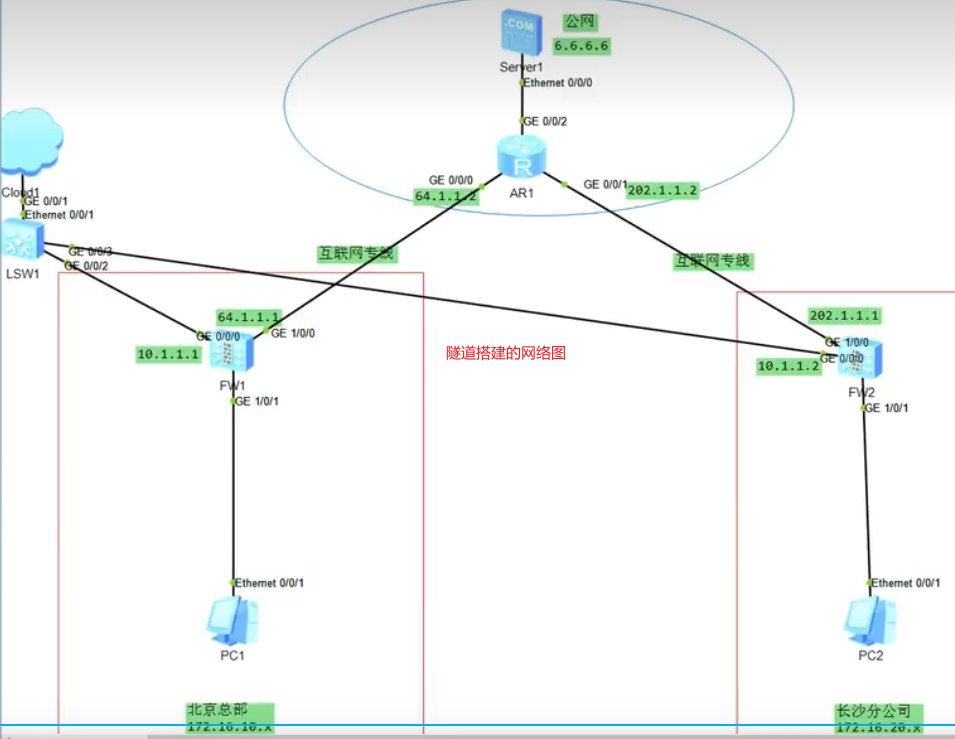
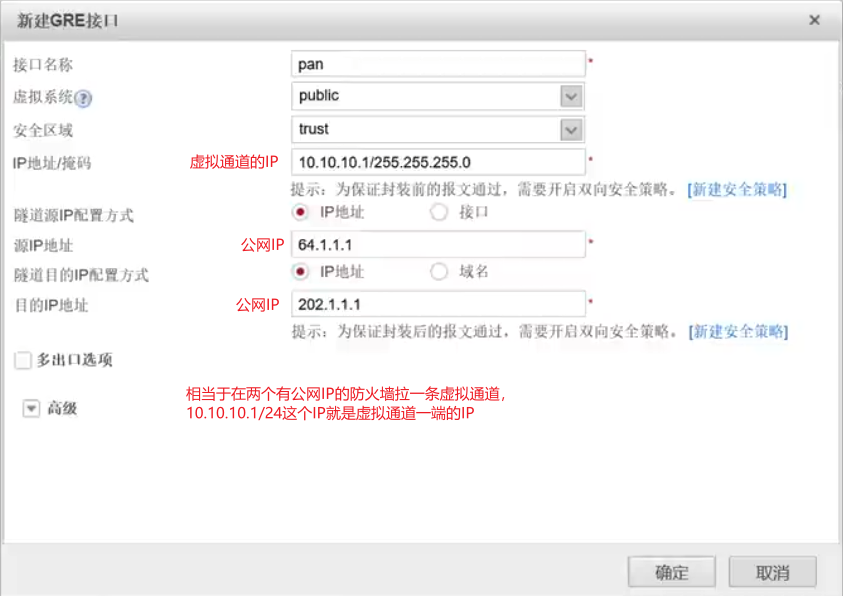
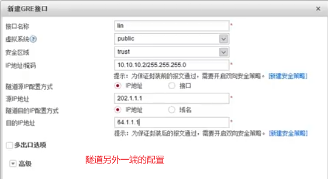
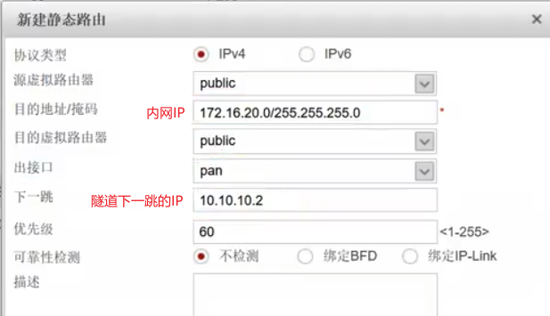
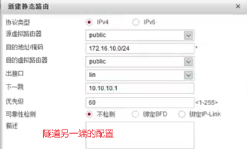
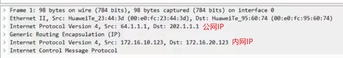
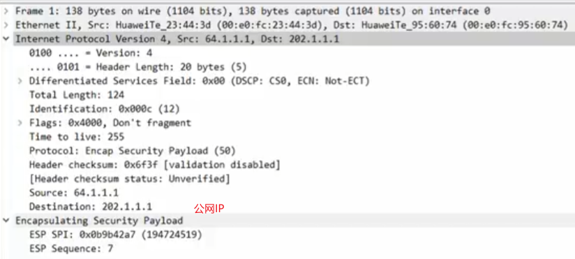

# 2. 查阅学习

## 1. 名词解释

### 1. WAN、LAN、WLAN、VLAN

这些术语通常用于描述计算机网络中不同的范围或连接类型：

WAN（Wide Area Network，广域网）：WAN 是一个广泛分布的计算机网络，覆盖大范围地理区域，例如跨越城市、国家或甚至跨越大洲。Internet 就是一个全球性的 WAN，连接了世界各地的计算机和网络设备。

LAN（Local Area Network，局域网）：LAN 是一个较小范围的网络，通常局限于单一建筑物、办公室、校园或相邻的建筑物。LAN 通过局域网技术，如以太网（Ethernet）或Wi-Fi，使得连接在局域网内的设备可以相互通信。

WLAN（Wireless Local Area Network，无线局域网）：WLAN 是一种无线局域网，使用无线通信技术（如Wi-Fi）来连接设备，而不是通过传统的有线连接。WLAN 允许移动设备在覆盖范围内自由移动，而不受有线连接的限制。

VLAN（Virtual Local Area Network，虚拟局域网）：VLAN 是一种将单个物理局域网分割成多个逻辑上独立的虚拟局域网的技术。这样，即使设备连接到同一个物理网络，它们仍可以被划分为不同的 VLAN，彼此之间可以隔离或按照一定规则进行通信。VLAN 在网络管理中提供了更多的灵活性和安全性。路由器中的guest模式就是使用vlan将访客隔离开，访客就无法访问局域网中的一些资源。

### 2. AP、Router、Switch

#### 1. AP是什么

AP 是指 "Access Point"，翻译为“接入点”。在计算机网络中，AP 是一种网络设备，用于提供无线通信服务，允许无线设备连接到有线网络（通常是局域网）。

具体来说，AP 的主要功能包括：

- 提供无线连接： AP 通过无线信号与无线设备（如笔记本电脑、智能手机、平板电脑）进行通信，使它们能够连接到有线网络。

- 连接有线网络： AP 通常连接到有线网络，例如路由器、交换机或局域网。这样，通过无线连接到 AP 的设备就可以访问有线网络上的资源。

- 转发数据包： AP 负责将无线设备发送的数据包转发到有线网络，同时将有线网络上的数据包转发到无线设备。

- 提供无线安全： AP 通常支持安全协议，如WPA（Wi-Fi Protected Access）或WPA2，以加密和保护通过无线连接传输的数据。

AP 在无线局域网（WLAN）中扮演着关键的角色，它们可以覆盖一定范围内的无线信号，使得设备可以在该范围内无线连接到网络。AP 可以独立存在，也可以集成在路由器或交换机等网络设备中。在大型无线网络中，可能有多个 AP 以提供更广泛的覆盖范围和更好的性能。

#### 2. 路由器、交换机与AP都有什么区别

路由器（Router）、交换机（Switch）、和接入点（Access Point，AP）是网络中的不同类型设备，各自有不同的功能和作用：

1. 路由器（Router）：

- 功能： 路由器连接不同的网络，负责在这些网络之间转发数据包。它具有在不同网络之间做出决策的能力，例如，将数据包从一个网络发送到另一个网络。
- 特点： 路由器是一种**层级设备**，通常在 OSI 模型的网络层（**第三层**）操作。它可以实现网络地址转换（NAT）和防火墙功能，用于保护局域网内的设备。

2. 交换机（Switch）：

- 功能： 交换机用于在局域网内的设备之间进行**数据包转发**。它可以**学习设备的 MAC 地址**，并根据这些地址将数据包定向到正确的目的地，提高局域网内设备之间的通信效率。

- 特点： 交换机是一种**层级设备**，通常在 OSI 模型的数据链路层（**第二层**）操作。它通常用于**构建局域网**，并提供更快的数据传输速率和更低的延迟。

  交换机本身**不能直接实现子网的划分**，但当与路由器结合使用时，它们共同构成了一个组织良好的局域网结构。在这种情况下，交换机用于连接同一子网内的设备，而路由器用于连接不同子网之间的设备。

3. 接入点（Access Point，AP）：

- 功能： 接入点是无线局域网（WLAN）中的设备，用于提供无线连接服务。它允许无线设备连接到有线网络，使得移动设备可以无线访问有线网络上的资源。

- 特点： 接入点是一种专注于无线通信的设备，它通常在 OSI 模型的**物理层和数据链路层**操作。接入点通常**集成在路由器或交换机中**，也**可以是独立的设备**。

  总体来说，路由器用于连接不同的网络，交换机用于在局域网内进行设备之间的数据交换，而接入点用于提供无线连接服务。在实际网络中，这些设备可能相互结合使用，例如，一个路由器可能集成了交换机和接入点的功能。

#### 3.将路由器调为AP模式，是不是就相当于是一个交换机了？

将路由器调整为 AP 模式，实质上是将其功能限制为提供无线接入服务，与交换机的功能有所不同。虽然 AP 和交换机都在网络中发挥重要作用，但它们有不同的用途和设计。

当你将路由器调整为 AP 模式时，它将主要承担以下角色：

- 提供无线连接： 调整为 AP 模式后，路由器将主要用于提供无线连接服务，允许无线设备连接到有线网络。

- 不进行路由： 在 AP 模式下，路由器通常**不执行路由功能**。它不会处理网络地址转换（NAT）或防火墙功能，而是专注于无线通信。

- 连接到交换机或网络： 调整为 AP 模式后，路由器通常会连接到现有的交换机或网络中，以便无线设备可以访问有线网络上的资源。

虽然路由器在 AP 模式下可以充当无线接入点，但它并不完全等同于交换机。交换机专注于有线设备之间的数据交换，而路由器在 AP 模式下主要处理无线连接。在一些情况下，路由器可能集成了交换机的功能，同时提供有线和无线连接。

总体来说，AP 模式下的路由器更接近于一个专注于无线通信的设备，而不同于典型的交换机。

#### 4. 什么是路由功能

路由功能是指网络设备能够根据网络地址信息（通常是 IP 地址）决定如何将数据包从一个网络发送到另一个网络的能力。这个过程包括在网络之间选择合适的路径，并在数据包经过这些路径时进行转发。

具体来说，路由功能包括以下几个关键方面：

- 网络地址转换（NAT）： 在某些情况下，路由器可能执行网络地址转换，将内部网络中的**私有 IP 地址映射到外部网络中的公共 IP** 地址，以实现更有效的使用 IP 地址和增强网络安全性。

- 路由表管理： 路由器维护一个路由表，其中包含了与其他网络直接相连的信息，以及如何到达其他网络的指示。路由表中的信息帮助路由器确定如何将数据包从源发送到目的地。

- 数据包转发： 路由器根据路由表中的信息对收到的数据包进行转发。它检查数据包的目标地址，并选择合适的出口接口或下一跳路由器，然后将数据包传送到正确的目的地。

- 动态路由协议： 一些路由器能够使用动态路由协议，如 OSPF（Open Shortest Path First）或 BGP（Border Gateway Protocol），与其他路由器交换路由信息，以动态**更新路由表**。

路由功能是构建复杂网络的关键组成部分，它允许数据包在网络中跨越不同的子网、网络和子网掩码。路由器在互联网和大型企业网络中扮演着核心角色，确保数据能够在全球范围内准确快速地传递。

### 3. Router、Gateway

#### 1. 路由器与网关的区别

路由器（Router）和网关（Gateway）是网络中的两个不同的设备，它们有不同的功能和角色：

路由器（Router）：

- 功能： 路由器负责将数据包从一个网络传递到另一个网络。它通过检查数据包的目标 IP 地址，并根据路由表中的信息来确定如何将数据包转发到正确的目的地。路由器通常连接不同的网络，比如连接局域网和互联网。
  位置： 路由器通常位于不同网络之间，充当网**络的边界设备**。它可能**连接到一个或多个网络**，并帮助将数据包从一个网络传递到另一个网络。

网关（Gateway）：

- 功能： 网关是在**两个不同的网络**之间充当接口的设备。它能够进行协议转换，将一个网络中的数据包转换为另一个网络中使用的协议。网关可以是硬件设备、软件程序或者是网络中的某个具有网关功能的设备。
  位置： 网关可以位于**网络的边缘**，连接两个不同的网络，也可以位于**网络中**的某个设备上，负责连接不同的网络。
  总结：

路由器是网络中用于转发数据包的设备，它连接不同的网络。
网关是在**两个不同网络**之间进行**协议转换**的设备，它**可以是路由器、交换机、或者网络中的其他设备**。
在实际网络中，有时候这两个术语可能会交叉使用，因为某些设备可能**同时具有路由和网关功能**。例如，一个连接到互联网的路由器同时也可能充当局域网内部设备访问互联网的网关。

### 4. vpn隧道

#### 1. GRE技术

隧道技术就是套娃，在含有内网IP的报文上面套娃加上公网IP，使用公网IP来转发数据包。转发到目标公网IP地址后，再根据报文里的内网IP转发到目标IP。

隧道的网络图如下

下面看一下如何具体的进行配置：

要通信的另一端也要进行配置

此时配置了隧道，但是目前还是无法进行通信的，需要给隧道配置路由，

隧道另一端也需要配置路由

至此，内网172.16.10.0/24网段与内网172.16.20.0/24网段的IP就可以ping通了。

上面是抓取的一个数据包，在内网IP上面又套了一个公网IP，当数据包发送到目的公网IP后，会把包含公网IP部分的报文丢弃，然后再转发给内网目的IP。

这里有个疑问：报文里为什么没有显示出隧道的虚拟IP10.10.10.1，如果只是一个虚拟的概念它是否就不需要进行配置呢？它的作用是什么？

#### 2. ipsec技术

gre方式数据都是明文，不安全。ipsec在gre的基础上采用多种方式来保证数据的安全：

1. 数据加密
2. 计算哈希值来保证数据没有被篡改
3. 使用预共享密钥

加密后的数据如下，只能看到公网IP，看不到数据的内容

