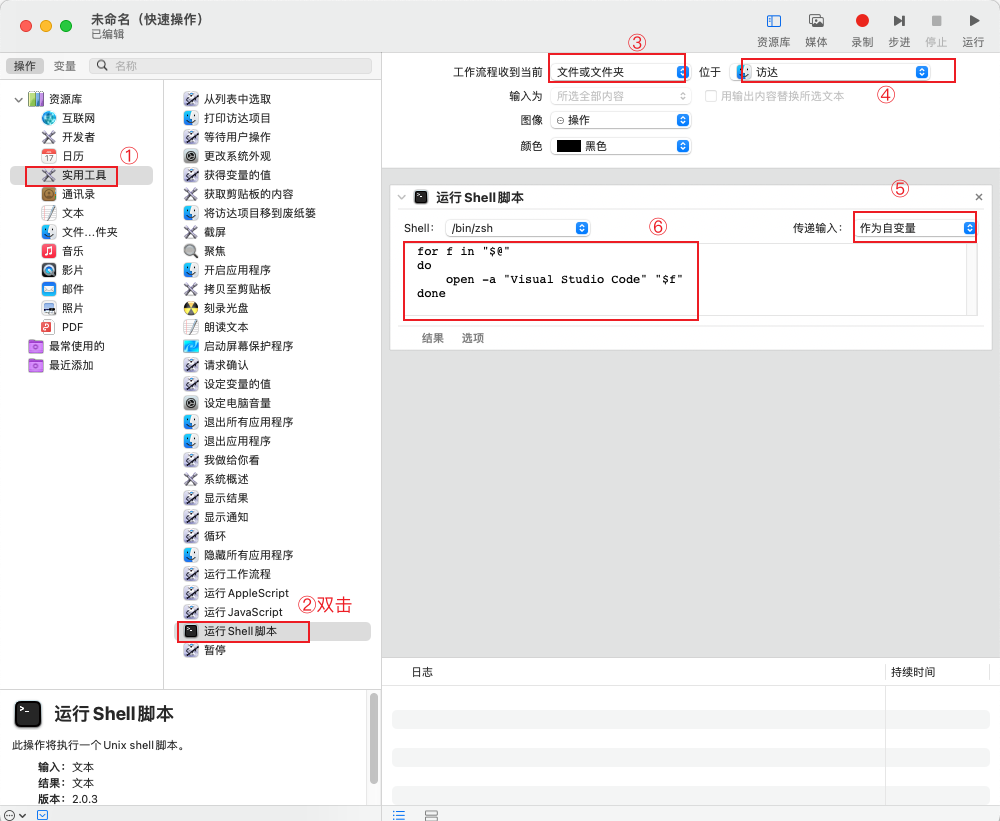

### 1. 右键添加用 *** 打开

1. 打开 自动操作 app

2. command + n 新建文稿，在「选取文稿类型」里选择「快速操作」

3. 按照如下操作：

   依次点击：实用工具->运行Shell脚本(双击)-》选择文件或文件夹=》访达=》作为自变量=》填入shell脚本

   

脚本如下：

```shell
 for f in "$@"
 do
     open -a "Visual Studio Code" "$f"
 done
```

4. 修改创建的快速操作

   在 `/Users/wirelessdev/Library/Services` 目录下有创建的快速操作文件，双击进行修改。


### 2. 新建文本

依次点击：双击 AppleScript=》文件或文件夹=》访达，粘贴下面的脚本

```AppleScript
on run {input, parameters}
	
	tell application "Finder"
		set insertionLocation to (get insertion location)
        set baseName to "Untitled"
        set extension to ".md"
        
        set fileName to baseName & extension
        set counter to 1
        
        repeat while (exists file ((insertionLocation as text) & fileName))
            set fileName to baseName & "-" & counter & extension
            set counter to counter + 1
        end repeat
        
        set newFile to make new file at insertionLocation
        set name of newFile to fileName
	end tell
	
	return input
end run
```

