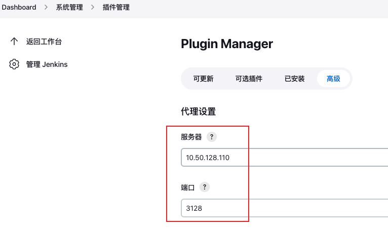
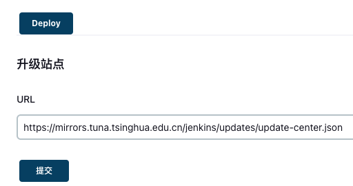

### 创建本地数据卷

```bat
注意：这一步必须做
mkdir jenkins/jenkins_home
# 需要修改下目录权限，因为本地jenkins目录的拥有者为root用户，而容器中jenkins用户的 uid 为 1000
sudo chown -R 1000:1000 jenkins_home
```

### jenkins的dockerfile

```bat
FROM jenkins/jenkins
MAINTAINER xbu
# 如果不设置 USER root 就需要修改 jenkins_home 目录权限
USER root
# 复制解压
ADD allure-commandline-2.13.8.tgz /usr/local

# 将 debian 源更换为 阿里云源
RUN cp /etc/apt/sources.list /etc/apt/sources.list.init
RUN sed -i 's/deb.debian.org/mirrors.aliyun.com/g' /etc/apt/sources.list
RUN apt-get update --fix-missing && apt-get install -y vim --fix-missing

RUN apt-get install -y python3-pip sudo curl lsof virtualenv

# 安装 python 环境
#RUN pip install virtualenv

# 修改时区
RUN echo  'Asia/Shanghai' > /etc/timezone
#设置环境变量
#ENV JAVA_HOME /opt/java/openjdk 
ENV ALLURE /usr/local/allure-2.13.8/bin/ 
#设置环境变量 分隔符是：
ENV PATH $PATH:$ALLURE

# drop back to the regular jenkins user - good practice
USER jenkins
#设置环境变量
ENV JENKINS_SLAVE_AGENT_PORT 50001
ENV MYPATH /usr/local
#设置工作目录
WORKDIR /home 
```


```bat
FROM jenkins/jenkins:lts-jdk11
MAINTAINER xbu
# 如果不设置 USER root 就需要修改 jenkins_home 目录权限
USER root

# 复制解压
ADD allure-commandline-2.13.8.tgz /usr/local

# 将 debian 源更换为 阿里云源
RUN cp /etc/apt/sources.list /etc/apt/sources.list.init
RUN sed -i 's/deb.debian.org/mirrors.aliyun.com/g' /etc/apt/sources.list
RUN apt-get update --fix-missing && apt-get install -y vim --fix-missing

RUN apt-get install -y python3-pip sudo openssh-server openssh-clients curl lsof
# 更换 pip 源，一旦RUN命令完成，这个目录就消失了
RUN mkdir -p /home/.pip && touch /home/.pip/pip.conf
# dockerfile 中要加 \ 不然无法识别为一行命令
RUN echo $'[global]\n \
\nindex-url = http://mirrors.aliyun.com/pypi/simple/\n \
\n[install]\n \
\ntrusted-host=mirrors.aliyun.com\n' \
>> /home/.pip/pip.conf
# 安装 python 环境
RUN pip install virtualenv
RUN mkdir -p /home/python_env && virtualenv /home/python_env/devtest --python=python3.9

#设置环境变量
#ENV JAVA_HOME /opt/java/openjdk 
ENV ALLURE /usr/local/allure-2.13.8/bin/ 
#设置环境变量 分隔符是：
ENV PATH $PATH:$ALLURE

# drop back to the regular jenkins user - good practice
#USER jenkins
#设置环境变量
ENV MYPATH /usr/local
#设置工作目录
WORKDIR /home 

# 设置默认命令
# CMD /bin/bash 不能用 /bin/bash，不然网页访问不了 jenkins
```

启动容器

```bat
# docker run 的时候不能用 /bin/bash，不然网页访问不了 jenkins
docker run -it --name myjenkins03 -p 7080:8080 -p 50000:50000 -p 7081:8081 -v /home/xbu/files/docker/myjenkins03/jenkins_home:/var/jenkins_home -v /home/xbu/files/docker/myjenkins03/files:/home --env JENKINS_SLAVE_AGENT_PORT=50001 jenkins/jenkins:lts-jdk11

docker run -d -it --name myjenkins01 -p 7080:8080 -p 50000:50000 -p 7081:8081 -v /home/xbu/files/docker/jenkins01/jenkins_home:/var/jenkins_home -v /home/xbu/files/docker/jenkins01/files:/home --env JENKINS_SLAVE_AGENT_PORT=50001 jenkins-xbu:0.1 

docker run -d -it --name jenkins01 -p 7080:8080 -p 55000:50000 -p 7081:8081 -p 222:22 -v /srv/jenkins01/jenkins_home:/var/jenkins_home -v /srv/jenkins01/files:/home --env JENKINS_SLAVE_AGENT_PORT=55001 jenkins-xbu:0.3

docker run -d -it --name myjenkins -p 6080:8080 -p 50000:50000 -p 6081:8081 -p 220:22 -v /srv/myjenkins/jenkins_home:/var/jenkins_home -v /srv/myjenkins/files:/home --env JENKINS_SLAVE_AGENT_PORT=50001 xbu-jenkins:0.3 
```


更换插件源

```bat
sed -i 's/https:\/\/updates.jenkins.io\/download/http:\/\/mirrors.tuna.tsinghua.edu.cn\/jenkins/g' /var/jenkins_home/updates/default.json && sed -i 's/http:\/\/www.google.com/https:\/\/www.baidu.com/g' /var/jenkins_home/updates/default.json

# 更换 https://updates.jenkins.io/update-center.json 为http://mirrors.tuna.tsinghua.edu.cn/jenkins/updates/update-center.json

```


更换 pip 源

```bat
mkdir -p /home/.pip
tee ~/.pip/pip.conf <<-'EOF'
[global]
index-url = http://mirrors.aliyun.com/pypi/simple/
[install]
trusted-host=mirrors.aliyun.com
EOF

# 自己的server换源
tee ~/.pip/pip.conf <<-'EOF'
[global]
index-url = http://mirrors.aliyun.com/pypi/simple/
[install]
trusted-host=mirrors.aliyun.com
EOF
```


### 执行 shell

```shell
#!/bin/bash
source /home/python_env/devtest/bin/activate
cd /home/code/test_yml_local
# 关键是传入参数 ${WORKSPACE}，对于jenkins容器来说，WORKSPACE的目录是在jenkins_home/workspace下，jenkins框架会自动使用allure插件在此目录下生成测试报告
python main.py --alluredir ${WORKSPACE}/report/results
exit 0

#!/bin/bash
source /home/python_env/devtest/bin/activate
cd /home/code/test_multi_task
python main.py --allure_dir ${WORKSPACE}/results
exit 0
```

### jenkins 出现的问题

自己的12.238容器导出的 xbu-jenkins:0.2 镜像，启动容器时出现问题

```bat
docker run -d -it --name myjenkins -p 6080:8080 -p 50000:50000 -p 6081:8081 -p 220:22 -v /srv/myjenkins/jenkins_home:/var/jenkins_home -v /srv/myjenkins/files:/home --env JENKINS_SLAVE_AGENT_PORT=50001 xbu-jenkins:0.2 
# 出现问题
(base) xbu@sonicwall-virtual-machine:/srv$ docker run -d -it --name myjenkins -p 6080:8080 -p 50000:50000 -p 6081:8081 -p 220:22 -v /srv/myjenkins/jenkins_home:/var/jenkins_home -v /srv/myjenkins/files:/home --env JENKINS_SLAVE_AGENT_PORT=50001 xbu-jenkins:0.2
docker: Error response from daemon: No command specified.
See 'docker run --help'.
# 原因是没有cmd命令，使用docker inspect【镜像名】查看下不能create容器的镜像，里面的cmd是否为null，再看看可以创建容器的镜像是不是存在值。
# 解决办法：加上 /bin/bash，如下
docker run -d -it --name myjenkins -p 6080:8080 -p 50000:50000 -p 6081:8081 -p 220:22 -v /srv/myjenkins/jenkins_home:/var/jenkins_home -v /srv/myjenkins/files:/home --env JENKINS_SLAVE_AGENT_PORT=50001 xbu-jenkins:0.2 /bin/bash
# 加上 /bin/bash 后网页访问不了 jenkins
```


#### 安装插件失败

#### 1. 设置代理更换源

在`插件管理=》高级`中设置插件代理，重启后生效



同样是在`插件管理=》高级=》升级站点`中设置更换源

```
https://mirrors.tuna.tsinghua.edu.cn/jenkins/updates/update-center.json
```


