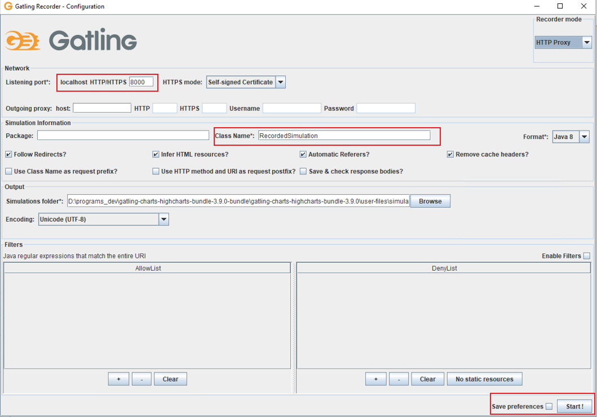
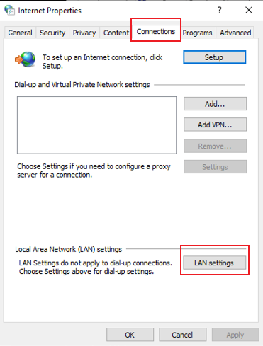
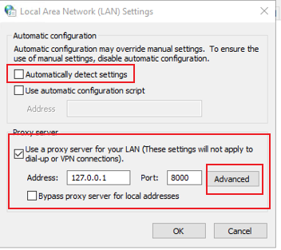

## 1. 录制脚本

### 1. 配置监听端口和项目名

设置参考链接：https://zhuanlan.zhihu.com/p/109577859

我们需要定义记录器监听的端口，默认值为8000。然后命名项目名，然后单击开始！



### 2. 浏览器设置

由于记录器侦听预定义的端口，因此我们需要配置浏览器。

对于Google Chrome和Internet Explorer，请转到“控制面板”，选择“网络选项(Internet options)”，然后导航至“连接(connection)”标签。

在此选项卡中，单击“局域网设置(LAN setting)”。



如果已选中“Automatically detect settings”，请在此处取消选择。选中“Use a proxy server for your LAN” 。Address设置成 127.0.0.1，Port设置成之前定义的监听的值，点击“确定”。然后就可以录制浏览器中的操作过程了。



这个是使用gatling建立一个本地的代理服务器，浏览器都会通过gatling的代理来访问网页，所以测试完成后将proxy server勾选去掉，不然浏览器无法请求访问。

## 2. 在容器跑gatling

在官方版本上进行更改的，

```dockerfile
# Gatling is a highly capable load testing tool.
## Documentation: https://gatling.io/docs/3.2/
# Cheat sheet: https://gatling.io/docs/3.2/cheat-sheet/

FROM openjdk:11
MAINTAINER Denis Vazhenin <denis.vazhenin@me.com>

# working directory for gatling
WORKDIR /opt

# gating version
ENV GATLING_VERSION 3.9.0

# create directory for gatling install
RUN mkdir -p gatling

# install gatling
RUN mkdir -p /tmp/downloads && \
    wget -q -O /tmp/downloads/gatling-$GATLING_VERSION.zip \
    https://repo1.maven.org/maven2/io/gatling/highcharts/gatling-charts-highcharts-bundle/$GATLING_VERSION/gatling-charts-highcharts-bundle-$GATLING_VERSION-bundle.zip && \
    mkdir -p /tmp/archive && cd /tmp/archive && \
    unzip /tmp/downloads/gatling-$GATLING_VERSION.zip && \
    mv /tmp/archive/gatling-charts-highcharts-bundle-$GATLING_VERSION/* /opt/gatling/ && \
    rm -rf /tmp/*

# change context to gatling directory
WORKDIR /opt/gatling

# set directories below to be mountable from host
VOLUME ["/opt/gatling/conf", "/opt/gatling/results", "/opt/gatling/user-files"]

# set environment variables
ENV PATH /opt/gatling/bin:/usr/local/sbin:/usr/local/bin:/usr/sbin:/usr/bin:/sbin:/bin
ENV GATLING_HOME /opt/gatling
ENV ClassName=""

##这里看怎么改来跑多个脚本
ENTRYPOINT gatling.sh --run-mode local -sf /opt/gatling/user-files/simulations/ -rf /opt/gatling/results/ -s ${ClassName}
```

起容器的命令

```shell
docker run -it --rm -e ClassName=ccprodDeviceUserApplicationTenantsScala -v /home/core/gatling/conf:/opt/gatling/conf -v /home/core/gatling/user-files/simulations:/opt/gatling/user-files/simulations -v /home/core/gatling/results:/opt/gatling/results gatling:3.9.1
```

```shell
docker run -it --rm -e ClassName=FirstTestSimulation -v /home/xbu/wnm/gatling/conf:/opt/gatling/conf -v /home/xbu/wnm/gatling/user-files/simulations:/opt/gatling/user-files/simulations -v /home/xbu/wnm/gatling/results:/opt/gatling/results mygatling:0.1
```