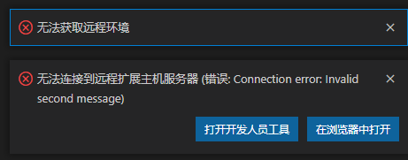
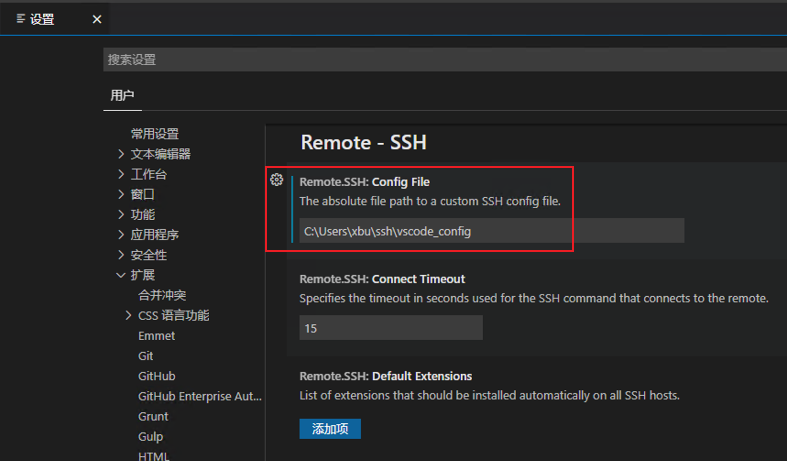

### vscode中的ssh-remote远程连接出错

最近想要用IDE远程连接服务器，使用服务器中的开发环境。使用vscode中插件SSH-Remote进行远程连接，总是出现如下错误：



注册ssh-key

```bat
ssh-keygen -t rsb -b 2048 -c "xbu@sonicwall.com"
```


#### 修改config文件的绝对路径

在`设置>拓展>remote-ssh>Remote.Ssh:config file`中配置绝对路径



#### 连接超时错误

出现错误Resolver error: Error: Timed out while waiting for the local startup lock

（参考链接：http://www.bugscaner.com/jiaobenyuyan/python/229.html）

Remote-SSH 右键，选择Extension Settings-->Edit in settings.json：（在json文件中添加下面两项）

```json
"remote.SSH.showLoginTerminal": true,
"remote.SSH.useLocalServer": true,
```

### 连接远端开发环境时，一直处于"Setting up SSH Host xxx: Downloading VS Code Server locally"

#### 解决方法：手动安装 vscode-server。
参考链接：https://support.huaweicloud.com/modelarts_faq/modelarts_05_3117.html
1. 点击`关于 vs code` 获取VS Code的commitID
```
版本: 1.79.2 (Universal)
提交: 695af097c7bd098fbf017ce3ac85e09bbc5dda06
日期: 2023-06-14T08:58:52.392Z
Electron: 22.5.7
Chromium: 108.0.5359.215
Node.js: 16.17.1
V8: 10.8.168.25-electron.0
OS: Darwin x64 22.3.0
```
2. 下载相应版本vscode-server压缩包，请根据开发环境cpu架构选择arm版本或x86版本。
>说明：替换下面链接中${commitID}为[步骤1 获取VS Code的commitID]中commitID。
```
- arm版本，下载vscode-server-linux-arm64.tar.gz
https://update.code.visualstudio.com/commit:${commitID}/server-linux-arm64/stable

- x86版本，下载vscode-server-linux-x64.tar.gz 
https://update.code.visualstudio.com/commit:${commitID}/server-linux-x64/stable
```
3. SSH 进入远程环境。
4. 手动安装vscode-server
在VS Code的Terminal中执行如下命令，清空残留的vscode-server，注意替换命令中${commitID}为[步骤1 获取VS Code的commitID]中commitID。
```shell
rm -rf /home/ma-user/.vscode-server/bin/${commitID}/*
mkdir -p /home/ma-user/.vscode-server/bin/${commitID}
```
上传vscode-server压缩包到开发环境。执行如下命令：
```
exit
scp -i xxx.pem -P 31205 本地vscode-server压缩包路径 ma-user@xxx:/home/ma-user/.vscode-server/bin
```
以arm版本为例，将vscode-server压缩包解压至$HOME/.vscode-server/bin文件夹，
```SHELL
cd /home/ma-user/.vscode-server/bin
tar -zxf vscode-server-linux-arm64.tar.gz
mv vscode-server-linux-arm64/* ${commitID}
```
5. 重新远程连接


### 2. 设置免密码登录(画重点)

方式一：在终端输入 `ssh-copy-id username@IP`地址，输入密码即可

方式二：将公钥配置到.ssh目录下


### 3、使用vscode在远程服务器上debug

参考链接：https://zhuanlan.zhihu.com/p/385073692

方式1、命令行的方式： ipdb

首先需要安装ipdb：pip install ipdb

在终端上输入 python -m ipdb xxx.py就可以一行一行的调试了。

或者，在xxx.py文件中在需要中断的地方插入上如下代码：

“from ipdb import set_trace

set_trace()”

xxx.py程序跑的时候就会在你设置断点的位置停下来。

但是并不建议使用在源代码中插入代码来达到断点的作用，因为这样破坏了程序源代码的完整性。

方式2：直接点击vscode的run进行调试：

首先在你项目的文件夹下，创建一个.vscode文件夹，然后，在.vscode文件夹下面创建3个json文件，launch.json、setting.json、task.json。（我的目前只有launch.json也能正常工作）

a).编写launch.json

```json
{
    // Use IntelliSense to learn about possible attributes.
    // Hover to view descriptions of existing attributes.
    // For more information, visit: https://go.microsoft.com/fwlink/?linkid=830387
    "version": "0.2.0",
    "configurations": [

        {
            "name": "Python: Current File",
            "type": "python",
            "request": "launch",
            "program": "${file}",
            "python": "/home/ml/anaconda3/envs/py36/bin/python", #这个是虚拟环境 conda info --envs 可以看虚拟环境的地址
            "console": "integratedTerminal",
            "args": [
                "--lr",               "0.4",
                "--iter",             "4" ,
                "--epoch",            "30",
                "--model",            "CNN",
              ],
        }
    ]
}

创建虚拟环境: conda create -n name python=3.6
查看虚拟环境: conda info --envs
激活虚拟环境: conda activate
退出虚拟环境: conda deactivate
```

b).编写setting.json

```json
{
  "python.pythonPath": "/home/ml/anaconda3/envs/py36/bin/python" #这个是虚拟环境 conda info --envs 可以看虚拟环境的地址
}
```

c).编写task.json

```json
{
    "version": "2.0.0",
    "tasks": [
        {
            "label": "python",
            "type": "shell",
            "command": "/home/ml/anaconda3/envs/py36/bin/python",  #这个是虚拟环境 conda info --envs 可以看虚拟环境的地址
            "args": [
                "${file}"
            ],
            "group": {
                "kind": "build",
                "isDefault": true
            },
            "problemMatcher": [
                "$eslint-compact"
            ]
        }
    ]
}
```

**给调试传参数**，这个主要是在launch.json里面，在args里面 传入你自己设定的参数。

```json
{ // Use IntelliSense to learn about possible attributes. 
// Hover to view descriptions of existing attributes. 
// For more information, visit: https://go.microsoft.com/fwlink/?linkid=830387 
       ....
        "args": [
            "--lr",               "0.4",
            "--iter",             "4" ,
            "--epoch",            "30",
            "--model",            "CNN",
          ],
         ....
}
```

最后点击 Run and Debug。
